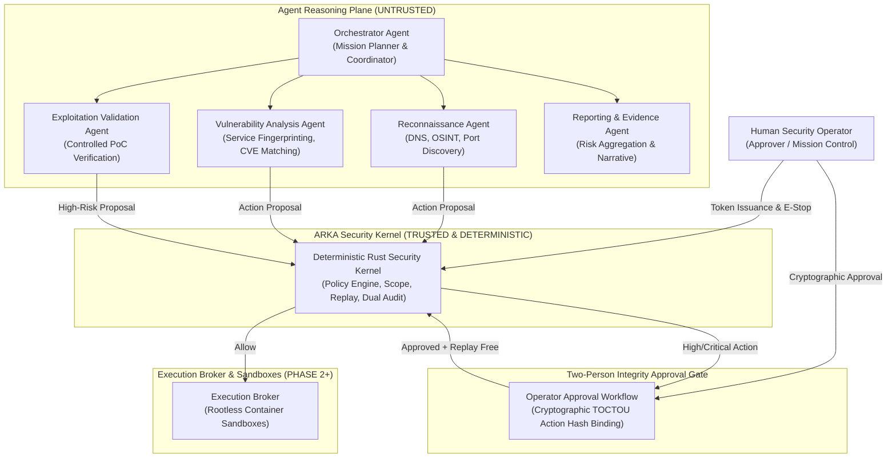

# ARKA Multi-Agent Operating Model & Agent Specification

**Project:** ARKA — Autonomous Risk Knowledge & Assessment  
**Document:** `AGENTS.md` (canonical) / `agent.md`  
**Governing Documents:** ARKA PRD v2.2, ARKA TRD v2.2, Phase 0 Security Foundation, Phase 1 Security Kernel  
**Classification:** Internal Security Architecture & Autonomous Agent Specification

---

## 1. Foundational Operating Invariants

Every autonomous agent, LLM orchestration pipeline, and automated worker operating within the ARKA ecosystem is governed by non-negotiable architectural invariants:

$$\mathbf{DISCOVERED \neq AUTHORIZED}$$

1. **Zero Execution Authority:** Agents and LLMs have zero direct operating system, shell, socket, or network execution authority.
2. **Deterministic Kernel Superiority:** The Rust Security Kernel is the sole, authoritative decision-maker. An agent may only construct and submit structured action proposals.
3. **Immutable Identity Binding:** An agent's identity (`AgentId`, `Subject`, `MissionId`) is cryptographically bound to an Ed25519 authentication token signed under `KeyDomain::TokenSigning`. An agent cannot spoof or substitute identity in action proposals.
4. **Child Monotonicity:** Sub-delegated child agent authority cannot exceed parent authority across capabilities, risk, budget, expiry, or scope boundaries.
5. **No Parallel Authorization Authority:** No agent, background worker, or external orchestrator may bypass the Security Kernel or establish an out-of-band execution path.

---

## 2. Multi-Agent Topology & Role Taxonomy

ARKA partitions autonomous operations into discrete, single-responsibility agent roles. Each agent is instantiated with a restricted capability profile and isolated context.

### Agent Roles & Assigned Standard Capabilities

| Agent Role | Primary Responsibility | Permitted Standard Capabilities | Maximum Default Risk Class |
|---|---|---|:---:|
| **Orchestrator Agent** | Mission planning, sub-task delegation, status aggregation | Delegation management, read-only status query | `Observation` |
| **Reconnaissance Agent** | Passive and active perimeter mapping | `DNS_LOOKUP`, `TCP_CONNECT`, `PORT_SCAN`, `WEB_DISCOVERY`, `OSINT_LOOKUP` | `Moderate` |
| **Vulnerability Analysis Agent** | Banner grabbing, technology identification, endpoint analysis | `HTTP_REQUEST`, `SERVICE_ENUMERATION`, `BROWSER_AUTOMATION` | `Moderate` |
| **Exploitation Validation Agent** | Verifying exploitable state with safe, non-destructive proofs | `CREDENTIAL_VALIDATION`, `CONTROLLED_EXPLOITATION` | `Critical` (Requires Human Approval) |
| **Reporting & Evidence Agent** | Cryptographic evidence collation, remediation guidance generation | Internal read-only evidence aggregation | `Observation` |

---

## 3. The Action Proposal & Normalization Lifecycle

When an agent intends to execute any operation, it must execute the following lifecycle:

1. **Proposal Construction:**  
   The agent constructs an untrusted JSON action proposal containing:
   - `proposal_id`: Strongly-typed identifier.
   - `mission_id`: Must match the agent's authenticated context.
   - `capability_id`: Standard capability registered in the `CapabilityRegistry`.
   - `target`: Raw target string (IP, CIDR, domain, URL origin).
   - `parameters`: Key-value payload adhering strictly to the capability schema.
   - `nonce`: Unique randomness preventing accidental replay collisions.
2. **Ingress Normalization (`ActionNormalizer`):**  
   The Security Kernel ingests the proposal through `StrictJsonParser` (rejecting payloads >64KB, depth >8, or duplicate keys) and formats parameters via RFC 8785 JSON Canonicalization (JCS).
3. **Deterministic Evaluation (`AuthorizationEngine`):**  
   The kernel evaluates the action against the active mission state, monotonic emergency stop status, scope rules, and capability risk classifications.
4. **Approval Barrier (Two-Person Integrity):**  
   If the capability carries a risk class requiring approval (e.g., `CONTROLLED_EXPLOITATION`), authorization fails with `RequireApproval`. The action proposal's cryptographic hash (`action_hash`) is presented to the human operator. An approval is valid **only** if its `bound_action_hash` matches byte-for-byte.
5. **Atomic Commit & Dual Audit:**  
   Upon authorization, SQLite executes a `BEGIN IMMEDIATE` transaction that:
   - Consumes the single-use approval (if applicable).
   - Inserts the unique replay key into `replay_log`.
   - Records the authorized action state.
   - Appends and signs both System and Mission cryptographic audit records (`AUDIT-SIGNING`).
   - Commits atomically.

---

## 4. Multi-Agent Developer & AI Pair-Programming Rules

When developing, reviewing, or modifying ARKA code:

1. **Zero Unsafe Code:** `#![forbid(unsafe_code)]` must remain active across all workspace crates. No `unsafe` block may be introduced for any reason.
2. **Strict Cryptographic Domain Separation:** Never reuse private keys across key domains. Use `KeyDomain::TokenSigning` for tokens and `KeyDomain::AuditSigning` for audit logs.
3. **Never Trust Agent or LLM Input:** Always validate through `StrictJsonParser` and typed ID constructors (`MissionId::new`, `OperatorId::new`, `CapabilityId::new`).
4. **Fail-Closed Principle:** Internal security errors must never be exposed to callers in ways that leak mission existence, scope configurations, or cryptographic keys. Always sanitize using `to_external()`.
5. **Verify With Executable Proof:** Changes must be verified with `cargo fmt --check`, `cargo clippy --all-targets --all-features -- -D warnings`, and `cargo test --all`.
