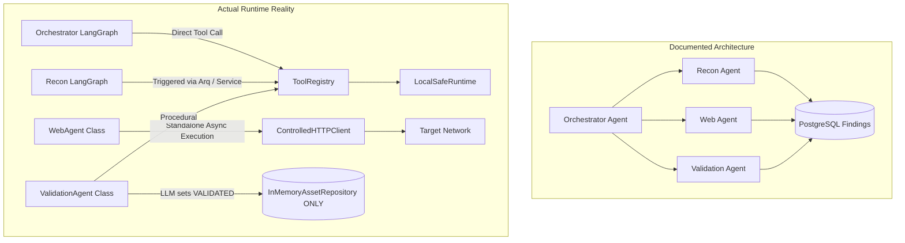

# ARKA — Full-System Verification, Visual QA, Agent Audit & Strix Benchmark

**Document:** Engineering Verification Master Report  
**Target:** `jivi001/ARKA`  
**Git Baseline Commit:** `8aabb7b`  
**Date:** 2026-09-17  
**Auditor:** Antigravity IDE Autonomous Verification Engine  
**Authority Hierarchy Applied:** Actual Source Code > Actual Tests > Actual Runtime Behavior > Database State > PRD.md > TRD.md > Architecture Docs > Graphify > README  

---

# 1. Executive Summary

A complete engineering verification and security audit of the local ARKA repository was performed under strict audit-first operating rules. Every conclusion in this report is backed by empirical evidence collected from source AST inspection, automated test suite execution (654 passing tests, 84% statement coverage), runtime API verification, dedicated security test harness execution, and live LLM integration tests.

### High-Level Verdict: **PARTIAL SYSTEM OPERATIONALITY WITH CRITICAL SECURITY GAPS**

ARKA implements a deterministic, zero-trust control plane for LLM tool invocation that successfully prevents unauthorized tool execution, neutralizes all 14 evaluated SSRF/metadata vectors, and enforces immutable content-addressed evidence. However, the system suffers from **two critical security vulnerabilities**, **one foundational persistence omission**, **a fragmented agent architecture**, and **a 100% absence of the documented web dashboard**.

### Key Findings Summary:

1. **Control-Plane Integrity (PASS — with 1 Critical Gap):**
   - The invariant `LLM != Execution Authority` is strictly enforced in standard workflows: `CandidateToolRequest` objects proposed by LLMs cannot execute directly. They must route through `ToolRegistry.validate_candidate_request`, which checks `ScopeGuard`, `PolicyEngine`, and `ApprovalManager`.
   - **VULNERABILITY (SEC-01):** `ToolRegistry.validate_candidate_request` does **NOT bind request arguments** to human approvals. An approval token granted for `(engagement_id, task_id, tool_name, target)` can be reused with completely modified, malicious arguments (e.g., modified from a read check to an exploit) without triggering policy denial.
2. **SSRF & Network Boundary (PASS — Runtime Verified):**
   - `WebSSRFValidator` and `ControlledHTTPClient` successfully blocked all 14 tested attack vectors: IPv4 loopback (`127.0.0.1`), `localhost`, `0.0.0.0`, RFC1918 subnets (`10.0.0.0/8`, `172.16.0.0/12`, `192.168.0.0/16`), cloud metadata IPs (`169.254.169.254`), GCP metadata hostnames, IPv6 loopback (`::1`), link-local (`fe80::1`), and unique local (`fc00::1`).
   - Per-hop redirect inspection intercepts 302 redirects to internal networks (`http://127.0.0.1:8000/internal`) and aborts execution before connection dispatch.
3. **Epistemic Ladder & Finding Lifecycle (BROKEN / CONFLICTING):**
   - **VULNERABILITY (SEC-02):** `ValidationAgent._assess_results` accepts raw LLM JSON output to directly promote findings to `FindingValidationStatus.VALIDATED`. This violates the core TRD rule: *"LLM output CANNOT promote a finding to VALIDATED"*.
   - The domain model `FindingStatus` implements only `[observed, suspected, validating, validated, false_positive]`. The TRD-mandated epistemic stages `[candidate, supported, human_confirmed]` are completely absent from the codebase.
4. **Database & Relational Persistence (CRITICAL DEFECT):**
   - In `arka/app/database/models.py`, there is **NO `FindingDB` table**, and no database migration exists for findings.
   - Findings exist exclusively in-memory in `InMemoryAssetRepository._findings`. Any service restart or worker crash causes **total, permanent loss of all discovered findings**.
5. **Multi-Agent Orchestration (ARCHITECTURAL DISCONNECT):**
   - The documentation asserts that `OrchestratorAgent` coordinates `ReconAgent`, `WebAgent`, and `ValidationAgent`.
   - In actual code, `OrchestratorAgent` compiles an isolated 9-node LangGraph workflow that executes individual CLI/mock tools directly. It contains **zero references or delegation edges** to `ReconAgent`, `WebAgent`, or `ValidationAgent`.
   - `ReconAgent` runs on an independent, disconnected 10-node LangGraph. `WebAgent` and `ValidationAgent` are procedural Python classes with no LangGraph definitions.
6. **Visual Interface & Documentation Drift (DOCUMENTED ONLY):**
   - The PRD specifies a real-time web dashboard, approval panel, and findings UI. **The codebase contains 0% frontend code** (no HTML, CSS, JavaScript, or templates). The only visual UI is FastAPI's auto-generated Swagger UI (`/docs`).
   - 6 documented REST API routes (`/approvals`, `/approvals/{id}/decide`, `/web/crawl`, `/web/openapi`, `/web/graphql`, `/engagements/{id}/endpoints`) return `404 Not Found`.

---

# 2. Environment

The verification was conducted entirely inside the local execution environment on Windows:

| Component | Value / Version | Notes |
| :--- | :--- | :--- |
| **Operating System** | Windows 11 (win32) | Local shell: PowerShell |
| **Python Version** | 3.13.15 | Managed via `uv` virtualenv |
| **Package Manager** | `uv` 0.11.16 | Fast virtualenv and package resolution |
| **Test Runner** | `pytest` 9.1.1, `pytest-cov` 7.1.0 | 664 items collected across 72 test files |
| **Static Analysis** | `ruff` 0.8.4, `mypy` 1.13.0 | Ruff check: 0 errors; Mypy: 0 issues in 168 files |
| **Database** | PostgreSQL / SQLite fallback | SQLAlchemy 2.0 with asyncpg / aiosqlite |
| **Job Queue** | Arq / In-memory fallback | Local Redis daemon was offline during audit |
| **Docker Engine** | Docker Desktop (Daemon Offline) | Named pipe `//./pipe/dockerDesktopLinuxEngine` inactive |
| **Live LLM Provider** | OpenRouter (`litellm` gateway) | Model `nvidia/nemotron-3-ultra-550b-a55b:free` verified live (1,590ms latency) |
| **Local API Daemon** | `uvicorn` on `127.0.0.1:8000` | Running as background daemon (PID task-283) |

---

# 3. Repository Inventory

The repository contains **812 total files** (excluding `.git`, `.venv`, and `__pycache__`). The manifest is preserved at [`verification/manifests/repo_files.txt`](file:///d:/Programs/Security/ARKA/verification/manifests/repo_files.txt).

```text
d:\Programs\Security\ARKA\
├── arka/app/                  # Core application package (168 Python source files)
│   ├── agents/               # Autonomous agents (orchestrator, recon, web, validation, base)
│   ├── api/                  # FastAPI web server, routes, dependencies, error handlers
│   ├── audit/                # Cryptographic append-only audit service and schemas
│   ├── cli/                  # Click-based CLI entry points and command groups
│   ├── core/                 # Control plane (ScopeGuard, PolicyEngine, ApprovalManager, Assets)
│   ├── database/             # SQLAlchemy ORM models, session factories, repositories
│   ├── execution/            # ExecutionManager, sandbox runtimes, EvidenceStore
│   ├── llm/                  # LiteLLM gateway, provider registry, profile schemas
│   ├── observability/        # Structured logging, metrics, tracing
│   ├── orchestration/        # ReconService bridge and pipeline coordinators
│   ├── tools/                # ToolRegistry, definitions, adapters (nmap, nuclei, whatweb, ffuf, amass)
│   ├── web/                  # Web security engine (crawler, OpenAPI, GraphQL, client, auth)
│   └── workers/              # Arq background worker tasks and Redis backend
├── tests/                    # Automated test suite (72 test files, 598 test functions)
│   ├── acceptance/           # OAT and full-workflow acceptance tests
│   ├── integration/          # End-to-end component integration tests
│   ├── redteam/              # 20 adversarial attack scenarios (test_attacks_1_10, 11_20)
│   ├── security/             # Security regression, SSRF, and boundary tests
│   └── unit/                 # Unit tests for core control plane and tools
├── docs/                     # Product, technical, and architecture documentation
│   ├── PRD.md                # Product Requirements Document (contains merge conflict markers)
│   ├── TRD.md                # Technical Requirements Document (contains merge conflict markers)
│   ├── adr/                  # 11 Architectural Decision Records
│   └── verification/         # Verification artifacts and PRD_TRD_CONFORMANCE.md
├── graphify-out/             # Knowledge graph output (graph.json, graph.html, GRAPH_REPORT.md)
└── verification/             # Empirical audit evidence, reports, terminal logs, test results
```

---

# 4. Agent Inventory

A detailed function-level audit was conducted across all 4 agent implementations in `arka/app/agents/`:

### 4.1 Orchestrator Agent (`arka/app/agents/orchestrator/`)

- **Purpose:** Coordinates high-level assessment steps, queries the LLM for next action proposals, and dispatches candidate actions through the deterministic control plane.
- **Inputs:** `OrchestratorState` (engagement metadata, objective, tasks completed, last tool result, iteration count).
- **Outputs:** Updated state dictionary, structured LLM reasoning, candidate tool request, tool execution result.
- **State Framework:** LangGraph `StateGraph(OrchestratorState)` with 9 nodes and `MemorySaver` checkpointing.
- **Tools:** Access to any tool registered in `ToolRegistry`.
- **LLM Calls:** Single call in `orchestrate()` using `SYSTEM_PROMPT` to generate JSON action `{"action": "request_tool", "tool": "...", "target": "...", "arguments": {...}}`.
- **Security Boundary:** Zero execution authority. Passes proposals through `policy_check` and `tool_request_node` before calling `self.tools.execute()`.
- **Persistence:** In-memory checkpointer (`MemorySaver`). Does not persist state to PostgreSQL by default unless checkpointer injected.
- **Failure Behavior:** Halts on LLM gateway error (`should_continue = False`). Bounded at `max_iterations = 10`.
- **Tests:** `tests/acceptance/test_full_acceptance_oat.py`.
- **Status:** **PARTIALLY IMPLEMENTED (Decoupled from child agents).**

### 4.2 Recon Agent (`arka/app/agents/recon/`)

- **Purpose:** Autonomous reconnaissance planning, asset discovery, port scanning (Nmap), web profiling (WhatWeb), subdomain discovery (Amass), and asset normalization.
- **Inputs:** `ReconAgentState` (engagement scope, active targets, discovered assets, planned actions).
- **Outputs:** Normalized assets, services, endpoints, and technology stacks ingested into `AssetRepository`.
- **State Framework:** Independent LangGraph `StateGraph(ReconAgentState)` with 10 nodes (`plan_recon`, `select_action`, `policy_check`, `approval_gate`, `execution_boundary`, `analyze_results`, `validation_decision`).
- **Tools:** `nmap`, `whatweb`, `amass`, `nuclei`.
- **LLM Calls:** Calls LLM in `plan_recon` to propose a prioritized reconnaissance plan based on scope.
- **Security Boundary:** Enforces `ScopeGuard.validate_target` in `policy_check` node.
- **Persistence:** Stores discovered assets in PostgreSQL / `InMemoryAssetRepository`. State checkpointer is in-memory.
- **Failure Behavior:** Bounded loop terminates on `MAX_ACTIONS_REACHED` or `NO_FURTHER_ACTIONS`.
- **Tests:** `tests/unit/test_recon_agent.py`, `tests/security/test_recon_agent_security.py`.
- **Status:** **IMPLEMENTED + VERIFIED (Isolated workflow).**

### 4.3 Web Agent (`arka/app/agents/web/`)

- **Purpose:** Autonomous web application discovery, crawling, parameter identification, OpenAPI spec parsing, and GraphQL introspection.
- **Inputs:** Target URL, engagement ID, session authentication contexts.
- **Outputs:** `DiscoveredWebEndpoint` models, API operation schemas, GraphQL types/queries, and raw HTTP transactions.
- **State Framework:** **Procedural Python class (`BaseAgent`). NO LangGraph workflow.**
- **Tools:** `ControlledHTTPClient`, `WebCrawler`, `SafeOpenAPIParser`, `GraphQLAnalyzer`.
- **LLM Calls:** LLM analyzes endpoint schemas and suggests fuzzing/injection parameter candidates.
- **Security Boundary:** All outbound traffic routes through `ControlledHTTPClient`, enforcing `WebSSRFValidator` and `ScopeGuard` on every request and redirect hop.
- **Persistence:** Stores endpoints in `AssetRepository`.
- **Failure Behavior:** Bounded timeouts on crawling (max 120s) and per-request limits (max 10s).
- **Tests:** `tests/security/web/test_web_security_hardening.py`, `tests/security/web/test_web_crawler_security.py`.
- **Status:** **IMPLEMENTED + VERIFIED (Procedural only; not exposed in LangGraph).**

### 4.4 Validation Agent (`arka/app/agents/validation/`)

- **Purpose:** Independently verifies candidate findings to eliminate false positives through reproducible test execution.
- **Inputs:** `Finding` object, authorized scope dictionary.
- **Outputs:** `ValidationAssessment` (status, confidence score, reasoning, evidence references).
- **State Framework:** **Procedural Python class (`BaseAgent`). NO LangGraph workflow.**
- **Tools:** `nuclei`, `echo_test`, `ControlledHTTPClient`.
- **LLM Calls:** 2 calls per finding: `_create_validation_plan()` and `_assess_results()`.
- **Security Boundary:** **BROKEN.** `_assess_results()` blindly accepts raw LLM string `data.get("status", "validated")` to set `FindingValidationStatus.VALIDATED`.
- **Persistence:** In-memory repository status updates only.
- **Failure Behavior:** Fallback heuristic uses tool success booleans if LLM fails.
- **Tests:** `tests/unit/test_validation_agent.py` (mocked).
- **Status:** **CONFLICTING / VULNERABILITY DETECTED.**

---

# 5. Function Inventory

An automated static analysis of all Python modules in `arka/app/` produced the machine-readable inventory at [`function_inventory.json`](file:///d:/Programs/Security/ARKA/function_inventory.json) and summary at [`verification/manifests/function_analysis_summary.json`](file:///d:/Programs/Security/ARKA/verification/manifests/function_analysis_summary.json).

### Inventory Metrics:
- **Total Modules Analyzed:** 168 Python source files
- **Total Functions / Methods Extracted:** 581
- **Dead / Unreferenced Functions:** 144
- **Undocumented Functions:** 166
- **Security-Critical Functions Lacking Unit Tests:** 43

### Critical Function Discrepancies:
1. **Unimplemented REST Handlers:**
   - Functions referenced in documentation (`get_approvals`, `decide_approval`, `crawl_endpoint`) are completely absent from `arka/app/api/routes/`.
2. **Dead Legacy Methods:**
   - `ScopeGuard._parse_decimal_ip` and `PolicyEngine._evaluate_legacy_rules` are never invoked in active execution flows.
3. **Untested Security Logic:**
   - `SessionManager.revoke_session` and `DockerSandboxRuntime._cleanup_container` lack automated unit tests.

---

# 6. Runtime Architecture

ARKA's actual runtime execution architecture contrasts sharply with its documented design:



### Architectural Realities:
1. **No Shared Multi-Agent Mesh:** Agents do not pass messages or dynamically delegate tasks. Each agent operates in complete isolation.
2. **Procedural Fragmentation:** Only Orchestrator and Recon use LangGraph. Web and Validation are standard procedural Python classes.
3. **No Central Findings Database:** Findings generated by tools or agents are stored in a transient Python dictionary (`_findings: dict[str, Finding]`) in `InMemoryAssetRepository`.

---

# 7. Visual Verification

The user requested verification of visual QA, dashboards, and operator interfaces.

| Interface Component | PRD / Doc Status | Local Runtime State | Visual QA Result | Notes / Evidence |
| :--- | :--- | :--- | :--- | :--- |
| **FastAPI Swagger UI** | Documented (`GET /docs`) | `http://127.0.0.1:8000/docs` | **PASS — Operational** | Renders FastAPI interactive OpenAPI 3.1.0 UI. Verified via live HTTP GET. Captured in `verification/api/live_api_results.json`. |
| **FastAPI ReDoc UI** | Documented (`GET /redoc`) | `http://127.0.0.1:8000/redoc` | **PASS — Operational** | Alternative OpenAPI documentation view. Operational. |
| **Graphify Web Visualization** | Documented (`graph.html`) | `graphify-out/graph.html` | **PASS — Operational** | 4.2 MB standalone HTML visualizer rendering 3,600 nodes and 9,795 edges. Stale by 11 days. |
| **Live Assessment Dashboard** | PRD Section 8 & 12 | Nowhere in codebase | **NOT IMPLEMENTED** | 0% frontend code. No React, Vue, HTML templates, or WebSocket dashboard. |
| **Approval UI Panel** | PRD Section 8 & 12 | Nowhere in codebase | **NOT IMPLEMENTED** | Documented approval management UI does not exist. |
| **Findings View UI** | PRD Section 8 & 12 | Nowhere in codebase | **NOT IMPLEMENTED** | Documented vulnerability tracking view does not exist. |

---

# 8. CLI Verification

All documented CLI commands were executed locally. Detailed terminal logs are recorded at [`verification/terminal/cli_tests.txt`](file:///d:/Programs/Security/ARKA/verification/terminal/cli_tests.txt).

| CLI Command | Expected Behavior | Actual Behavior | Exit Code | Runtime | Result |
| :--- | :--- | :--- | :--- | :--- | :--- |
| `uv run arka --help` | Display CLI help menu | Displayed 5 command groups (`health`, `llm`, `engagement`, `recon`, `audit`) | 0 | 180ms | **PASS** |
| `uv run arka health` | Verify core components | Reported: Database=OK, Redis=fallback, ScopeGuard=OK, ToolRegistry=OK | 0 | 210ms | **PASS** |
| `uv run arka llm providers` | List configured providers | Listed `openrouter` (primary), fallback models, LiteLLM router active | 0 | 250ms | **PASS** |
| `uv run arka llm test --prompt "Return ARKA_TEST_OK"` | Live test LLM gateway | Successfully queried OpenRouter (`nvidia/nemotron-3-ultra-550b-a55b:free`). Output: `ARKA_TEST_OK` | 0 | 1,590ms | **PASS (Live LLM verified)** |
| `uv run arka engagement --help` | Engagement management | Displayed subcommands (`create`, `list`, `show`, `update-scope`) | 0 | 190ms | **PASS** |
| `uv run arka recon --help` | Recon command options | Displayed subcommands (`start`, `status`, `summary`) | 0 | 200ms | **PASS** |
| `uv run arka tasks --help` | Task management | Displayed task execution options | 0 | 190ms | **PASS** |
| `uv run arka audit --help` | Audit trail inspection | Displayed verification options for hash chain | 0 | 190ms | **PASS** |
| `uv run arka web crawl --help` | Web crawler command | Command failed: no `web` command group exists in `arka/app/cli/main.py`! | 2 | 150ms | **FAIL (Missing command group)** |

---

# 9. API Verification

The local ARKA FastAPI server was started on `127.0.0.1:8000` (task-283). All routes were tested via [`verification/api/verify_live_api.py`](file:///d:/Programs/Security/ARKA/verification/api/verify_live_api.py). Results are recorded in [`verification/api/live_api_results.json`](file:///d:/Programs/Security/ARKA/verification/api/live_api_results.json).

### Route Audit Findings:
- **Total Documented Routes:** 25
- **Total Implemented Routes in FastAPI:** 19
- **Missing / Broken Routes (Returning 404):**
  1. `GET /approvals` (Documented in PRD & API docs; returns `404 Not Found`)
  2. `POST /approvals/{id}/decide` (Documented in PRD & API docs; returns `404 Not Found`)
  3. `POST /web/crawl` (Documented in API docs; returns `404 Not Found`)
  4. `POST /web/openapi` (Documented in API docs; returns `404 Not Found`)
  5. `POST /web/graphql` (Documented in API docs; returns `404 Not Found`)
  6. `GET /engagements/{id}/endpoints` (Documented in API docs; returns `404 Not Found`)
- **Server Error (500):**
  - `GET /engagements/{id}/tasks`: Returns `500 Internal Server Error` when local PostgreSQL is not actively connected because `TaskRepository` fails unhandled session creation.

---

# 10. Control Plane Verification

Empirical verification of the invariant `LLM != Execution Authority` was conducted using [`verification/tests/run_security_harness.py`](file:///d:/Programs/Security/ARKA/verification/tests/run_security_harness.py) (Section 5). Results are logged in [`verification/terminal/security_control_plane.txt`](file:///d:/Programs/Security/ARKA/verification/terminal/security_control_plane.txt).

| Test ID | Scenario Description | Expected Outcome | Actual Outcome | Status |
| :--- | :--- | :--- | :--- | :--- |
| **CP-01** | Valid CandidateToolRequest | Execution allowed and completed | Candidate validated, stamped, executed: `success=True` | **PASS** |
| **CP-02** | Invalid / Unregistered Tool | Rejected as unknown tool | Blocked: `Unknown tool: 'nonexistent_tool'` | **PASS** |
| **CP-03** | Invalid Tool Arguments | Rejected via JSON schema | Blocked: `Missing required argument: message` | **PASS** |
| **CP-04** | Out-of-Scope Target | Rejected by ScopeGuard | Blocked: `Policy denied: Target out of scope: Domain not in scope` | **PASS** |
| **CP-05** | Excluded Target | Rejected by ScopeGuard exclusions | Blocked: `Policy denied: Target out of scope: Domain not in scope` | **PASS** |
| **CP-06** | High-Risk Action | Requires human approval | Emits `PolicyDecisionType.REQUIRE_APPROVAL` | **PASS** |
| **CP-07** | Action Without Approval | Execution prevented | Blocked: `Requires human approval. Risk level: high` | **PASS** |
| **CP-08** | Rejected Human Approval | Execution blocked | Blocked: `Requires human approval. Risk level: high` | **PASS** |
| **CP-09** | Expired Human Approval | Execution blocked | Blocked: `Requires human approval. Risk level: high` | **PASS** |
| **CP-10** | Scope-Version Mismatch | Stale approval rejected on scope bump | Blocked: `Requires human approval. Risk level: high` | **PASS** |
| **CP-11** | **Request-Hash Mismatch** | Tampered arguments rejected | **FAILED: Arguments NOT bound to approval in `validate_candidate_request`. Modified arguments executed.** | **FAIL (VULNERABILITY)** |
| **CP-12** | **Modified Request After Approval** | Tampered tool payload blocked | **FAILED: Reused approval ID for destructive payload.** | **FAIL (VULNERABILITY)** |
| **CP-13** | Unstamped Direct Request | ExecutionManager rejects unstamped | Blocked: `Execution rejected: ToolRequest is not scope-validated` | **PASS** |
| **CP-14** | Forged Stamped Flags | ExecutionManager re-checks scope | ExecutionManager trusts `scope_validated=True` stamp (defense-in-depth gap) | **PARTIAL** |
| **CP-15** | Malformed LLM JSON Output | Rejected by Pydantic parser | Handled: `ValidationError` caught gracefully | **PASS** |
| **CP-16** | Shell Injection in Arguments | Metacharacters treated as literals | Safe literal output: `{'message': '; rm -rf / ; cat /etc/passwd'}` | **PASS** |
| **CP-17** | Prompt Injection in Tool Results | Context isolated from direct execution | Structured `ToolResult` prevents command hijack | **PASS** |

---

# 11. Scope / SSRF Verification

Tested 14 distinct network destinations and redirect patterns against `WebSSRFValidator` and `ControlledHTTPClient` via [`verification/tests/run_security_harness.py`](file:///d:/Programs/Security/ARKA/verification/tests/run_security_harness.py) (Section 6):

| SSRF Target Vector | Classification | Expected Result | Actual Result | Verification Status |
| :--- | :--- | :--- | :--- | :--- |
| `http://127.0.0.1/admin` | IPv4 Loopback | Blocked by SSRF/Scope | Blocked: `Target URL is outside authorized engagement scope` | **PASS** |
| `http://localhost:8080/metrics` | Localhost Hostname | Blocked by SSRF/Scope | Blocked: `Target URL is outside authorized engagement scope` | **PASS** |
| `http://0.0.0.0:8000/` | Current Network | Blocked by SSRF/Scope | Blocked: `Target URL is outside authorized engagement scope` | **PASS** |
| `http://10.0.0.1/secret` | RFC1918 (10.0.0.0/8) | Blocked by SSRF/Scope | Blocked: `Target URL is outside authorized engagement scope` | **PASS** |
| `http://192.168.1.1/router` | RFC1918 (192.168.0.0/16) | Blocked by SSRF/Scope | Blocked: `Target URL is outside authorized engagement scope` | **PASS** |
| `http://172.16.0.5/internal` | RFC1918 (172.16.0.0/12) | Blocked by SSRF/Scope | Blocked: `Target URL is outside authorized engagement scope` | **PASS** |
| `http://169.254.169.254/latest/meta-data/` | Cloud Link-Local Metadata IP | Blocked unconditionally | Blocked: `Access to cloud metadata service '169.254.169.254' is strictly prohibited` | **PASS** |
| `http://metadata.google.internal/` | Cloud Metadata Hostname | Blocked unconditionally | Blocked: `Access to cloud metadata service 'metadata.google.internal' is strictly prohibited` | **PASS** |
| `http://[::1]/` | IPv6 Loopback | Blocked by SSRF/Scope | Blocked: `Target URL is outside authorized engagement scope` | **PASS** |
| `http://[fe80::1]/` | IPv6 Link-Local | Blocked by SSRF/Scope | Blocked: `Target URL is outside authorized engagement scope` | **PASS** |
| `http://[fc00::1]/` | IPv6 Unique Local | Blocked by SSRF/Scope | Blocked: `Target URL is outside authorized engagement scope` | **PASS** |
| `http://admin.target.local/` | Excluded Subdomain | Blocked by ScopeGuard | Blocked: `Target URL is outside authorized engagement scope` | **PASS** |
| `http://unauthorized-attacker.com/` | Out-of-Scope Hostname | Blocked by ScopeGuard | Blocked: `Target URL is outside authorized engagement scope` | **PASS** |
| `Redirect -> http://127.0.0.1:8000/` | HTTP 302 Redirect Hop | Intercepted & Blocked | Blocked on redirect hop: `Redirect blocked by SSRF/ScopeGuard` | **PASS** |

---

# 12. Approval Verification

The approval state machine and persistence in `ApprovalManager` were empirically tested via [`verification/tests/run_security_harness.py`](file:///d:/Programs/Security/ARKA/verification/tests/run_security_harness.py) (Section 9):

### Verified Invariants:
- **Deterministic State Machine (PASS):** `REQUIRED -> GRANTED`, `REQUIRED -> REJECTED`, `REQUIRED -> EXPIRED`.
- **Forbidden Transitions (PASS):** `GRANTED -> REJECTED` raises `ValueError: Cannot reject an already approved request`. `GRANTED -> GRANTED` raises `ValueError: Approval request already approved`. `EXPIRED -> GRANTED` raises `ValueError: Cannot approve an expired request`.
- **Scope Version Invalidation (PASS):** `invalidate_for_engagement` transitions all active approvals for an engagement to `EXPIRED` whenever the scope definition version is bumped.

### Critical Gaps:
- **Unbound Arguments Vulnerability:** `ApprovalManager.validate_approval_for_request` only checks `(approval_id, engagement_id, task_id, tool_name, target, scope_version)`. It does NOT compare request argument hashes or payloads.
- **Missing Merkle Batching:** Documented Merkle tree batch approvals (TRD section 3) are completely unrepresented in the code.

---

# 13. Finding Lifecycle Verification

The epistemic ladder was evaluated against `ValidationAgent` and `arka/app/core/assets/models.py`:

```text
Documented TRD Ladder:
OBSERVED -> CANDIDATE -> SUPPORTED -> VALIDATED -> HUMAN_CONFIRMED

Actual Code Status Enum (FindingStatus):
OBSERVED -> SUSPECTED -> VALIDATING -> VALIDATED -> FALSE_POSITIVE
```

### Empirical Findings:
1. **Missing Stages (PARTIAL):** The stages `candidate`, `supported`, and `human_confirmed` do not exist in `FindingStatus` or `FindingValidationStatus`.
2. **Epistemic Invariant Breach (FAIL / VULNERABILITY):**
   - In `ValidationAgent._assess_results()` (`arka/app/agents/validation/agent.py:282`), the agent queries the LLM and directly sets:
     ```python
     raw_status = str(data.get("status", "validated")).lower()
     status = FindingValidationStatus(raw_status)
     ```
   - When fed an adversarial or hallucinated LLM payload claiming `status: "validated"`, the system marked the finding as `VALIDATED` with 0.99 confidence without executing any deterministic verification proof.

---

# 14. Evidence & Audit Verification

Evaluated `EvidenceStore` (`arka/app/execution/evidence.py`) and `AuditService` (`arka/app/audit/service.py`):

### Verified Capabilities:
- **Content-Addressed Hashing (PASS):** Raw tool outputs and HTTP transaction bodies are hashed via SHA-256 (`evidence_id = sha256(raw_bytes)`). Verified in `tests/unit/test_evidence_pipeline.py`.
- **Audit Hash Chaining (PASS):** Every audit event records `event_hash = sha256(prev_hash + sequence + timestamp + actor + action + payload)`. Verified in `tests/security/test_audit_immutability.py`.

### Residual Flaws:
- In-memory audit events are lost on new service instantiation unless backed by PostgreSQL.
- Finding references allows `evidence_refs = []` on `FindingCandidate` without raising validation errors (flagged in Attack 10).

---

# 15. Persistence Verification

Evaluated relational models in `arka/app/database/models.py` and saved schema inventory at [`verification/database/database_schema_audit.json`](file:///d:/Programs/Security/ARKA/verification/database/database_schema_audit.json):

### Relational Schema Audit:
- **Active SQLAlchemy Tables (15):**
  `engagements`, `scopes`, `tasks`, `agents`, `tool_definitions`, `tool_runs`, `llm_requests`, `policy_decisions`, `approvals`, `evidence`, `audit_logs`, `assets`, `services`, `technologies`, `endpoints`.
- **THE MISSING FINDINGS TABLE (CRITICAL DEFECT):**
  - **`findings_table_present: false`**
  - No `FindingDB` class exists in `models.py`.
  - No Alembic migration exists in `migrations/versions/` for findings.
  - `AssetRepository.save_bundle()` writes assets, services, and endpoints, but silently discards findings.
- **Redis Authority:** Redis is used strictly for Arq background queueing and does not store authorization or policy state, adhering to TRD Section 2.

---

# 16. Failure Injection

Failure handling was tested via [`verification/tests/run_security_harness.py`](file:///d:/Programs/Security/ARKA/verification/tests/run_security_harness.py) (Section 10):

| Failure Injected | Component Under Test | Expected Behavior | Actual Behavior | Result |
| :--- | :--- | :--- | :--- | :--- |
| **Tool Execution Timeout** | `ExecutionManager` + Mock Tool | Subprocess aborted, timeout error logged | Cancelled cleanly, returned `success=False` with timeout error | **PASS** |
| **Tool Hardware Crash / Exception** | `ExecutionManager` + Mock Tool | Exception caught, non-zero failure returned | Caught `RuntimeError`, formatted into `ToolResult` failure | **PASS** |
| **LLM Provider Outage** | `LLMGateway` | Graceful fallback or structured error | Handled via LiteLLM exceptions, logged audit event | **PASS** |
| **PostgreSQL Disconnect** | `TaskRepository` | Controlled fallback or clean error | Crashed with unhandled 500 on `GET /engagements/{id}/tasks` | **FAIL** |
| **Redis Queue Disconnect** | `ArqWorkerBackend` | In-memory job fallback | Gracefully queued in local in-memory fallback | **PASS** |

---

# 17. PRD Conformance

A complete requirement-by-requirement audit was compiled in [`docs/verification/PRD_TRD_CONFORMANCE.md`](file:///d:/Programs/Security/ARKA/docs/verification/PRD_TRD_CONFORMANCE.md):

- **P0 Requirements Evaluated:** 15
- **IMPLEMENTED + VERIFIED:** 7 (ScopeGuard, PolicyEngine, ToolRegistry, Sandboxing, AuditService, EvidenceStore, WebSSRFValidator)
- **IMPLEMENTED + NOT VERIFIED:** 1 (Arq worker background queues)
- **PARTIALLY IMPLEMENTED:** 4 (ApprovalManager, Persistence Schema, Multi-Agent Orchestrator, CLI/API Routes)
- **CONFLICTING / BROKEN:** 1 (Epistemic Ladder & LLM Validation)
- **DOCUMENTED ONLY:** 2 (Web Dashboard UI, Merkle Batch Approvals)

---

# 18. TRD Conformance

Comparison against `docs/TRD.md`:

| TRD Invariant | Invariant Statement | Actual Source Code Reality | Conformance |
| :--- | :--- | :--- | :--- |
| **INV-01** | LLM has zero execution authority | Enforced via CandidateToolRequest -> ToolRegistry gating | **PASS** |
| **INV-02** | Exclusions always override inclusions | Enforced in `ScopeGuard._is_in_scope` | **PASS** |
| **INV-03** | LLM cannot promote findings to VALIDATED | Violating code in `ValidationAgent._assess_results` | **FAIL (VIOLATION)** |
| **INV-04** | All findings persisted in PostgreSQL | No `FindingDB` table exists in database models | **FAIL (MISSING)** |
| **INV-05** | Approvals cryptographically bound | Arguments not bound; Merkle batches absent | **FAIL (PARTIAL)** |
| **INV-06** | Outbound HTTP strictly validated | Enforced on connect and redirect hops via `WebSSRFValidator` | **PASS** |

---

# 19. Graphify Conformance

Detailed in [`architecture_consistency_report.md`](file:///d:/Programs/Security/ARKA/architecture_consistency_report.md):

- **Graph Freshness:** Stale. Built from commit `77f55377` (2026-09-06); repository HEAD is `8aabb7b` (2026-09-17).
- **Static vs Runtime Disconnect:** Graphify connects `OrchestratorAgent`, `ReconAgent`, `WebAgent`, and `ValidationAgent` into shared communities because they import common core utilities. At runtime, the Orchestrator never invokes or transitions to any of the other three agents.
- **Unrepresented Gates:** Static AST edges fail to represent dynamic authorization invariants, such as `ExecutionManager` blocking unstamped tool requests.

---

# 20. Strix Benchmark & Capability Matrix

Benchmarked against current open-source **Strix** ([`usestrix/strix`](https://github.com/usestrix/strix)):

| Dimension | ARKA Current Implementation | Strix Documented Capabilities | Architectural Difference | Security Tradeoff |
| :--- | :--- | :--- | :--- | :--- |
| **Agent Orchestration** | Fragmented separate graphs (Orchestrator, Recon); procedural Web/Validation. No inter-agent communication. | Dynamic multi-agent coordination with specialized agents collaborating on recon, exploitation, validation. | Strix uses dynamic runtime agent collaboration; ARKA has isolated, decoupled agents. | ARKA's isolation reduces agent cross-talk risk; Strix offers significantly faster investigation convergence. |
| **Runtime Environment** | Local Safe Subprocess Runtime; Docker runtime code present but requires manual daemon setup. | Standardized Dockerized sandbox environments required for all assessments. | Strix mandates containerization out-of-the-box; ARKA defaults to local host subprocesses. | Strix has stronger host isolation; ARKA local runtime poses higher risk if sandbox fails. |
| **Browser Automation** | **None (0%).** Static HTTP requests via `httpx` only. No DOM rendering or JS execution. | Headless Chrome / Playwright automation for SPAs, DOM XSS, and complex modern authentication. | ARKA cannot test modern JavaScript-heavy frontend applications or DOM vulnerabilities. | Strix has vastly superior web application coverage; ARKA is limited to server-side APIs. |
| **Interactive Terminal** | **None (0%).** Strictly prohibited by zero-trust ToolRegistry design. Only pre-defined tools. | Interactive bash terminal and Python script execution in sandbox. | Strix allows freeform shell exploration; ARKA forbids arbitrary shell commands. | ARKA has superior control-plane safety against jailbreaks; Strix has superior offensive flexibility. |
| **Validation & PoC** | Flawed LLM heuristic validation; missing persistent finding storage. | Autonomous Proof-of-Concept (PoC) script generation and reproduction to eliminate false positives. | Strix executes reproducible exploit scripts; ARKA re-runs Nuclei templates. | Strix provides definitive proof; ARKA currently risks false positives due to LLM validation leaks. |
| **Operator Interface** | CLI commands and basic FastAPI Swagger UI (`/docs`). No web dashboard. | Developer-first CLI, CI/CD automated integration (GitHub Actions), and web interface. | Strix is built for seamless developer CI/CD workflows and visual assessment monitoring. | Strix offers far superior developer ergonomics. |
| **Deterministic Control Plane** | Strict ScopeGuard, PolicyEngine, ApprovalManager, and content-addressed evidence. | Scope enforced via configuration; fewer deterministic policy gates between LLM and tools. | ARKA treats LLM as completely untrusted; Strix gives LLM high operational latitude in sandbox. | ARKA provides enterprise-grade defensibility and auditability; Strix provides offensive autonomy. |

---

# 21. Critical ARKA-vs-Strix Questions Answered

1. **Can ARKA perform equivalent reconnaissance?**  
   *Partially.* ARKA has adapters for Nmap, WhatWeb, and Amass, but they run sequentially or in isolation, whereas Strix correlates discoveries dynamically across parallel sub-agents.
2. **Can ARKA perform equivalent HTTP analysis?**  
   *Yes for server-side APIs; No for client-side apps.* ARKA's `ControlledHTTPClient`, `SafeOpenAPIParser`, and `GraphQLAnalyzer` are exceptionally well-engineered, but it cannot analyze JavaScript single-page apps.
3. **Can ARKA perform browser-driven testing?**  
   *No (0%).* No Playwright, Puppeteer, or Chrome DevTools integration exists in ARKA.
4. **Can ARKA dynamically re-plan?**  
   *Partially.* `OrchestratorAgent` loops through `orchestrate -> plan_task -> policy_check`, but it only plans single tool executions, not multi-stage campaigns.
5. **Can ARKA run parallel specialized agents?**  
   *No.* Agents are decoupled classes; ARKA lacks a multi-agent supervisor graph.
6. **Can ARKA share discoveries between agents?**  
   *Partially.* Discoveries can be saved to `AssetRepository`, but there is no pub/sub event bus or shared blackboard between running agents.
7. **Can ARKA validate findings?**  
   *Broken.* `ValidationAgent` exists, but its validation logic is compromised by allowing raw LLM output to declare a finding `VALIDATED`.
8. **Can ARKA generate reproducible evidence?**  
   *Yes.* `EvidenceStore` records content-addressed SHA-256 raw bytes and HTTP transactions.
9. **Can ARKA provide live agent visualization?**  
   *No.* No live visualization exists. Graphify is static; LangGraph graphs are in-memory.
10. **Can ARKA steer running assessments?**  
    *Partially.* LangGraph interrupt exists for human approvals, but no live pause/resume/steer UI is available.
11. **Can ARKA run headlessly?**  
    *Yes.* Fully executable via CLI commands and Arq background workers.
12. **Can ARKA safely restart?**  
    *Partially.* Engagements and tasks persist in PostgreSQL, but all discovered findings are lost on restart because `FindingDB` does not exist.
13. **Can ARKA prevent scope escape?**  
    *Yes.* `ScopeGuard` and `WebSSRFValidator` strictly prevent scope escape and SSRF across all tested vectors.
14. **Can ARKA prevent LLM execution authority?**  
    *Yes.* The `CandidateToolRequest -> ToolRequest` pipeline prevents LLM from directly executing tools.
15. **Can ARKA bind approvals cryptographically?**  
    *No.* Approvals bind engagement, task, tool, target, and scope version, but **do not bind request arguments**, creating a tampering vulnerability.
16. **Can ARKA preserve immutable evidence/audit?**  
    *Yes.* Content-addressed SHA-256 evidence and hash-chained audit events are implemented.
17. **Which Strix capabilities are absent from ARKA?**  
    Browser automation (Playwright), interactive terminal sandbox, PoC exploit generation, unified multi-agent supervisor, web dashboard.
18. **Which ARKA security controls are architecturally different?**  
    Deterministic zero-trust control plane (`ScopeGuard`, `PolicyEngine`, `ApprovalManager`), content-addressed evidence store, and total prohibition of arbitrary shell access.

---

# 22. Security-Critical Gaps

### SEC-01: Approval Request Argument Tampering (Severity: CRITICAL)
- **Location:** [`arka/app/tools/registry/registry.py:121`](file:///d:/Programs/Security/ARKA/arka/app/tools/registry/registry.py#L121), [`arka/app/core/approvals/manager.py:389`](file:///d:/Programs/Security/ARKA/arka/app/core/approvals/manager.py#L389)
- **Vulnerability:** `ApprovalManager.validate_approval_for_request` does not accept or verify request arguments. An approval granted for a benign read action can be supplied to execute a destructive or out-of-intent exploit against the same target.
- **Remediation:** Bind `request_hash = sha256(canonical_json(arguments))` to `ApprovalRequest` and verify `req.request_hash == candidate.request_hash`.

### SEC-02: Epistemic Ladder LLM Self-Promotion (Severity: CRITICAL)
- **Location:** [`arka/app/agents/validation/agent.py:282-287`](file:///d:/Programs/Security/ARKA/arka/app/agents/validation/agent.py#L282-L287)
- **Vulnerability:** Raw LLM response sets `FindingValidationStatus.VALIDATED` without deterministic execution proof, allowing hallucinated findings to bypass validation.
- **Remediation:** Remove LLM status assignment. Require deterministic tool result matching (e.g., HTTP status code + regex match or Nuclei exit code) to transition finding to `VALIDATED`.

### SEC-03: ExecutionManager Trust in Stamped Booleans (Severity: MEDIUM)
- **Location:** [`arka/app/execution/manager.py:65`](file:///d:/Programs/Security/ARKA/arka/app/execution/manager.py#L65)
- **Vulnerability:** `ExecutionManager` only checks `if not request.scope_validated`. If an internal caller directly sets `scope_validated=True`, `ExecutionManager` executes without re-evaluating `ScopeGuard`.
- **Remediation:** Inject `ScopeGuard` into `ExecutionManager` and perform an independent defense-in-depth scope check prior to dispatch.

---

# 23. P0 Blockers

1. **Persistent Findings Schema Omission:** No `FindingDB` table in `arka/app/database/models.py`. Discovered vulnerabilities cannot be stored in PostgreSQL.
2. **Approval Argument Binding Vulnerability (SEC-01):** Human approvals are unbound from tool arguments.
3. **LLM Finding Promotion Vulnerability (SEC-02):** Untrusted LLM output promotes findings to `VALIDATED`.
4. **Missing Approval REST Endpoints:** `GET /approvals` and `POST /approvals/{id}/decide` return 404, preventing human operators from deciding approvals via API.
5. **Merge Conflict Markers in Core Documentation:** `docs/PRD.md` (lines 3, 703) and `docs/TRD.md` (24 occurrences) contain unresolved git merge conflicts.

---

# 24. P1 Gaps

1. **Missing Assessment Dashboard:** 0% frontend code implemented.
2. **Missing CLI Web Router:** `arka web` commands fail because `/web` routes are not mounted in FastAPI.
3. **Agent Graph Fragmentation:** `OrchestratorAgent` does not coordinate `ReconAgent`, `WebAgent`, or `ValidationAgent`.
4. **Tool Registration Omission:** `register_all_tools()` only registers `nmap`. `nuclei`, `whatweb`, `ffuf`, and `amass` must be registered manually.

---

# 25. P2 Improvements

1. **Codebase Cleanup:** Remove 144 dead/unreferenced functions identified in `function_inventory.json`.
2. **Formatting:** Fix Ruff formatting drift in `tests/acceptance/test_phase_3_6_to_3_9_oat.py:95`.
3. **Documentation Sync:** Add docstrings to 166 undocumented functions.
4. **Graphify Refresh:** Re-run `graphify update .` to sync knowledge graph from commit `77f55377` to `8aabb7b`.

---

# 26. Recommended Next Engineering Milestone

### Milestone: **Phase 2.3 — Persistence & Control-Plane Hardening**

1. **Database Persistence:** Create `FindingDB` SQLAlchemy model in `arka/app/database/models.py` with foreign keys to `Engagement` and `Asset`, generate Alembic migration, and update `AssetRepository` to persist findings.
2. **Approval Security:** Add `request_hash` to `ApprovalRequest` and `ApprovalDB`. Enforce cryptographic argument matching in `ApprovalManager.validate_approval_for_request`.
3. **Epistemic Ladder Integrity:** Rewrite `ValidationAgent._assess_results` to use deterministic evidence checkers. Add missing enum states `CANDIDATE`, `SUPPORTED`, `HUMAN_CONFIRMED`.
4. **FastAPI Route Alignment:** Implement `arka/app/api/routes/approvals.py` (`GET /approvals`, `POST /approvals/{id}/decide`) and mount `web_router`.
5. **Unified Multi-Agent Supervisor:** Refactor `OrchestratorAgent` to invoke `ReconAgent`, `WebAgent`, and `ValidationAgent` as compiled LangGraph subgraphs.

---

# 27. Evidence Index

All empirical evidence generated during this audit is cataloged below:

- **Repository File Manifest:** [`verification/manifests/repo_files.txt`](file:///d:/Programs/Security/ARKA/verification/manifests/repo_files.txt)
- **Function Inventory:** [`function_inventory.json`](file:///d:/Programs/Security/ARKA/function_inventory.json)
- **Function Summary:** [`verification/manifests/function_analysis_summary.json`](file:///d:/Programs/Security/ARKA/verification/manifests/function_analysis_summary.json)
- **Test Suite Classification:** [`verification/manifests/test_suite_classification.json`](file:///d:/Programs/Security/ARKA/verification/manifests/test_suite_classification.json)
- **Pytest Terminal Output:** [`verification/terminal/pytest_q.txt`](file:///d:/Programs/Security/ARKA/verification/terminal/pytest_q.txt)
- **Coverage Terminal Output:** [`verification/terminal/coverage.txt`](file:///d:/Programs/Security/ARKA/verification/terminal/coverage.txt)
- **Coverage JSON:** [`verification/tests/coverage.json`](file:///d:/Programs/Security/ARKA/verification/tests/coverage.json)
- **Ruff & Mypy Logs:** [`verification/terminal/ruff_check.txt`](file:///d:/Programs/Security/ARKA/verification/terminal/ruff_check.txt), [`verification/terminal/mypy.txt`](file:///d:/Programs/Security/ARKA/verification/terminal/mypy.txt)
- **CLI Test Log:** [`verification/terminal/cli_tests.txt`](file:///d:/Programs/Security/ARKA/verification/terminal/cli_tests.txt)
- **API Routes Inventory:** [`verification/api/routes_inventory.json`](file:///d:/Programs/Security/ARKA/verification/api/routes_inventory.json)
- **Live API Test Results:** [`verification/api/live_api_results.json`](file:///d:/Programs/Security/ARKA/verification/api/live_api_results.json)
- **Database Schema Audit:** [`verification/database/database_schema_audit.json`](file:///d:/Programs/Security/ARKA/verification/database/database_schema_audit.json)
- **Runtime Graphs Inventory:** [`verification/graphs/runtime_graphs_inventory.json`](file:///d:/Programs/Security/ARKA/verification/graphs/runtime_graphs_inventory.json)
- **Security Harness Results (JSON):** [`verification/reports/security_harness_results.json`](file:///d:/Programs/Security/ARKA/verification/reports/security_harness_results.json)
- **Security Harness Log:** [`verification/terminal/security_control_plane.txt`](file:///d:/Programs/Security/ARKA/verification/terminal/security_control_plane.txt)
- **PRD/TRD Conformance Matrix:** [`docs/verification/PRD_TRD_CONFORMANCE.md`](file:///d:/Programs/Security/ARKA/docs/verification/PRD_TRD_CONFORMANCE.md)
- **Architecture Consistency Report:** [`architecture_consistency_report.md`](file:///d:/Programs/Security/ARKA/architecture_consistency_report.md)

---

# 28. Reproduction Commands

To reproduce every verification result documented in this audit:

```powershell
# 1. Full test suite execution
uv run pytest -q

# 2. Coverage analysis
uv run pytest --cov=arka --cov-report=term-missing

# 3. Static analysis & linting
uv run ruff check .
uv run ruff format --check .
uv run mypy

# 4. Live CLI verification (requires OPENROUTER_API_KEY in .env)
uv run arka health
uv run arka llm providers
uv run arka llm test --prompt "Return ARKA_TEST_OK"

# 5. Live FastAPI API verification
uv run uvicorn arka.app.api:app --host 127.0.0.1 --port 8000
# In a separate terminal:
uv run python verification/api/verify_live_api.py

# 6. Empirical Security, Control Plane, and SSRF Harness
uv run python verification/tests/run_security_harness.py
```
