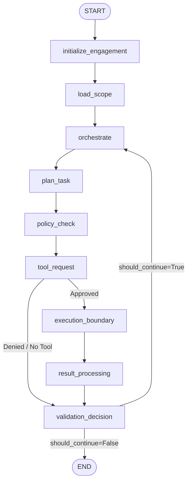
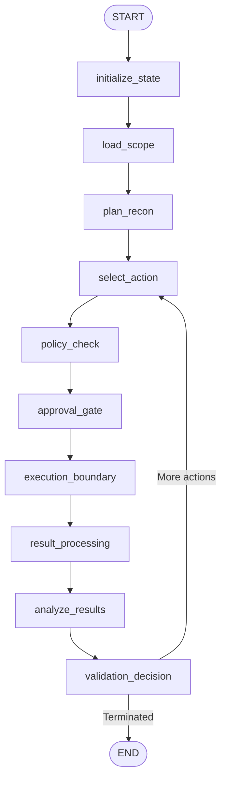

# ARKA Architecture Consistency Report

**Date:** 2026-09-17  
**Repository:** `jivi001/ARKA`  
**Git Commit Audited:** `8aabb7b` (HEAD)  
**Graphify Baseline Commit:** `77f55377`  

---

## 1. Executive Summary

This architecture consistency report evaluates the alignment between:
1. **Source Code Architecture:** The actual Python implementation in `arka/app/`.
2. **Runtime Execution Graph:** The LangGraph state graphs compiled and executed by agents.
3. **Graphify Knowledge Graph:** The 3,600-node static graph generated in `graphify-out/`.
4. **TRD Architecture:** The technical requirements defined in `docs/TRD.md`.
5. **PRD Workflow:** The product requirements defined in `docs/PRD.md`.

### Primary Architectural Finding

> **The documentation describes an integrated multi-agent system where an Orchestrator dynamically coordinates specialized Recon, Web, and Validation agents. In reality, the runtime execution consists of fragmented, isolated sub-graphs and procedural classes with NO unified multi-agent LangGraph supervisor.**

---

## 2. Layer-by-Layer Architectural Comparison

| Architectural Dimension | TRD / PRD Specification | Graphify Static Model (`graphify-out`) | Actual Runtime Implementation | Consistency Status |
| :--- | :--- | :--- | :--- | :--- |
| **Agent Orchestration** | Hierarchical multi-agent supervisor orchestrating Recon, Web, Validation agents | Nodes exist for all 4 agents; static imports shown | `OrchestratorAgent.create_graph()` only executes single tools directly via `ToolRegistry`. Zero references to `ReconAgent`, `WebAgent`, or `ValidationAgent` in the orchestrator runtime graph. | **MISMATCH (Fragmented)** |
| **LangGraph Topology** | Unified multi-agent graph with dynamic delegation and interrupt checkpoints | Shows class-level nodes without runtime state transition edges | Two separate, completely disjoint LangGraph workflows exist (`OrchestratorState` graph and `ReconAgentState` graph). `WebAgent` and `ValidationAgent` have NO LangGraph graphs. | **MISMATCH (Disjoint)** |
| **Control Plane Boundary** | `LLM -> CandidateToolRequest -> Deterministic Gates -> Authoritative ToolRequest -> ExecutionManager` | Shows connections between `ToolRegistry`, `PolicyEngine`, `ScopeGuard`, `ApprovalManager` | Fully implemented and strictly enforced in `ToolRegistry.validate_candidate_request`. `ExecutionManager` rejects unstamped requests. | **CONSISTENT (PASS)** |
| **Epistemic Ladder** | `OBSERVED -> CANDIDATE -> SUPPORTED -> VALIDATED -> HUMAN_CONFIRMED`. Deterministic proof required for `VALIDATED`. | References `FindingStatus` and `FindingCandidate` | Enum only has `[observed, suspected, validating, validated, false_positive]`. `ValidationAgent._assess_results` allows raw LLM output to directly promote findings to `VALIDATED`. | **VULNERABILITY / DIVERGENCE** |
| **Finding Persistence** | PostgreSQL authoritative storage for findings, evidence, and audit | Shows `models.py` as god node | `FindingDB` table is completely missing from SQLAlchemy `models.py` and Alembic migrations. Findings exist ONLY in memory (`InMemoryAssetRepository`). | **DEFECT / MISSING** |
| **Approval System** | Cryptographic binding (Merkle batch root, request-hash, scope version) | Shows `ApprovalManager` connected to `PolicyEngine` | Approvals bind `(engagement_id, task_id, tool_name, target, scope_version)`. **Request-hash / argument binding is NOT verified**, allowing argument tampering after approval. Merkle batching not implemented. | **VULNERABILITY / PARTIAL** |
| **Web Security Client** | Hardened client with pre-request SSRF, redirect interception, TOCTOU protection | Shows `ControlledHTTPClient` connected to `WebSSRFValidator` | Fully implemented and runtime verified. Blocks loopback, RFC1918, cloud metadata, and validates redirect hops. | **CONSISTENT (PASS)** |
| **Visual Dashboard / UI** | Live assessment dashboard, approval panel, finding view | References dashboard in documentation nodes | **0% frontend code**. No HTML/JS templates, no dashboard. FastAPI Swagger UI (`/docs`) is the only visual interface. | **DOCUMENTED ONLY** |

---

## 3. Disjoint Runtime Graph vs Source AST Analysis

### 3.1 Orchestrator Runtime Graph (`arka/app/agents/orchestrator/graph.py`)

The compiled LangGraph execution graph for the Orchestrator has 9 nodes:

#### Discrepancies:
1. **Missing Child Agents:** In the TRD, the Orchestrator delegates tasks to specialized sub-agents. In code, `tool_request` builds a `ToolRequest` directly for registered CLI/mock tools (`echo_test`, `nmap`, `high_risk_mock`). It **never invokes ReconAgent or WebAgent**.
2. **Missing Finding Ingestion:** When the LLM outputs `{"action": "report_finding"}`, `orchestrate()` ignores it because it only processes `action == "request_tool"`. Findings are silently dropped.

### 3.2 ReconAgent Runtime Graph (`arka/app/agents/recon/graph.py`)

The ReconAgent has an independent 10-node LangGraph workflow:

#### Discrepancies:
1. **Siloed Execution:** This workflow is triggered solely via `ReconService.start_recon()` or `arq_worker.run_recon_task()`. It is not part of the primary assessment loop in `OrchestratorAgent`.
2. **Duplicated Gates:** Both `OrchestratorAgent` and `ReconAgent` implement duplicate policy check, approval gate, and execution boundary logic rather than sharing a reusable LangGraph subgraph pattern.

### 3.3 WebAgent and ValidationAgent: Procedural Classes (No Graph)

Neither `WebAgent` (`arka/app/agents/web/agent.py`) nor `ValidationAgent` (`arka/app/agents/validation/agent.py`) uses LangGraph. They are procedural Python classes inheriting from `BaseAgent`:
- `WebAgent` executes sequential async methods (`crawl_target`, `discover_openapi`, `discover_graphql`).
- `ValidationAgent` executes `validate_finding()`, calling LLMs with `_create_validation_plan()` and `_assess_results()`.

---

## 4. Graphify Static Graph Analysis (`graphify-out/`)

Graphify analyzed 303 repository files at commit `77f55377`, creating:
- **3,600 nodes**
- **9,795 edges**
- **208 communities**

### 4.1 Freshness Gap
- **Graphify Baseline Commit:** `77f55377` (2026-09-06)
- **Current Git HEAD:** `8aabb7b` (2026-09-17)
- **Status:** Stale by 11 days of development and commits.

### 4.2 Static Graph Illusions vs Runtime Reality

1. **Phantom Multi-Agent Coupling:**
   - Graphify generates community clusters grouping `OrchestratorAgent`, `ReconAgent`, `WebAgent`, and `ValidationAgent` because they share imports (`BaseAgent`, `LLMGateway`, `ToolRegistry`).
   - At runtime, there is **zero coupling or communication** between the Orchestrator and the other three agents.
2. **Unrepresented Execution Gate:**
   - Graphify models `ExecutionManager` and `ToolRegistry` as adjacent modules.
   - It cannot model the critical stateful property that `ExecutionManager` checks `request.scope_validated` and `request.policy_approved`.
3. **Database Model Disconnect:**
   - Graphify identifies `arka/app/database/models.py` as a primary community hub (64 connections).
   - However, it fails to flag that the relational schema has no table for `findings`, creating a critical architectural gap where `FindingCandidate` models exist in memory but cannot be persisted to PostgreSQL.

---

## 5. Summary of Architecture Mismatches

| ID | Component | Architectural Defect / Mismatch | Severity |
| :--- | :--- | :--- | :--- |
| **ARCH-01** | Orchestrator Topology | Orchestrator does not delegate to or coordinate child agents (`ReconAgent`, `WebAgent`, `ValidationAgent`). | **High** |
| **ARCH-02** | Agent Graph Fragmentation | `WebAgent` and `ValidationAgent` lack LangGraph definitions; `ReconAgent` runs on an isolated disjoint graph. | **Medium** |
| **ARCH-03** | Epistemic Ladder & LLM Validation | `ValidationAgent._assess_results` accepts unvalidated LLM output to set `FindingValidationStatus.VALIDATED`. Enum lacks TRD stages `[candidate, supported, human_confirmed]`. | **Critical** |
| **ARCH-04** | Missing Database Persistence | `FindingDB` table is absent from SQLAlchemy models and migrations. Findings cannot be persisted to PostgreSQL. | **Critical** |
| **ARCH-05** | Approval Request-Hash Binding | `validate_candidate_request` does not bind tool arguments to the approval ID, allowing argument manipulation after approval. | **Critical** |
| **ARCH-06** | Missing Visual Interface | PRD specifies a real-time web dashboard, approval panel, and findings UI. Actual implementation has 0% frontend code. | **High** |
| **ARCH-07** | Route / CLI Drift | 6 documented API routes and multiple CLI commands target nonexistent FastAPI endpoints (`404 Not Found`). | **High** |
