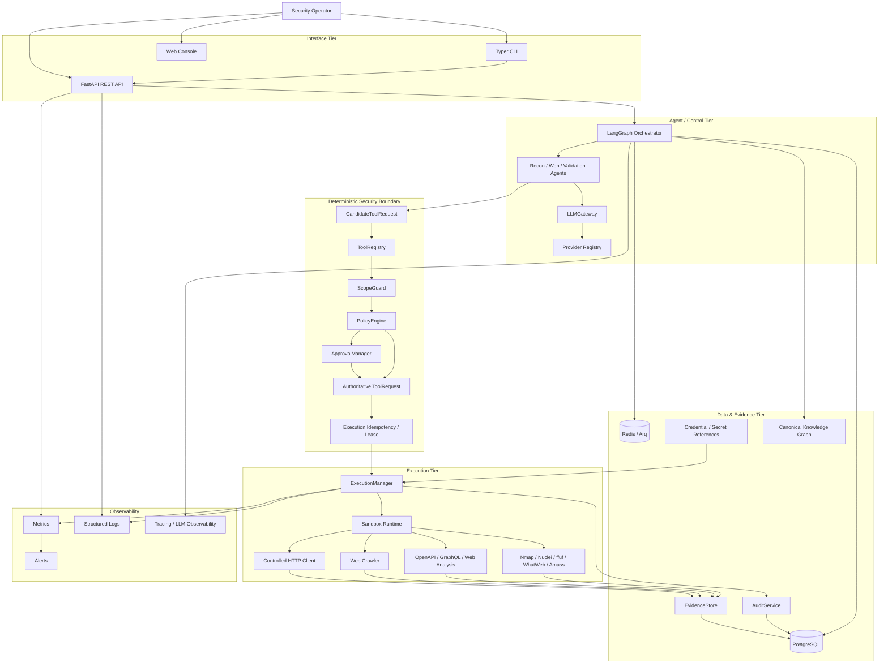
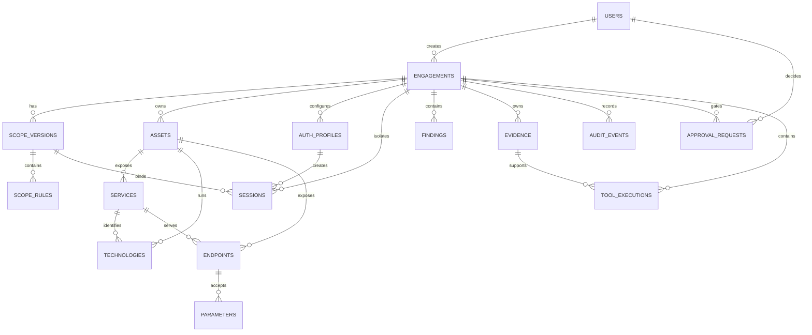

# ARKA — Technical Requirements Document (TRD)

**Document status:** Proposed engineering baseline  
**Product:** ARKA — Autonomous Risk Knowledge & Assessment  
**Repository:** `jivi001/ARKA`  
**Date:** 2026-09-16  
**Audience:** Security engineering, backend/platform engineering, DevSecOps, application security, SRE  
**Primary constraint:** Authorized security assessment only

> **Repository grounding:** The current repository contains the documented four-tier architecture, deterministic ScopeGuard/PolicyEngine/ApprovalManager/ToolRegistry control plane, LangGraph orchestration, PostgreSQL persistence/checkpointing, Redis/Arq execution infrastructure and canonical security data models. fileciteturn6file0L2-L2 Phase 2 documentation records secure execution, reconnaissance, evidence, canonical models, correlation and validation capabilities. fileciteturn7file0L2-L2 The repository README/roadmap still contains stale `PLANNED` labels for some completed phases; implementation work must treat the actual source tree and verified OAT as authoritative and synchronize documentation as part of this TRD.

---

# 1. ARCHITECTURAL OVERVIEW

## 1.1 System objectives

The technical architecture must provide:

- deterministic authorization;
- strict target scoping;
- isolated tool execution;
- durable workflow state;
- evidence provenance;
- immutable auditability;
- bounded autonomous reasoning;
- controlled authentication/session handling;
- safe web/API analysis;
- reliable worker execution;
- provider-independent LLM integration;
- observable and recoverable operations.

The existing architecture explicitly separates interface, orchestration/intelligence, security/policy, and execution/persistence tiers. fileciteturn6file0L2-L2

## 1.2 Proposed target architecture



## 1.3 Trust boundaries

### TB-1: External target → ARKA

All target content is hostile/untrusted data.

### TB-2: LLM → ARKA

All model output is untrusted structured data.

### TB-3: Candidate → authoritative request

This is the primary authorization boundary. Only deterministic code can create an authoritative `ToolRequest`.

### TB-4: Control plane → execution plane

Execution is possible only after scope, policy, approval and runtime checks succeed.

### TB-5: Credential store → execution

Credentials are referenced through opaque handles and injected only into the authorized execution context.

### TB-6: Execution → persistence

Execution results are normalized, sanitized and content-addressed before becoming durable evidence.

## 1.4 Technology stack

| Layer | Technology | Requirement |
|---|---|---|
| Language | Python 3.13+ | Strong typing and modern async runtime |
| API | FastAPI | REST API with Pydantic contracts |
| Validation | Pydantic v2 | Strict request/response schemas |
| Agent orchestration | LangGraph | Durable, interruptible workflows |
| LLM abstraction | LiteLLM + LLMGateway | Provider abstraction, retries, fallback and normalized responses |
| Database | PostgreSQL 16+ | Durable application/security state |
| ORM | SQLAlchemy 2.0 + asyncpg | Async database access |
| Migrations | Alembic | Versioned schema changes |
| Queue/cache | Redis 7+ | Task queue/broker and bounded caching |
| Workers | Arq | Async background execution |
| CLI | Typer + Rich | Operator workflow |
| Runtime isolation | DockerSandboxRuntime + LocalSafeRuntime | Least-privilege execution |
| HTTP | httpx.AsyncClient | Controlled HTTP access |
| XML | defusedxml | Safe XML parsing |
| YAML | PyYAML safe loader | No unsafe object construction |
| Observability | Structlog + Langfuse | Structured logs and LLM traces |
| Testing | Pytest | Unit, security, integration and acceptance tests |
| Static quality | Ruff + Mypy | Formatting/lint/type gates |

The repository README documents this core stack. fileciteturn4file0L2-L2

## 1.5 Architectural invariants

### Security invariants

```text
LLM != Authority
DISCOVERED != AUTHORIZED
DENY != ERROR TO IGNORE
Approval != Global Permission
Credential Reference != Credential Value
Evidence != Execution Capability
```

### Execution rule

```text
No authoritative ToolRequest
        => no execution
```

### Scope rule

```text
Any exclusion match
        => DENY
```

### Approval rule

```text
HIGH / CRITICAL operation
        => valid contextual approval
        => execution
```

---

# 2. DATA MODEL & SCHEMA DESIGN

## 2.1 Design principles

1. Security-critical records are engagement-scoped.
2. Foreign keys enforce ownership relationships.
3. UUIDs are preferred for externally visible identifiers.
4. Scope changes create a new immutable scope version.
5. Evidence is content-addressed by SHA-256.
6. Audit events are append-only.
7. Credentials are never stored in normal domain records as plaintext values.
8. Discovery records do not imply authorization.
9. Findings retain provenance to observations/evidence.
10. Security state transitions are transactionally persisted.

## 2.2 Core entities

### `users`

| Column | Type | Key | Requirements |
|---|---|---|---|
| id | UUID | PK | Stable user identity |
| external_subject | VARCHAR(255) | UNIQUE | Identity-provider subject |
| display_name | VARCHAR(255) | | Human-readable name |
| status | VARCHAR(32) | | active/suspended |
| created_at | TIMESTAMPTZ | | Creation time |
| updated_at | TIMESTAMPTZ | | Last update |

### `engagements`

| Column | Type | Key | Requirements |
|---|---|---|---|
| id | UUID | PK | Engagement identity |
| name | VARCHAR(255) | | Required |
| objective | TEXT | | Assessment objective |
| status | VARCHAR(32) | | lifecycle state |
| created_by | UUID | FK users.id | Owner |
| scope_version | INTEGER | | Current scope version |
| started_at | TIMESTAMPTZ | | Optional |
| stopped_at | TIMESTAMPTZ | | Optional |
| created_at | TIMESTAMPTZ | | Creation |
| updated_at | TIMESTAMPTZ | | Update |

### `scope_versions`

| Column | Type | Key | Requirements |
|---|---|---|---|
| id | UUID | PK | Scope version identity |
| engagement_id | UUID | FK | Parent engagement |
| version | INTEGER | UNIQUE(engagement_id,version) | Monotonic |
| rules_json | JSONB | | Canonical normalized scope |
| created_by | UUID | FK | Operator |
| created_at | TIMESTAMPTZ | | Immutable |

### `scope_rules`

| Column | Type | Key | Requirements |
|---|---|---|---|
| id | UUID | PK | Rule identity |
| scope_version_id | UUID | FK | Scope version |
| rule_type | VARCHAR(32) | | ip/cidr/domain/url/port |
| value | TEXT | | Canonical rule |
| action | VARCHAR(16) | | include/exclude |
| priority | INTEGER | | Deterministic evaluation |

### `assets`

| Column | Type | Key | Requirements |
|---|---|---|---|
| id | UUID | PK | Deterministic canonical identity |
| engagement_id | UUID | FK | Engagement ownership |
| asset_type | VARCHAR(32) | | host/ip/domain |
| canonical_value | TEXT | | Normalized identity |
| discovered_not_authorized | BOOLEAN | | Default true for discovery |
| authorization_state | VARCHAR(32) | | discovered/authorized/rejected |
| first_seen_at | TIMESTAMPTZ | | Provenance |
| last_seen_at | TIMESTAMPTZ | | Provenance |

### `services`

| Column | Type | Key | Requirements |
|---|---|---|---|
| id | UUID | PK | Canonical service identity |
| asset_id | UUID | FK | Parent asset |
| protocol | VARCHAR(16) | | tcp/udp/http/https/etc. |
| port | INTEGER | | 1–65535 |
| product | VARCHAR(255) | | Optional |
| version | VARCHAR(255) | | Optional |
| state | VARCHAR(32) | | observed state |

### `technologies`

| Column | Type | Key | Requirements |
|---|---|---|---|
| id | UUID | PK | Identity |
| asset_id | UUID | FK | Optional asset |
| service_id | UUID | FK | Optional service |
| name | VARCHAR(255) | | Product/framework |
| version | VARCHAR(255) | | Optional |
| confidence | NUMERIC(5,4) | | 0–1 |

### `endpoints`

| Column | Type | Key | Requirements |
|---|---|---|---|
| id | UUID | PK | Deterministic canonical identity |
| asset_id | UUID | FK | Parent asset |
| service_id | UUID | FK | Optional service |
| method | VARCHAR(16) | | Normalized HTTP method |
| normalized_url | TEXT | | Canonical URL |
| path | TEXT | | Normalized path |
| discovered_not_authorized | BOOLEAN | | Default true |
| auth_required | BOOLEAN | | Observation |
| source | VARCHAR(64) | | crawler/openapi/graphql/manual |

### `parameters`

| Column | Type | Key | Requirements |
|---|---|---|---|
| id | UUID | PK | Identity |
| endpoint_id | UUID | FK | Parent endpoint |
| name | VARCHAR(255) | | Parameter name |
| location | VARCHAR(32) | | path/query/header/cookie/body |
| data_type | VARCHAR(64) | | Normalized type |
| required | BOOLEAN | | Schema property |
| sensitivity | VARCHAR(32) | | normal/secret/personal |

### `sessions`

| Column | Type | Key | Requirements |
|---|---|---|---|
| id | UUID | PK | Opaque session handle |
| engagement_id | UUID | FK | Isolation |
| scope_version_id | UUID | FK | Authorization context |
| auth_profile_id | UUID | FK | Authentication definition |
| target_origin | TEXT | | Canonical origin |
| status | VARCHAR(32) | | active/expired/revoked |
| expires_at | TIMESTAMPTZ | | Mandatory expiry |
| created_at | TIMESTAMPTZ | | Creation |
| last_used_at | TIMESTAMPTZ | | Activity |

Raw session credentials MUST NOT be stored in this table.

### `auth_profiles`

| Column | Type | Key | Requirements |
|---|---|---|---|
| id | UUID | PK | Identity |
| engagement_id | UUID | FK | Isolation |
| name | VARCHAR(255) | | Operator-visible name |
| auth_type | VARCHAR(32) | | cookie/bearer/api_key/form |
| credential_ref | VARCHAR(255) | | External secret reference |
| target_origin | TEXT | | Bound origin |
| status | VARCHAR(32) | | active/revoked |
| created_at | TIMESTAMPTZ | | |

### `findings`

| Column | Type | Key | Requirements |
|---|---|---|---|
| id | UUID | PK | Finding identity |
| engagement_id | UUID | FK | Ownership |
| title | TEXT | | Finding title |
| severity | VARCHAR(16) | | INFO/LOW/MEDIUM/HIGH/CRITICAL |
| status | VARCHAR(32) | | observed/suspected/validated/false_positive/remediated |
| confidence | NUMERIC(5,4) | | 0–1 |
| description | TEXT | | Sanitized description |
| remediation | TEXT | | Guidance |
| first_seen_at | TIMESTAMPTZ | | |
| last_validated_at | TIMESTAMPTZ | | |

### `evidence`

| Column | Type | Key | Requirements |
|---|---|---|---|
| sha256 | CHAR(64) | PK | Content address |
| engagement_id | UUID | FK | Ownership |
| evidence_type | VARCHAR(32) | | HTTP/STDOUT/STDERR/JSON/etc. |
| size_bytes | BIGINT | | Bounded |
| metadata_json | JSONB | | Sanitized metadata |
| storage_ref | TEXT | | Blob/object reference |
| created_at | TIMESTAMPTZ | | Immutable |

### `audit_events`

| Column | Type | Key | Requirements |
|---|---|---|---|
| id | UUID | PK | Event identity |
| engagement_id | UUID | FK | Context |
| event_type | VARCHAR(64) | | Security event |
| actor_type | VARCHAR(32) | | human/agent/system |
| actor_id | UUID | | Optional |
| correlation_id | UUID | | Traceability |
| payload_json | JSONB | | Sanitized |
| previous_hash | CHAR(64) | | Chain integrity |
| event_hash | CHAR(64) | UNIQUE | Hash chain |
| created_at | TIMESTAMPTZ | | Immutable |

### `approval_requests`

| Column | Type | Key | Requirements |
|---|---|---|---|
| id | UUID | PK | Approval identity |
| engagement_id | UUID | FK | Isolation |
| task_id | UUID | | Workflow context |
| tool_name | VARCHAR(128) | | Exact tool |
| target_canonical | TEXT | | Exact target |
| arguments_hash | CHAR(64) | | Exact argument binding |
| scope_version | INTEGER | | Scope binding |
| risk_level | VARCHAR(16) | | Risk |
| status | VARCHAR(32) | | required/granted/rejected/expired/executed/revoked |
| requested_at | TIMESTAMPTZ | | |
| expires_at | TIMESTAMPTZ | | Mandatory expiry |
| decided_by | UUID | FK users.id | Approver |
| decided_at | TIMESTAMPTZ | | |

### `tool_executions`

| Column | Type | Key | Requirements |
|---|---|---|---|
| id | UUID | PK | Execution identity |
| engagement_id | UUID | FK | Isolation |
| task_id | UUID | | Workflow |
| tool_name | VARCHAR(128) | | Tool |
| request_hash | CHAR(64) | | Idempotency |
| status | VARCHAR(32) | | queued/running/succeeded/failed/cancelled |
| started_at | TIMESTAMPTZ | | |
| finished_at | TIMESTAMPTZ | | |
| evidence_sha256 | CHAR(64) | FK evidence.sha256 | Result |

## 2.3 Relationship diagram



## 2.4 Indexing requirements

Minimum indexes:

- `engagements(status, created_at)`
- `scope_versions(engagement_id, version)` unique
- `scope_rules(scope_version_id, rule_type, action)`
- `assets(engagement_id, canonical_value)` unique where appropriate
- `services(asset_id, protocol, port)` unique
- `endpoints(asset_id, method, normalized_url)` unique
- `parameters(endpoint_id, name, location)` unique
- `sessions(engagement_id, status, expires_at)`
- `findings(engagement_id, severity, status)`
- `evidence(engagement_id, created_at)`
- `audit_events(engagement_id, created_at)`
- `approval_requests(engagement_id, status, expires_at)`
- `tool_executions(engagement_id, request_hash)`

---

# 3. API SPECIFICATIONS

## 3.1 API conventions

Base path:

```text
/api/v1
```

All API responses should include:

```json
{
  "request_id": "uuid",
  "data": {},
  "error": null
}
```

Errors:

```json
{
  "request_id": "uuid",
  "data": null,
  "error": {
    "code": "SCOPE_DENIED",
    "message": "Target is outside the effective engagement scope"
  }
}
```

Do not return secrets, raw provider credentials or unsanitized sensitive HTTP headers.

## 3.2 Engagement APIs

### Create engagement

**POST** `/api/v1/engagements`

Request:

```json
{
  "name": "Web Application Assessment",
  "objective": "Assess authorized application attack surface",
  "scope": {
    "includes": [
      {"type": "url", "value": "http://127.0.0.1:3000"}
    ],
    "excludes": [
      {"type": "url", "value": "http://127.0.0.1:8000"}
    ],
    "ports": [80, 443, 3000]
  },
  "policy_profile": "standard-authorized-assessment"
}
```

Success `201`:

```json
{
  "request_id": "uuid",
  "data": {
    "id": "uuid",
    "status": "created",
    "scope_version": 1
  },
  "error": null
}
```

Errors:

```json
{
  "request_id": "uuid",
  "data": null,
  "error": {
    "code": "INVALID_SCOPE",
    "message": "Scope contains an invalid or ambiguous target"
  }
}
```

### Start engagement

**POST** `/api/v1/engagements/{engagement_id}/start`

Request:

```json
{
  "assessment_profile": "web-api-standard"
}
```

Success:

```json
{
  "request_id": "uuid",
  "data": {
    "engagement_id": "uuid",
    "status": "running",
    "workflow_id": "uuid"
  },
  "error": null
}
```

### Status

**GET** `/api/v1/engagements/{engagement_id}`

Success:

```json
{
  "request_id": "uuid",
  "data": {
    "id": "uuid",
    "status": "running",
    "phase": "web_analysis",
    "scope_version": 2,
    "tasks_running": 2,
    "pending_approvals": 1,
    "assets": 14,
    "endpoints": 63,
    "findings": 4
  },
  "error": null
}
```

## 3.3 Scope APIs

### Create new scope version

**POST** `/api/v1/engagements/{engagement_id}/scope`

Request:

```json
{
  "includes": [
    {"type": "domain", "value": "app.example.test"}
  ],
  "excludes": [
    {"type": "host", "value": "admin.example.test"}
  ]
}
```

Success:

```json
{
  "request_id": "uuid",
  "data": {
    "scope_version": 3,
    "effective_rules": 2
  },
  "error": null
}
```

Any scope change MUST invalidate incompatible pending approvals.

## 3.4 Web APIs

### Start crawler

**POST** `/api/v1/engagements/{engagement_id}/web/crawl`

Request:

```json
{
  "target": "http://127.0.0.1:3000",
  "max_pages": 100,
  "max_depth": 5,
  "max_requests": 200,
  "max_response_bytes": 1048576,
  "session_ref": null
}
```

Success:

```json
{
  "request_id": "uuid",
  "data": {
    "task_id": "uuid",
    "status": "queued"
  },
  "error": null
}
```

### OpenAPI analysis

**POST** `/api/v1/engagements/{engagement_id}/web/openapi`

Request:

```json
{
  "target": "http://127.0.0.1:3000/openapi.json",
  "max_document_bytes": 5242880
}
```

### GraphQL analysis

**POST** `/api/v1/engagements/{engagement_id}/web/graphql`

Request:

```json
{
  "target": "http://127.0.0.1:3000/graphql",
  "introspection": true,
  "max_query_depth": 8,
  "max_response_bytes": 1048576
}
```

## 3.5 Findings APIs

### List findings

**GET** `/api/v1/engagements/{engagement_id}/findings?status=validated&severity=high`

Success:

```json
{
  "request_id": "uuid",
  "data": {
    "items": [
      {
        "id": "uuid",
        "title": "Potential object-level authorization weakness",
        "severity": "high",
        "status": "validated",
        "confidence": 0.94,
        "evidence": ["sha256:..."],
        "affected_endpoint": "uuid"
      }
    ],
    "total": 1
  },
  "error": null
}
```

## 3.6 Approval APIs

### List approvals

**GET** `/api/v1/approvals?engagement_id={id}&status=required`

### Decide approval

**POST** `/api/v1/approvals/{approval_id}/decide`

Request:

```json
{
  "decision": "GRANTED",
  "reason": "Authorized by assessment owner"
}
```

Success:

```json
{
  "request_id": "uuid",
  "data": {
    "approval_id": "uuid",
    "status": "granted",
    "scope_version": 3,
    "expires_at": "2026-09-16T20:00:00Z"
  },
  "error": null
}
```

The API MUST reject decisions made against stale scope or wrong engagement context.

## 3.7 Audit API

**GET** `/api/v1/engagements/{engagement_id}/audit`

Response:

```json
{
  "request_id": "uuid",
  "data": {
    "items": [
      {
        "id": "uuid",
        "event_type": "POLICY_DECISION",
        "actor_type": "system",
        "decision": "DENY",
        "reason_code": "OUT_OF_SCOPE",
        "event_hash": "sha256..."
      }
    ]
  },
  "error": null
}
```

## 3.8 Evidence API

**GET** `/api/v1/engagements/{engagement_id}/evidence/{sha256}`

Return metadata and sanitized content according to evidence sensitivity policy. Do not expose credentials merely because they occurred in an HTTP transaction.

## 3.9 LLM APIs

### Provider status

**GET** `/api/v1/llm/providers`

### LLM status

**GET** `/api/v1/llm/status`

Returned data should expose provider/model/capabilities/health, not API keys.

---

# 4. INFRASTRUCTURE, SCALE & PERFORMANCE

## 4.1 Runtime topology

Development:

```text
Developer
  |
  +-- FastAPI
  +-- ARQ worker
  +-- PostgreSQL
  +-- Redis
  +-- Docker sandbox
  +-- LLM provider
```

Production target:

```text
Load Balancer
      |
  API replicas
      |
PostgreSQL HA
      |
Redis HA / managed queue
      |
Worker pool
      |
Ephemeral execution runtimes
      |
Controlled external tools / HTTP targets
```

## 4.2 Scaling strategy

### API

- Stateless application replicas where possible.
- No security state held only in process memory.
- Connection pool sizing based on PostgreSQL capacity.
- Per-user/tenant/engagement rate limits in enterprise deployment.

### Workers

- Separate queues for low-risk analysis and gated/high-risk work.
- Bounded concurrency per worker.
- Per-engagement concurrency budget.
- Global platform execution budget.
- Dead-letter handling for irrecoverable tasks.

### PostgreSQL

- Proper indexes listed in the schema section.
- Connection pooling.
- Transactional approval and execution state transitions.
- Point-in-time recovery for production deployments.
- Read replicas only for non-authoritative analytics; security decisions must use authoritative state.

### Redis

Use Redis for:

- task queue/broker;
- ephemeral coordination;
- bounded cache;
- rate-limit counters.

Do not treat Redis as the authoritative source for security decisions.

## 4.3 Rate limiting

Minimum logical limits:

| Resource | Default target |
|---|---:|
| API requests/user | 120/min |
| LLM requests/engagement | 60/min |
| Web requests/engagement | 20 concurrent |
| Crawl pages/task | 1,000 |
| Crawl requests/task | 2,000 |
| HTTP response | 5 MiB |
| OpenAPI document | 5 MiB |
| GraphQL response | 1 MiB |
| Candidate tool arguments | 256 KiB |

These values must be configurable through a validated policy profile and cannot be increased by LLM output.

## 4.4 Resource isolation

Each execution must have:

- CPU limit;
- memory limit;
- process/PID limit;
- wall-clock deadline;
- output-size limit;
- network policy;
- filesystem policy;
- environment-variable allowlist;
- temporary workspace with cleanup.

The existing Phase 2 architecture already documents LocalSafeRuntime and DockerSandboxRuntime with least-privilege execution. fileciteturn7file0L2-L2

## 4.5 Security requirements

### Transport

- TLS 1.2+; TLS 1.3 preferred.
- HSTS for externally exposed web console/API.
- Secure cookie attributes for browser sessions.
- No credentials in URLs.

### Encryption

- PostgreSQL storage encrypted at rest in production.
- Object/evidence storage encrypted at rest.
- Secret manager/KMS for provider and target credentials.
- Key rotation supported.

### Authentication / authorization

Core local deployment may use operator authentication appropriate to the environment. Enterprise deployment must provide:

- OIDC/SAML SSO;
- RBAC;
- least privilege;
- MFA through the identity provider;
- session timeout;
- audit of administrative actions.

Suggested roles:

```text
VIEWER
ANALYST
APPROVER
ENGAGEMENT_MANAGER
PLATFORM_ADMIN
SECURITY_ADMIN
```

No role should automatically bypass ScopeGuard.

### Data privacy

- Data minimization for evidence.
- Configurable evidence retention.
- Redaction before remote LLM transmission.
- Tenant/engagement isolation.
- Export/delete workflows subject to audit and retention policy.
- Data residency controls for enterprise deployment.

### Supply chain

- Lock dependencies.
- Generate SBOM for release builds.
- Scan container images and Python dependencies.
- Sign release artifacts where deployment maturity requires it.
- Pin base images to reviewed versions/digests.

## 4.6 SSRF requirements

All server-side HTTP operations must pass:

```text
URL parser
→ canonicalization
→ scheme allowlist
→ DNS resolution
→ IP classification
→ ScopeGuard
→ connection
```

Redirects repeat the validation process for every hop.

Blocked categories include:

- loopback;
- RFC1918 private networks;
- link-local;
- cloud metadata endpoints;
- unsupported schemes;
- ambiguous/malformed host representations.

## 4.7 Authentication/session requirements

Session references must be:

- random/opaque;
- engagement-bound;
- target-origin-bound;
- scope-version-aware;
- time-limited;
- revocable;
- non-transferable across engagements.

Raw secrets must be injected only into execution contexts that have passed authorization.

---

# 5. ERROR HANDLING & OBSERVABILITY

## 5.1 Error taxonomy

Every subsystem should emit structured errors with stable codes.

Example categories:

```text
VALIDATION_ERROR
SCOPE_DENIED
POLICY_DENIED
APPROVAL_REQUIRED
APPROVAL_INVALID
APPROVAL_EXPIRED
SESSION_INVALID
SESSION_EXPIRED
SSRF_BLOCKED
REDIRECT_BLOCKED
RESOURCE_LIMIT
TOOL_NOT_FOUND
TOOL_EXECUTION_FAILED
TARGET_TIMEOUT
LLM_PROVIDER_ERROR
LLM_TIMEOUT
LLM_INVALID_OUTPUT
DATABASE_ERROR
QUEUE_ERROR
CHECKPOINT_ERROR
EVIDENCE_ERROR
INTERNAL_ERROR
```

Security-sensitive errors should not reveal implementation secrets or credentials.

## 5.2 Graceful degradation

### LLM provider unavailable

- Retry within bounded policy.
- Use configured fallback provider/model if permitted.
- Preserve workflow state.
- If no safe provider exists, pause rather than execute guessed actions.

### Redis unavailable

- Do not enqueue new execution work.
- Preserve durable state in PostgreSQL where possible.
- Return explicit degraded status.

### PostgreSQL unavailable

- No security-sensitive state transitions should be treated as successful.
- Do not execute actions requiring authoritative state.
- Return degraded/fail-closed status.

### Target unavailable

- Mark task failed/blocked according to error type.
- Preserve evidence of the failure.
- Permit bounded retry.
- Do not infer target compromise from availability failure.

### Sandbox unavailable

- Do not execute outside the approved runtime.
- Mark execution blocked.
- Audit the failure.

## 5.3 Structured logging

Every security-relevant log should contain where applicable:

```json
{
  "timestamp": "...",
  "level": "INFO",
  "request_id": "uuid",
  "engagement_id": "uuid",
  "task_id": "uuid",
  "candidate_id": "uuid",
  "tool_request_id": "uuid",
  "tool_name": "http_request",
  "policy_decision": "ALLOW",
  "scope_decision": "ALLOW",
  "approval_state": "NOT_REQUIRED",
  "execution_id": "uuid"
}
```

Never log:

- passwords;
- API keys;
- bearer tokens;
- session cookies;
- full secret-bearing request headers;
- raw credential references if they could reveal secret-manager structure.

## 5.4 Metrics

Required metrics:

### Platform

- API request latency/error rate
- active engagements
- running tasks
- queue depth
- worker utilization
- database pool utilization
- Redis health

### Security

- scope denials
- policy denials
- approval requests
- approval latency
- approval rejection rate
- SSRF blocks
- redirect blocks
- unauthorized candidate requests
- tool execution failures
- sandbox failures

### Agent

- LLM requests
- LLM latency
- token usage
- provider failure rate
- fallback rate
- invalid structured outputs
- replanning count
- tool proposal rejection rate

### Assessment

- assets discovered
- endpoints discovered
- evidence generated
- findings observed/suspected/validated/false-positive
- validation rate
- report generation time

## 5.5 Alert thresholds

Initial operational alerts:

| Condition | Threshold |
|---|---|
| API 5xx | > 2% for 5 min |
| API p95 latency | > 1 s for 10 min |
| Worker failure rate | > 5% for 10 min |
| Queue age | > 5 min for normal work |
| PostgreSQL connection saturation | > 80% for 10 min |
| Redis unavailable | Immediate |
| ScopeGuard failures | Any unexpected internal error |
| Approval bypass detection | Immediate / critical |
| Secret-leak detector | Immediate / critical |
| Sandbox escape indicator | Immediate / critical |
| Unexpected out-of-scope request | Immediate / critical |
| Repeated LLM invalid outputs | > 10% over 15 min |

## 5.6 Tracing

Propagate a correlation ID across:

```text
API
→ workflow
→ LLM call
→ candidate request
→ policy decision
→ approval
→ execution
→ evidence
→ audit
```

LLM traces must sanitize prompts and outputs before external observability systems receive them.

---

# 6. TECHNICAL MILESTONES & IMPLEMENTATION PLAN

## Milestone 0 — Architecture baseline and repository synchronization

### Work

- Synchronize README status with actual implementation.
- Mark Phase 2 and Phase 3.1–3.5 correctly.
- Record OAT baseline.
- Freeze core security invariants.
- Add/update ADRs for major architectural changes.

### Exit criteria

- Documentation matches source tree.
- Existing OAT baseline remains reproducible.
- No Phase 1–3.5 security regression.

---

## Milestone 1 — Security Architecture Hardening

### Work

1. Review ScopeGuard canonicalization.
2. Strengthen DNS/IPv4/IPv6 handling.
3. Revalidate redirects per hop.
4. Harden ToolRegistry schemas.
5. Bind approvals to request hash and scope version.
6. Add execution idempotency.
7. Audit race conditions.
8. Harden EvidenceStore.
9. Harden AuditService.
10. Add secret-leak detection.
11. Add resource budgets.
12. Add structured security error codes.

### Exit criteria

- Security adversarial suite passes.
- No authorization bypass identified.
- Race tests pass.
- Secret-leak tests pass.

---

## Milestone 2 — Phase 3.6 Authentication & Session Foundation

### Work

- AuthProfile model.
- Credential references.
- Session model.
- Session manager.
- target-origin binding.
- scope-version binding.
- expiry/revocation.
- secret injection boundary.
- authentication telemetry.

### Exit criteria

- No raw credential reaches LLM.
- Session cannot cross engagement boundaries.
- Expired/revoked session cannot execute.
- Session state survives restart.

---

## Milestone 3 — Phase 3.7 Authenticated Web Analysis

### Work

- session-aware HTTP client;
- authenticated crawler;
- login/session detection;
- access-state tracking;
- bounded authenticated crawling;
- duplicate/cycle prevention;
- endpoint integration.

### Exit criteria

- Real authenticated Juice Shop test or equivalent controlled target passes.
- SSRF remains enforced under authenticated redirects.
- Discovery does not expand scope.

---

## Milestone 4 — Phase 3.8 Business Logic / Access Control Analysis

### Work

- controlled request variants;
- object identifier analysis;
- role/context comparison;
- response differential analysis;
- state-transition observations;
- confidence scoring;
- validation lifecycle;
- evidence linkage.

### Exit criteria

- Potential authorization anomalies are reported as observations until validated.
- Tests cannot cause uncontrolled destructive behavior.
- Findings retain reproducible evidence.

---

## Milestone 5 — Phase 3.9 Web Security Agent

### Work

- unified web assessment state;
- evidence-aware planning;
- discovery prioritization;
- controlled re-planning;
- deterministic tool selection enforcement;
- approval-aware planning;
- task cancellation;
- durable checkpoint recovery.

### Exit criteria

A live LLM-driven assessment demonstrates:

```text
LLM
→ CandidateToolRequest
→ deterministic gates
→ execution
→ evidence
→ correlation
→ validation
→ report
```

without any direct LLM execution path.

---

## Milestone 6 — Operational Reliability

### Work

- queue retry policies;
- idempotency;
- execution leases;
- cancellation propagation;
- worker restart recovery;
- API restart recovery;
- database transaction hardening;
- health/readiness endpoints;
- resource monitoring.

### Exit criteria

- Failure injection tests pass.
- No duplicate gated execution.
- Recovery does not bypass approval or scope validation.

---

## Milestone 7 — API / CLI / Operator Experience

### Work

- API consistency.
- CLI parity.
- structured output.
- approval UX.
- live assessment status.
- findings/evidence views.
- report generation.

### Exit criteria

A security operator can complete the core workflow without directly accessing internal Python APIs.

---

## Milestone 8 — Phase 3.6–3.9 OAT

### Required test layers

1. Unit.
2. Security/adversarial.
3. Integration.
4. Runtime.
5. Live LLM.
6. Real controlled target.
7. Restart/recovery.
8. Concurrency/race testing.

### Required target

Use a controlled application such as OWASP Juice Shop and dedicated test fixtures for:

- authentication;
- redirects;
- SSRF;
- OpenAPI;
- GraphQL;
- access-control differences;
- oversized responses;
- failures.

### Required final evidence

Produce:

```text
SOURCE_INSPECTED
STATICALLY_VERIFIED
UNIT_TESTED
INTEGRATION_TESTED
RUNTIME_TESTED
LIVE_LLM_TESTED
REAL_TARGET_TESTED
ADVERSARIAL_TESTED
```

Never label unexecuted tests as passed.

---

# TECHNICAL RISKS & ARCHITECTURAL UNKNOWNS

## Risk 1 — Authorization TOCTOU

**Problem:** Scope or approval state can change between validation and execution.  
**Mitigation:** Immutable scope snapshots, transactional state, request hashes and execution-time revalidation.

## Risk 2 — DNS rebinding

**Problem:** Host resolution can change after validation.  
**Mitigation:** Resolve and validate immediately before connection; control connection destination; reject ambiguous resolution; revalidate redirects.

## Risk 3 — LLM output drift

**Problem:** Provider/model changes can alter tool proposal behavior.  
**Mitigation:** strict schemas, deterministic gates, model/provider regression tests and live OAT.

## Risk 4 — Worker duplicate execution

**Problem:** At-least-once queues can produce duplicates.  
**Mitigation:** execution leases, request hashes, idempotency and approval binding.

## Risk 5 — Credential contamination

**Problem:** Authenticated responses may contain secrets or personal data.  
**Mitigation:** redaction pipeline, evidence sensitivity classes, LLM prompt minimization and secret references.

## Risk 6 — Resource exhaustion

**Problem:** Targets or documents can deliberately cause high CPU/memory/network use.  
**Mitigation:** strict budgets at HTTP, parser, crawler, worker and sandbox layers.

## Risk 7 — Architecture drift

**Problem:** New agent/tool features may bypass the established control plane.  
**Mitigation:** architectural review, security ADRs, mandatory control-path tests and OAT regression gates.

## Risk 8 — Remote LLM data exposure

**Problem:** Assessment data may be sent to third-party model providers.  
**Mitigation:** data minimization, configurable provider policy, sensitive-data redaction, local/VPC model options and enterprise residency controls.

## Risk 9 — Documentation divergence

**Problem:** Current README/roadmap status can lag behind actual implementation.  
**Mitigation:** documentation synchronization is a release acceptance criterion.

---

# ARCHITECTURAL DECISIONS REQUIRED BEFORE PHASE 4

1. Whether credential storage uses an external KMS/secrets manager or a local development abstraction.
2. Whether PostgreSQL remains sufficient for Phase 5 attack graphs or a graph database becomes justified.
3. Whether the future UI is a separate frontend service or server-rendered/API-driven application.
4. Exact enterprise RBAC/tenant isolation model.
5. Evidence blob storage backend for production-scale assessments.
6. Remote versus local LLM data handling policy.
7. Exploit authorization model for Phase 4.
8. Maximum autonomy policy per assessment profile.

Until these decisions are resolved, implementation should favor interfaces that preserve the existing deterministic control plane and avoid irreversible infrastructure coupling.

---

# FINAL TECHNICAL DEFINITION OF DONE

The architecture is ready for the next major phase only when:

```text
[ ] Core control plane remains authoritative
[ ] CandidateToolRequest remains untrusted
[ ] ToolRequest can only be minted after deterministic validation
[ ] ScopeGuard is enforced at discovery and execution boundaries
[ ] DISCOVERED != AUTHORIZED is preserved
[ ] Approval is contextual and scope-version-bound
[ ] Execution is idempotent and bounded
[ ] Sandboxes remain least privilege
[ ] Credentials remain outside LLM authority
[ ] SSRF is defended at DNS/IP/redirect/connection layers
[ ] Evidence is content-addressed and immutable
[ ] Audit records are append-only and integrity protected
[ ] PostgreSQL is authoritative for security state
[ ] Redis is not authoritative for authorization
[ ] Worker retries cannot bypass policy
[ ] API/worker restart recovery is verified
[ ] Authentication sessions are isolated
[ ] Web analysis remains bounded
[ ] Findings retain provenance
[ ] LLM provider failures fail safely
[ ] Secret-leak tests pass
[ ] Concurrency tests pass
[ ] Security regression tests pass
[ ] Runtime OAT passes
[ ] Documentation matches implementation
```

**Architecture principle:** ARKA's intelligence may become increasingly autonomous; its authority must not.
