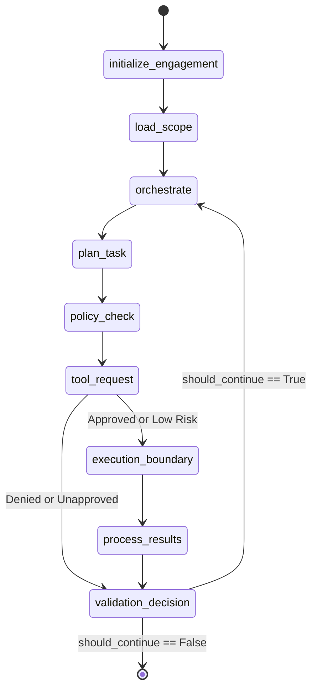

# Orchestrator Agent Implementation

The **Orchestrator Agent** (`arka/app/agents/orchestrator/graph.py`) is the primary coordinator in ARKA. It guides assessment tasks from scope loading through iterative execution and result synthesis.

---

## 1. Graph State & Transitions

---

## 2. Step-by-Step Node Execution

1. **`initialize_engagement` (`_node_init`)**: Validates that the engagement exists, has valid scope configuration, and is in an `active` or `created` state.
2. **`load_scope` (`_node_load_scope`)**: Instantiates `ScopeGuard` and `PolicyEngine` from the engagement's scope definition dictionary.
3. **`orchestrate` (`_node_orchestrate`)**: Formulates the structured prompt containing the assessment objective, scope summary, completed tasks, and errors. Invokes `LLMGateway.complete()`.
4. **`plan_task` (`_node_plan_task`)**: Parses the LLM's JSON response. If an action is requested, constructs an untrusted `CandidateToolRequest`.
5. **`policy_check` (`_node_policy_check`)**: Evaluates the candidate action against `PolicyEngine` to determine risk level and whether human approval is required.
6. **`tool_request` (`_node_tool_request`)**:
   - If `PolicyDecisionType.REQUIRE_APPROVAL`, checks for an existing approval via `ApprovalManager.find_matching_request()`.
   - If not approved, creates a persistent approval in `REQUIRED` state and triggers a LangGraph `interrupt()`.
   - When resumed, re-verifies the approval status. If approved, calls `ToolRegistry.validate_candidate_request()` to mint an authoritative `ToolRequest`.
7. **`execution_boundary` (`_node_execution_boundary`)**: Invokes `ToolRegistry.execute()`, enforcing execution timeouts and safety wrappers.
8. **`process_results` (`_node_process_results`)**: Appends the tool output to `tasks_completed`, logs execution telemetry, and records audit actions.
9. **`validation_decision` (`_node_validation_decision`)**: Checks if iteration limits (`max_iterations`) have been reached or if errors require termination.
