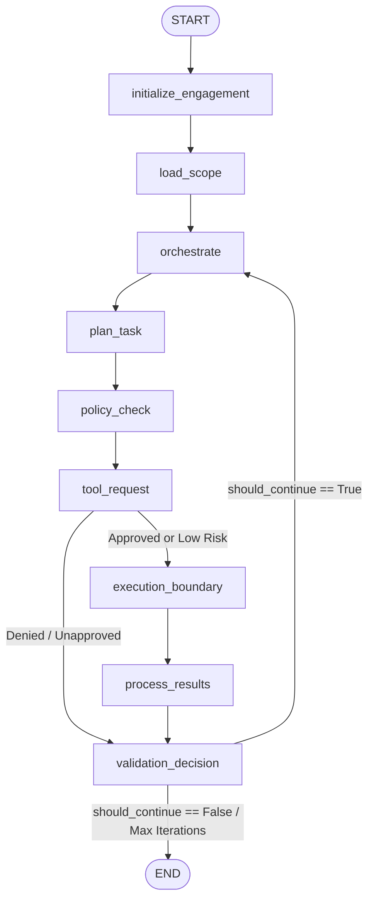

# Agent Architecture

This document describes the agent abstractions, LangGraph integration, state schemas, and interaction models used across ARKA.

---

## 1. Agent Design Philosophy

1. **Stateful Graph Execution**: Agents are implemented as directed graphs using **LangGraph**, allowing cycles, conditional branches, loops, and durable state resumption.
2. **Explicit State Contracts**: All agent memory and state transitions are strongly typed using Pydantic models (`arka/app/core/state/models.py`) and TypedDict definitions (`OrchestratorState`).
3. **No Direct Authority**: Agents cannot authorize their own actions, override scope restrictions, or execute shell commands.

---

## 2. Orchestrator State Contract (`OrchestratorState`)

The orchestrator state contains the complete contextual memory of an active engagement thread:

```python
class OrchestratorState(TypedDict):
    engagement_id: str
    engagement_name: str
    objective: str
    status: str
    scope: dict[str, Any]
    
    # Task Tracking
    current_task_id: str
    current_task_name: str
    current_task_status: str
    
    # LLM Interaction
    llm_response: str
    llm_structured_output: dict[str, Any]
    
    # Tool Proposal & Decision
    candidate_tool_request: dict[str, Any] | None
    policy_decision: dict[str, Any] | None
    tool_request: dict[str, Any] | None
    tool_result: dict[str, Any] | None
    
    # Execution & Approval Control
    should_continue: bool
    requires_approval: bool
    approval_id: str | None
    approval_status: str
    
    # History & Observability
    tasks_completed: Annotated[list[str], operator.add]
    audit_trail: Annotated[list[dict[str, Any]], operator.add]
    errors: Annotated[list[str], operator.add]
    
    # Iteration Safeguards
    iteration_count: int
    max_iterations: int
```

---

## 3. Orchestrator Workflow Graph



---

## 4. Checkpointing & Multi-Turn Persistence

- **Durable Saver**: In production, the graph is compiled with `AsyncPostgresSaver`, saving state snapshots to PostgreSQL after each node execution.
- **Thread Isolation**: Graph invocations are partitioned by `thread_id` (typically formatted as `<engagement_id>:<task_id>`).
- **Resumption via Commands**: When a graph halts at an `interrupt()`, it can be resumed by passing a `langgraph.types.Command(resume={"status": "approved", ...})` targeting the thread ID.
