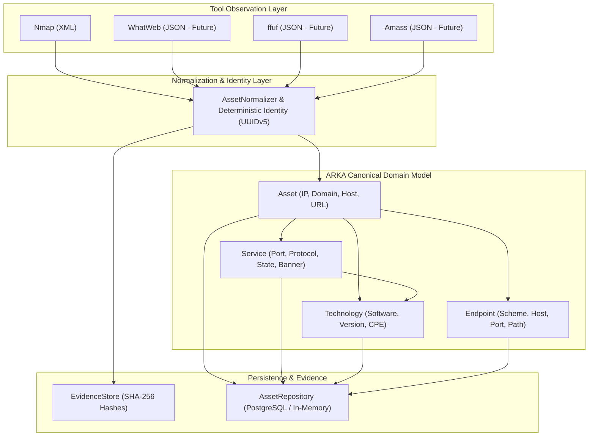

# ARKA Canonical Asset, Service, Technology, and Endpoint Model

## 1. Overview & Purpose

ARKA represents discovered infrastructure through a strictly normalized, tool-independent canonical domain model. 

In offensive security operations, different scanning and reconnaissance tools produce tool-specific output formats (XML, JSON, CLI text, NDJSON). ARKA establishes a uniform representation that abstracts tool specifics while preserving full cryptographic provenance and historical evidence.

---

## 2. Core Entities

### Asset
Represents a network or organizational asset.
- **`asset_id`**: Deterministic UUIDv5 based on `engagement_id` and normalized identifier.
- **`engagement_id`**: Scope and engagement boundary.
- **`asset_type`**: `IP`, `DOMAIN`, `SUBDOMAIN`, `HOST`, `URL`.
- **`address`**: Canonical IP or host address string.
- **`address_type`**: `ipv4`, `ipv6`, etc.
- **`hostname`**: Primary normalized hostname.
- **`domain`**: Registered domain name (e.g. `example.com`).
- **`status`**: `active`, `inactive`, `unknown`, `down`.
- **`source`**: Tool identifier (e.g. `nmap`).
- **`confidence`**: Float value from `0.0` to `1.0`.
- **`evidence_refs`**: List of SHA-256 evidence IDs from `EvidenceStore`.
- **`metadata`**: Extensible metadata dictionary preserving task and execution provenance.

### Service
Represents a network service listening on an Asset.
- **`service_id`**: Deterministic UUIDv5 based on `(engagement_id, asset_id, protocol, port)`.
- **`asset_id`**: Foreign key to the parent `Asset`.
- **`port`**: Port number (1-65535).
- **`protocol`**: Network protocol (e.g. `tcp`, `udp`).
- **`state`**: `open`, `filtered`, `closed`, `unknown`.
- **`service_name`**: Service name (e.g. `http`, `ssh`, `https`).
- **`product`**: Detected daemon or software (e.g. `nginx`, `OpenSSH`).
- **`version`**: Software version string.
- **`cpe`**: List of CPE 2.2 / 2.3 identifiers.
- **`banner`**: Service banner and script headers.
- **`evidence_refs`**: SHA-256 evidence linkages.

### Technology
Represents specific technologies (operating systems, frameworks, applications) observed on an asset or service.
- **`technology_id`**: Deterministic UUIDv5 based on `(engagement_id, asset_id, service_id, name, version)`.
- **`asset_id`**: Associated Asset.
- **`service_id`**: Associated Service (or `None` for host/OS-level technologies).
- **`name`**: Technology name (e.g. `Apache HTTP Server`, `Linux Kernel`).
- **`version`**: Version identifier.
- **`cpe`**: List of CPE strings.

### Endpoint
Represents reachable web application routes and URI endpoints.
- **`endpoint_id`**: Deterministic UUIDv5 based on `(engagement_id, asset_id, scheme, host, port, path)`.
- **`scheme`**: `http`, `https`.
- **`host`**: Hostname or IP.
- **`port`**: Port number.
- **`path`**: Normalized URI path.
- **`query_metadata`**: Discovered query parameters and parameter attributes.

---

## 3. Deterministic Identity Strategy

All canonical entities utilize **UUIDv5** deterministic generation using the fixed ARKA Asset Namespace (`a7e6b8c0-5f21-4d32-9c1a-8e7d6b5c4a3f`).

Deterministic identity ensures:
1. **Idempotence**: Re-running scans against the same target produces identical entity IDs.
2. **Order Independence**: Entity generation does not depend on scan ordering or concurrency.
3. **Engagement Isolation**: Entities from distinct engagements never produce colliding IDs.
4. **Zero LLM Dependency**: Identity generation is purely mathematical and programmatic.

### Normalization Rules
- **IPv4**: Strips leading zeros, normalizes to canonical representation (`192.168.001.010` -> `192.168.1.10`).
- **IPv6**: Standard compressed lowercase format (`2001:0db8::0001` -> `2001:db8::1`).
- **Domains & Hostnames**: Lowercased, stripped, trailing periods removed.
- **URLs**: Lowercase scheme, lowercase host, standard port omission (80 for http, 443 for https), duplicate slash removal (`/api//v1` -> `/api/v1`).
- **Protocols**: Lowercase string (`TCP` -> `tcp`).

---

## 4. Multi-Tool Extensibility

The canonical model is decoupled from any single tool:
- **Nmap** (Phase 2.2.1/2.2.2): Populates `Asset`, `Service`, `Technology`.
- **WhatWeb** (Future): Populates `Technology` with confidence ratings and component frameworks.
- **ffuf** (Future): Populates `Endpoint` with status codes and parameter schemas.
- **Amass / Sublist3r** (Future): Populates `Asset` (Domain, Subdomain).
- **Nuclei** (Future): Links `CandidateFinding` to canonical `Asset`, `Service`, or `Endpoint`.
