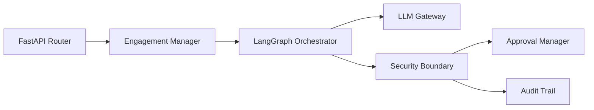

# Control Plane Architecture

The **Control Plane** is responsible for managing engagements, scheduling agent tasks, evaluating reasoning loops, enforcing security policies, and capturing compliance audits.

---

## 1. Responsibilities

- **Engagement Lifecycle**: Managing creation, starting, pausing, resuming, and stopping of assessments.
- **Scope Context Management**: Holding deterministic scope boundaries in memory for real-time validation.
- **Agent Orchestration**: Coordinating LangGraph cyclical state machines.
- **Human-in-the-Loop Interruption**: Pausing workflow execution when higher-risk actions require human authorization.
- **Security Intermediation**: Ensuring no agent or LLM directly touches the OS shell, raw sockets, or tool binaries.

---

## 2. Agent Control Flow & State Machine

The Control Plane manages agent workflows via `arka/app/agents/orchestrator/graph.py`.

### State Graph Nodes

| Node Name | Handler Method | Purpose |
|---|---|---|
| `initialize_engagement` | `_node_init` | Validates engagement status and loads scope definitions into memory. |
| `load_scope` | `_node_load_scope` | Instantiates active `ScopeGuard` and `PolicyEngine` instances for the engagement. |
| `orchestrate` | `_node_orchestrate` | Formulates the prompt with engagement history and queries `LLMGateway`. |
| `plan_task` | `_node_plan_task` | Parses LLM response into untrusted `CandidateToolRequest` structure. |
| `policy_check` | `_node_policy_check` | Runs deterministic scope and policy evaluation without executing the tool. |
| `tool_request` | `_node_tool_request` | Evaluates approval status, manages LangGraph `interrupt()`, and mints `ToolRequest`. |
| `execution_boundary` | `_node_execution_boundary` | Executes validated `ToolRequest` via `ToolRegistry.execute()`. |
| `process_results` | `_node_process_results` | Updates state observations, task status, and audit records with execution output. |
| `validation_decision` | `_node_validation_decision` | Evaluates iteration counts, errors, and determines if next loop should execute. |

---

## 3. Human Approval Gate Mechanism

When a proposed action requires human approval (e.g. `HIGH` or `CRITICAL` risk):

1. **Detection**: `PolicyEngine` returns `PolicyDecisionType.REQUIRE_APPROVAL`.
2. **Lookup & Persistence**: `_node_tool_request` checks for an existing active approval via `ApprovalManager.find_matching_request()`. If none exists, it creates an `ApprovalRequest` in `REQUIRED` status in PostgreSQL.
3. **Graph Interruption**: LangGraph's `interrupt()` function is called, suspending graph execution and writing a checkpoint to PostgreSQL.
4. **Out-of-Band Decision**: An authorized operator inspects the request via the API or CLI and marks it `GRANTED` or `REJECTED`.
5. **Resume**: The operator issues a `Command(resume=...)` to the graph thread. The graph resumes from the checkpoint, verifies the granted approval, and proceeds with execution.
