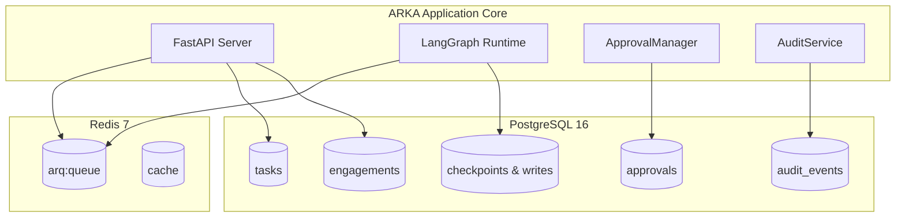

# Data Architecture

This document describes ARKA's persistence layers, database schema, caching strategy, and asynchronous job queuing architecture.

---

## 1. Storage Topology

ARKA utilizes a dual-engine storage architecture combining relational persistence in **PostgreSQL** with high-speed in-memory queuing and caching in **Redis**:

---

## 2. PostgreSQL Relational Schema

### Database Tables Summary

| Table Name | SQLAlchemy Model | Purpose | Primary Key |
|---|---|---|---|
| `engagements` | `EngagementDB` | Assessment metadata, target scope definitions, and lifecycle state. | `UUID` |
| `tasks` | `TaskDB` | Individual agent execution tasks and step history. | `UUID` |
| `approvals` | `ApprovalDB` | Persistent human-in-the-loop authorization requests, decisions, and reasons. | `UUID` |
| `audit_events` | `AuditEventDB` | Immutable security and compliance log records. | `UUID` |
| `checkpoints` | *LangGraph schema* | Serialized LangGraph execution frames for state persistence and resumption. | Composite |
| `checkpoint_writes`| *LangGraph schema* | Intermediate channel writes and state transitions. | Composite |

### Entity Relationships

- **Engagement (1) → Tasks (N)**: Each task is bound to a single engagement via foreign key `tasks.engagement_id`.
- **Engagement (1) → Approvals (N)**: Approvals are bound to an engagement and optionally a specific task via `approvals.engagement_id` and `approvals.task_id`.
- **Engagement (1) → Audit Events (N)**: Every action records the associated `engagement_id` and optional `task_id` for compliance traceability.

---

## 3. Schema Migrations (Alembic)

Database schema evolution is managed through Alembic async migrations located in `migrations/versions/`:

- `001_initial_schema.py`: Baseline tables (`engagements`, `tasks`, `approvals`, `audit_events`, `targets`, `findings`).
- `002_approval_fields.py`: Added `details` (JSONB), `rejection_reason` (String), and `correlation_id` (String) to the `approvals` table.
