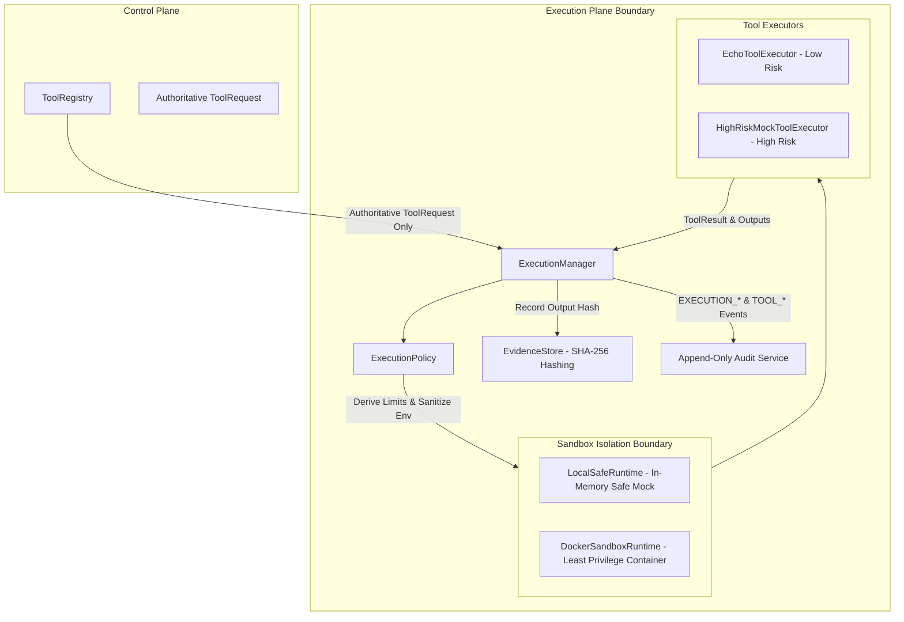

# Execution Plane Architecture

The **Execution Plane** is responsible for dispatching, sandboxing, running, and capturing the output of authorized security tools. It acts as an isolated sandbox boundary between the control plane and target systems.

---

## 1. Execution Plane Architecture (Phase 2.1 Complete)

---

## 2. Key Components

### 1. `ExecutionManager` (`arka/app/execution/manager.py`)
- Authoritative execution bridge between the control plane and sandbox runtimes.
- Rejects all unvalidated inputs (`CandidateToolRequest`, arbitrary dicts, unauthenticated calls).
- Drives execution through lifecycle: `EXECUTION_REQUESTED` $\to$ `EXECUTION_AUTHORIZED` $\to$ `EXECUTION_STARTED` $\to$ `EXECUTION_COMPLETED` (or `EXECUTION_FAILED` / `EXECUTION_TIMED_OUT` / `EXECUTION_REJECTED`).
- Enforces strict timeout cancellation and resource release.

### 2. `ExecutionPolicy` (`arka/app/execution/policy.py`)
- Deterministic runtime constraint engine.
- Rejects shell execution (`shell=True`), requiring argument arrays `[executable, arg1, arg2]`.
- Forbids dangerous shell binaries (`sh`, `bash`, `zsh`, `cmd.exe`, `powershell.exe`, `python`, etc.).
- Scrubs sensitive environment variables (`LD_PRELOAD`, `DATABASE_URL`, `API_KEY`, etc.).
- Enforces network profile isolation (`NO_NETWORK`).

### 3. `SandboxRuntime` (`arka/app/execution/sandbox/`)
- `LocalSafeRuntime`: Development and testing sandbox with zero subprocess shell and zero network egress. Safely truncates oversized outputs (`max_stdout_bytes`, `max_stderr_bytes`).
- `DockerSandboxRuntime`: Container isolation baseline configured with least privilege:
  - Non-root user (`1000:1000`)
  - Read-only root filesystem (`read_only=True`)
  - Dropped Linux capabilities (`cap_drop=["ALL"]`)
  - Prevention of privilege escalation (`no-new-privileges:true`)
  - Disabled network (`network_mode="none"`)
  - No host root filesystem mounts and no Docker socket (`/var/run/docker.sock`) exposure.

### 4. `EvidenceStore` (`arka/app/execution/evidence.py`)
- Cryptographic provenance tracking for all tool outputs.
- Computes SHA-256 integrity digests over raw stdout, stderr, and structured outputs.
- Provides tamper-evident verification of findings.
