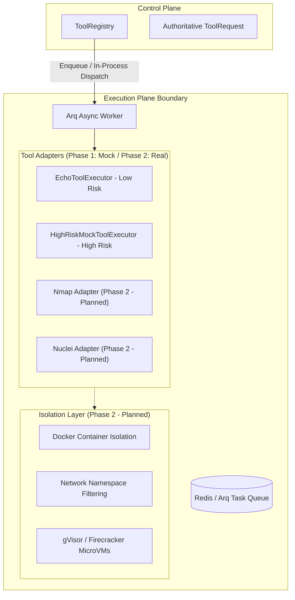

# Execution Plane Architecture

The **Execution Plane** is responsible for dispatching, running, and capturing the output of authorized security tools. It acts as an isolated sandbox boundary between the control plane and external network targets.

---

## 1. Execution Plane Architecture

---

## 2. Phase 1 Implementation (`IMPLEMENTED`)

In Phase 1, the execution plane is hardened with strict safety guarantees:

- **In-Memory & Direct Dispatch**: Tools are registered in `ToolRegistry` and executed via asynchronous Python executors implementing `ToolExecutor`.
- **Safe Mock Tools**:
  - `EchoToolExecutor`: Low-risk tool validating reachability and echoing arguments without invoking shell or network calls.
  - `HighRiskMockToolExecutor`: High-risk tool simulating exploit verification without destructive payloads or network calls.
- **Timeout Management**: Every tool definition specifies `timeout_seconds`. `ToolRegistry.execute()` enforces timeouts via `asyncio.wait_for()`, aborting frozen executions and generating structured `TOOL_FAILED` audit events.
- **Exception Isolation**: If a tool throws an unexpected exception, it is caught within `ToolRegistry`, returning a structured `ToolResult(success=False, error=...)` rather than crashing the orchestrator process.

---

## 3. Phase 2 Roadmap: Isolated Tool Runner (`PLANNED`)

In Phase 2, the execution plane will transition to strict containerized and microVM isolation:

1. **Docker Container Baselines**: Tools will execute inside ephemeral, single-use containers.
2. **Network Namespaces**: Outbound traffic from tool containers will be constrained by iptables/nftables to only allow communication with explicitly scoped IP addresses and ports.
3. **MicroVM Sandboxing (`PLANNED`)**: High-risk exploits will run inside gVisor (`runsc`) or Firecracker microVMs to prevent container breakout vulnerabilities.
4. **Structured Parsers**: Raw tool output (`stdout`, `stderr`, XML/JSON) will be parsed into normalized vulnerability artifacts before returning to the control plane.
