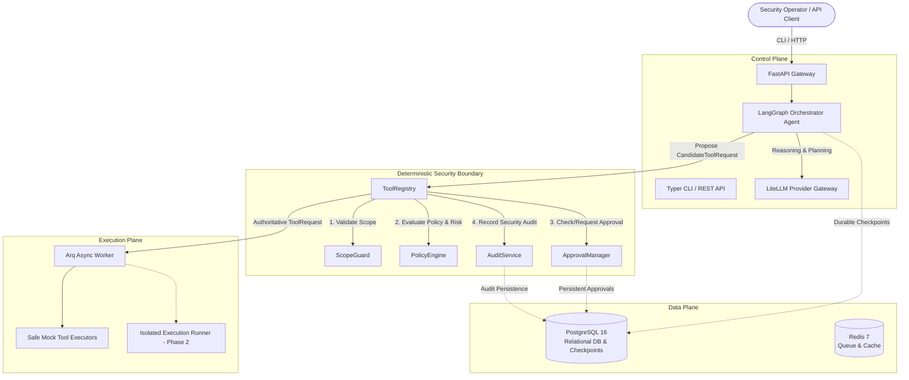

# Architecture Overview

**ARKA (Autonomous Risk Knowledge & Assessment)** is an enterprise-grade autonomous penetration testing platform. It orchestrates security assessments through deterministic security controls, stateful agent graph execution, provider-neutral LLM integration, and isolated tool execution.

---

## 1. High-Level System Topology

The platform is structured into distinct control, security, data, and execution planes:

---

## 2. Core Technology Stack

| Layer | Component | Version / Library | Rationale |
|---|---|---|---|
| **Language Runtime** | Python | `>=3.13` | Modern typing, performance improvements, and async support. |
| **API Gateway** | FastAPI | `fastapi[standard]>=0.115` | High-performance ASGI interface with OpenAPI schema auto-generation. |
| **Validation & Schema** | Pydantic | `pydantic>=2.0`, `pydantic-settings` | Fast C-based validation and structured runtime state contracts. |
| **Agent Orchestration** | LangGraph | `langgraph>=0.2` | Cyclical graph execution, durable checkpoints, human-in-the-loop interrupts. |
| **LLM Router** | LiteLLM | `litellm>=1.40` | Unified interface across OpenAI, Anthropic, Gemini, Nvidia NIM, and custom endpoints. |
| **Persistence (RDBMS)** | PostgreSQL & SQLAlchemy | `asyncpg`, `sqlalchemy[asyncio]>=2.0` | Async ORM, relational integrity, JSONB support for tool artifacts. |
| **Migrations** | Alembic | `alembic` | Version-controlled schema migrations for relational state. |
| **Task Queue** | Arq & Redis | `arq>=0.26`, `redis>=5.0` | High-throughput async job execution with minimal overhead compared to Celery. |
| **CLI** | Typer & Rich | `typer>=0.12.0`, `rich` | Type-safe CLI with structured tables, status animations, and output formatting. |
| **Observability** | Structlog & Langfuse | `structlog`, `langfuse>=2.0` | JSON structured logging, OpenTelemetry integration, and LLM telemetry. |

---

## 3. Component Taxonomy & Code Traceability

| Component | Responsibility | Implementation File |
|---|---|---|
| **API Server** | FastAPI application factory, routing, exception handlers | `arka/app/api/__init__.py` |
| **CLI** | Typer operational commands (`health`, `engagement`, `provider`, `audit`) | `arka/app/cli/main.py` |
| **Orchestrator Graph** | LangGraph workflow state machine and decision loops | `arka/app/agents/orchestrator/graph.py` |
| **ScopeGuard** | Deterministic target validation (IP, CIDR, Domain, URL, Port) | `arka/app/core/scope/scopeguard.py` |
| **PolicyEngine** | Authoritative risk scoring and single source of truth for authorization | `arka/app/core/policies/engine.py` |
| **ApprovalManager** | Persistent approval state machine (`REQUIRED`, `GRANTED`, `REJECTED`, `EXPIRED`) | `arka/app/core/approvals/manager.py` |
| **ToolRegistry** | Schema validation, tool lookup, and execution boundary | `arka/app/tools/registry/registry.py` |
| **LLMGateway** | Neutral LLM completion router, token tracking, and secret masking | `arka/app/llm/gateway/gateway.py` |
| **AuditService** | Append-only security audit log with secret sanitization | `arka/app/audit/service.py` |
| **Mock Tools** | Harmless mock executors for automated test verification | `arka/app/tools/mock/tools.py` |

---

## 4. Current Implementation Status

- **Phase 1: Secure Agent Control Plane** — **`IMPLEMENTED`**
- **Phase 2: Secure Tool Execution & Reconnaissance** — **`PLANNED`**
- **Phase 3: Web/API Security Analysis** — **`PLANNED`**
- **Phase 4: Controlled Exploitation & Validation** — **`PLANNED`**
- **Phase 5: Attack Graph & Autonomous Attack Paths** — **`PLANNED`**
- **Phase 6: Advanced Multimodal / Enterprise Capabilities** — **`PLANNED`**
