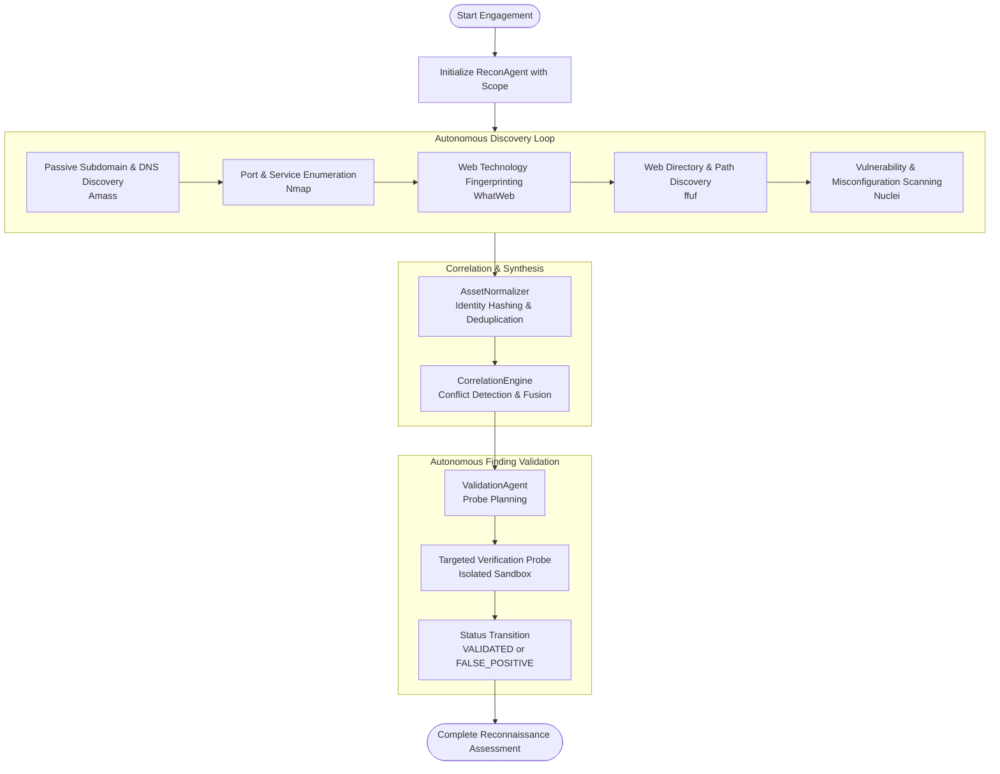
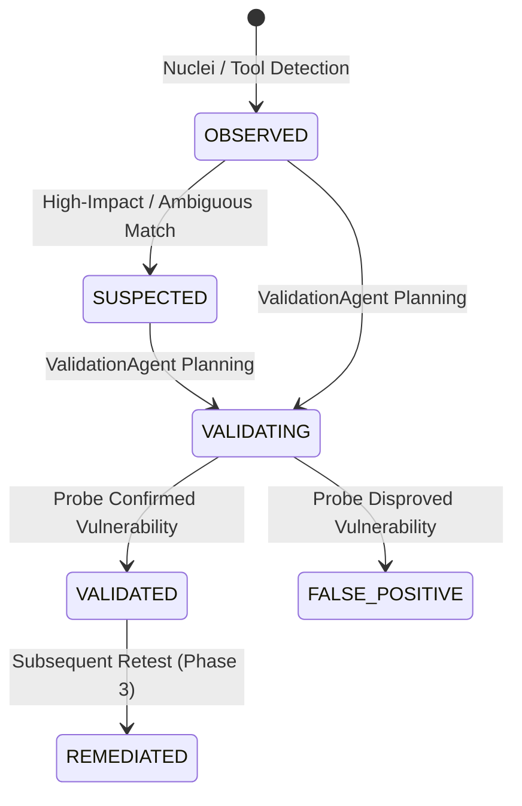

# ARKA Autonomous Reconnaissance Workflow Architecture

This document describes the end-to-end architecture and execution lifecycle of ARKA's autonomous reconnaissance platform (Phase 2).

---

## 1. High-Level Workflow Lifecycle

---

## 2. Component Roles & Execution Flow

### 1. Scope Definition & Authorization Boundary
- The engagement starts with an immutable `ScopeDefinition` specifying:
  - Allowed IP addresses and CIDR subnets.
  - Allowed root domains and subdomains.
  - Allowed TCP/UDP ports.
  - Explicit exclusion lists (e.g. out-of-bounds hosts or fragile infrastructure).
- `ScopeGuard` enforces boundary isolation before every tool execution.

### 2. ReconAgent Execution Loop
- The `ReconAgent` operates as a compiled LangGraph state machine:
  1. **Load State**: Restores current hypotheses, completed actions, and discovered assets.
  2. **Model Reasoning**: Prompts the LLM Gateway with authorized target context, tool definitions, and schema constraints.
  3. **Plan Validation**: Parses the structured plan into candidate actions.
  4. **Action Fingerprinting**: Computes a deterministic identity `hash(tool_name, target, normalized_arguments)` to prevent action loops.
  5. **Policy & Approval Validation**: Submits `CandidateToolRequest` to `ToolRegistry`. High-risk operations (e.g., intensive scans) pause execution and await explicit human approval via `ApprovalManager`.
  6. **Sandboxed Execution**: Dispatches approved `ToolRequest` to `ExecutionManager` inside a containerized or local safe sandbox.
  7. **Evidence Recording**: Captures immutable raw stdout/stderr and structured results into `EvidenceStore` with SHA-256 digests.
  8. **Canonical Ingestion**: Dispatches raw results to `AssetNormalizer` to update `AssetRepository`.

### 3. Tool Adapters & Observation Pipeline
- **Amass**: Identifies passive subdomains and DNS mappings. Discovered targets are saved with status `discovered` without expanding scope.
- **Nmap**: Conducts safe port scanning (`-sV`, `-p`) within authorized targets.
- **WhatWeb**: Fingerprints HTTP web server headers, cookies, and CMS frameworks into canonical `Technology` entities.
- **ffuf**: Discovers hidden routes, API endpoints, and sensitive directories using allowlisted wordlists and rate limits.
- **Nuclei**: Evaluates known vulnerability templates against discovered web endpoints and open services.

### 4. Correlation & Conflict Resolution
- The `CorrelationEngine` aggregates observations from multiple tools:
  - **Asset Merging**: Unifies IP addresses and hostnames across Amass, Nmap, WhatWeb, and ffuf.
  - **Service & Technology Fusion**: Correlates banners and version strings.
  - **Conflict Detection**: When two tools report differing metadata (e.g., Nmap reports Apache 2.4.49, WhatWeb reports Nginx 1.24), an `ObservationConflict` entity is recorded without overwriting historical provenance.

### 5. Autonomous Validation (ValidationAgent)
- Eliminates false positives before report generation:
  1. Identifies findings in `OBSERVED` or `SUSPECTED` status.
  2. Synthesizes a minimal, targeted verification probe (e.g., re-evaluating an HTTP response status or body substring).
  3. Submits an independent, scope-guarded `CandidateToolRequest`.
  4. Upon analyzing the probe result, authoritatively transitions the finding:
     - `VALIDATED`: Finding confirmed with high confidence.
     - `FALSE_POSITIVE`: Finding refuted by safe re-probe.

---

## 3. Finding Lifecycle State Machine

---

## 4. Checkpoint & Resume Integrity

The reconnaissance workflow supports interruptible execution and state recovery:
1. **LangGraph Checkpointer**: Every step is checkpointed into the configured state store (`MemorySaver` for testing, PostgreSQL for production).
2. **Approval Suspension**: When `PolicyEngine` returns `PolicyDecisionType.REQUIRE_APPROVAL`, the graph yields an interrupt with the `approval_id`.
3. **Resumption**: Once the human operator approves the request, the workflow resumes directly at the execution node.
4. **Anti-Replay**: Action fingerprints in `completed_actions` ensure that resumed graphs never re-execute already completed scans.
