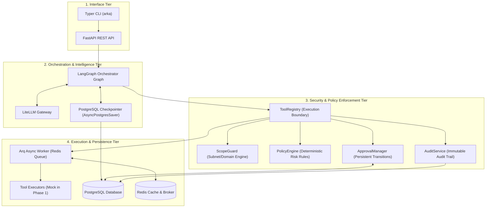
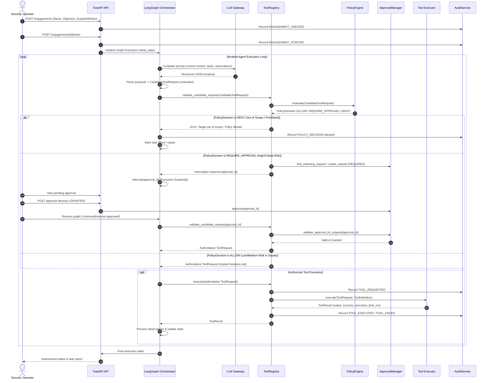

# System Architecture

This document details the architectural tiers, data flow, and runtime interaction models across the ARKA platform.

---

## 1. Architectural Tiers

ARKA separates responsibilities into four distinct runtime tiers to guarantee that untrusted operations cannot cross into privileged execution contexts:

---

## 2. End-to-End Operational Lifecycle

The operational lifecycle of a penetration testing assessment proceeds in well-defined stages:

---

## 3. Tier Separation Guarantees

1. **Memory Isolation**: Untrusted candidate data is maintained in a distinct Pydantic schema (`CandidateToolRequest`). Authoritative `ToolRequest` objects can only be minted within `ToolRegistry` after all security gates pass.
2. **Crash Resilience**: Because LangGraph checkpoints state after every node transition in PostgreSQL, any unexpected server reboot or process crash preserves the exact graph position and pending approvals.
3. **Audit Immutability**: The `AuditService` runs within the application process but treats all events as append-only records, preventing in-memory or database mutation.
