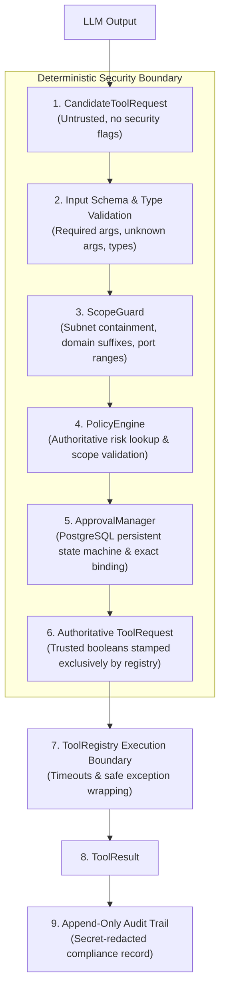

# Trust Boundaries & Authorization Model

This document defines the fundamental zero-trust architecture and invariant authorization model enforced across ARKA.

---

## 1. The Invariant Principle: The LLM is Untrusted

> [!IMPORTANT]
> In ARKA, the Large Language Model (LLM) and the Orchestrator Agent have **ZERO AUTHORIZATION AUTHORITY**.
>
> The LLM is strictly a **reasoning and proposal engine**. It proposes candidate operations, which must undergo deterministic, programmatic validation by non-LLM Python components before any tool can execute.

### What the LLM CANNOT Do:
- The LLM **cannot** authorize tools or operations.
- The LLM **cannot** authorize target hosts, IPs, or domains.
- The LLM **cannot** establish or expand engagement scope.
- The LLM **cannot** assign or downgrade its own risk classifications.
- The LLM **cannot** bypass human approval gates.
- The LLM **cannot** execute OS shell commands or raw network sockets directly.

---

## 2. Authoritative Enforcement Pipeline

Every candidate action traverses a strictly ordered security pipeline:

---

## 3. Detailed Boundary Specifications

### Boundary 1: Candidate Proposal (`CandidateToolRequest`)
- **Location**: `arka/app/tools/schemas/tool_schemas.py`
- **Mechanism**: The orchestrator parses raw LLM output strictly into a `CandidateToolRequest`.
- **Guarantee**: This model does NOT contain `scope_validated`, `policy_approved`, `risk_level`, or `approval_id` fields, making it impossible for the model to forge authorization metadata.

### Boundary 2: Deterministic Scoping (`ScopeGuard`)
- **Location**: `arka/app/core/scope/scopeguard.py`
- **Mechanism**: Validates target IPs (IPv4/IPv6), CIDR subnets, domains, URLs, and port numbers against authorized engagement boundaries.
- **Guarantee**: Exclusions **always** override inclusions. Suffix attacks (e.g. `evil-example.com` targeting `example.com`) are deterministically blocked.

### Boundary 3: Authoritative Risk & Policy (`PolicyEngine`)
- **Location**: `arka/app/core/policies/engine.py`
- **Mechanism**: The policy engine derives the risk level directly from the registered `ToolDefinition.risk_level` in code, ignoring any risk claim in the request.
- **Guarantee**: Out-of-scope targets **ALWAYS** produce `DENY`, regardless of risk level. In-scope `HIGH` or `CRITICAL` risk tools always return `REQUIRE_APPROVAL`.

### Boundary 4: Persistent Human Approval (`ApprovalManager`)
- **Location**: `arka/app/core/approvals/manager.py`
- **Mechanism**: Human decisions are stored in PostgreSQL. State transitions are strictly validated (`REQUIRED -> GRANTED`, `REQUIRED -> REJECTED`, `REQUIRED -> EXPIRED`).
- **Guarantee**: Approvals are cryptographically and contextually bound to the exact `(engagement_id, task_id, tool_name, target)`. Reusing an approval across engagements, tasks, or targets is immediately rejected.

### Boundary 5: Authoritative Execution (`ToolRegistry`)
- **Location**: `arka/app/tools/registry/registry.py`
- **Mechanism**: Only `ToolRegistry.validate_candidate_request()` can construct an authoritative `ToolRequest` with `scope_validated=True` and `policy_approved=True`.
- **Guarantee**: `ToolRegistry.execute()` rejects any request lacking validated security stamps. Tool execution is constrained by timeouts and exception handlers.

### Boundary 6: Immutable Compliance Audit (`AuditService`)
- **Location**: `arka/app/audit/service.py`
- **Mechanism**: All actions, approvals, policy decisions, and executions append records to the audit trail.
- **Guarantee**: The service has no update or delete APIs, returns defensive deep copies, and automatically scrubs credentials (`api_key`, `password`, `tokens`, `secrets`).
