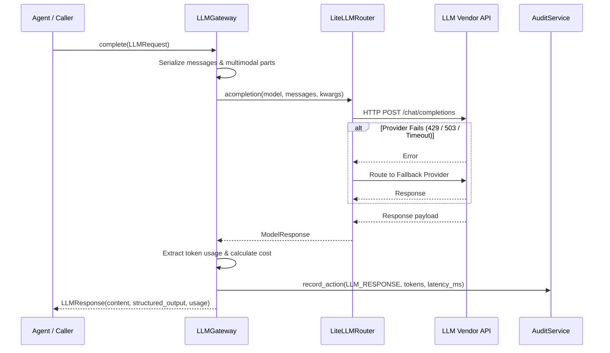

# LLM Gateway Implementation

The **LLMGateway** (`arka/app/llm/gateway/gateway.py`) is the centralized abstraction interface for all model interactions.

---

## 1. Gateway Interfaces

```python
class LLMGateway:
    """ARKA LLM Gateway — provider-neutral interface for all LLM operations."""

    def __init__(self, audit_service: AuditService | None = None): ...

    async def complete(self, request: LLMRequest) -> LLMResponse:
        """Send a completion request through the router."""

    async def health_check(self) -> dict:
        """Verify model connectivity and measure latency."""

    async def get_providers(self) -> list[dict]:
        """List active and fallback providers."""
```

---

## 2. Request & Response Lifecycle



---

## 3. Telemetry & Accounting

Every `LLMResponse` includes detailed token usage and cost accounting:

```python
class TokenUsage(BaseModel):
    prompt_tokens: int = 0
    completion_tokens: int = 0
    total_tokens: int = 0
    cost_usd: float | None = None
```

- **Cost Estimation**: Calculated dynamically via `litellm.completion_cost()`.
- **Latency Tracking**: Measured monotonically in milliseconds (`latency_ms`).
