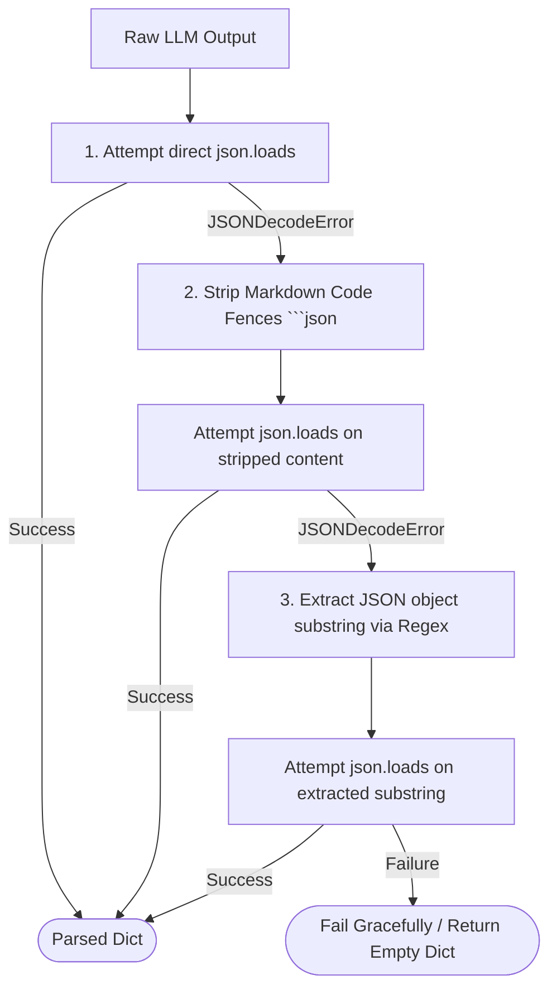

# Structured Output & Parsing

This document describes how ARKA enforces, validates, and parses structured output from LLM responses.

---

## 1. Structured Output Enforcement

To prevent non-deterministic free-form text from breaking agent execution loops, ARKA enforces structured JSON output via:

1. **System Prompt Directives**: System prompts strictly instruct the model to respond in valid JSON matching a specific schema.
2. **Response Format Flags**: Requests pass `response_format={"type": "json_object"}` when supported by the downstream provider.

---

## 2. Robust JSON Extraction Strategy

Because LLMs may return raw JSON, markdown-wrapped JSON (` ```json ... ``` `), or conversational preambles, `LLMGateway` and the Orchestrator apply multi-stage parsing:



---

## 3. Candidate Proposal Schema

When proposing a security action, the LLM must generate JSON conforming to this contract:

```json
{
  "action": "request_tool",
  "task_name": "recon_target",
  "tool": "echo_test",
  "target": "example.com",
  "arguments": {
    "message": "Verify host reachability"
  },
  "reason": "Initial reconnaissance step"
}
```

If parsed successfully, this is mapped into `CandidateToolRequest` for deterministic security evaluation.
