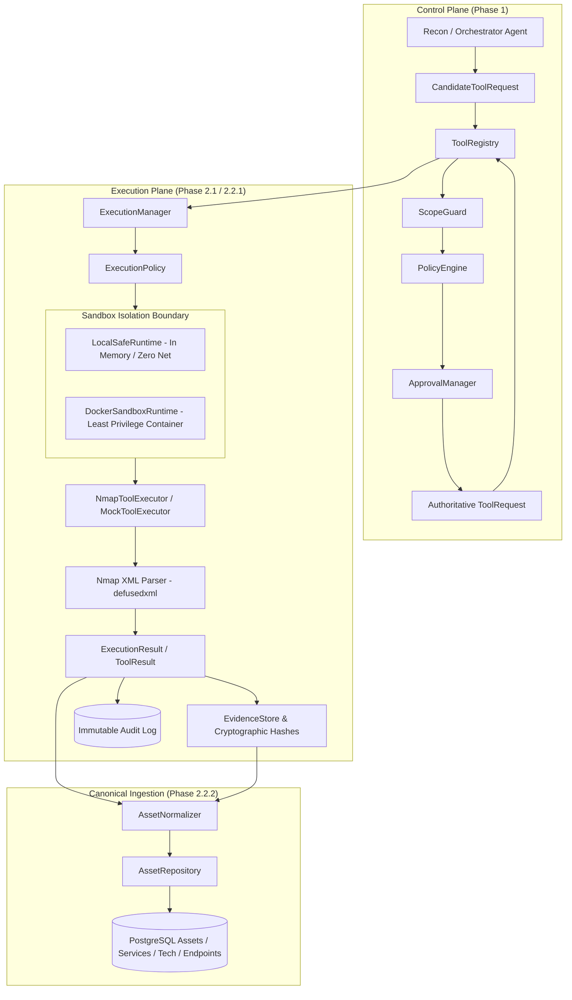

# Phase 2: Secure Tool Execution & Reconnaissance

**Current Status**:
- **Phase 2.1 (Secure Execution Engine & Sandboxing)**: **`COMPLETE`**
- **Phase 2.2.1 (Nmap Adapter & Parser Foundation)**: **`COMPLETE`**
- **Phase 2.2.2 (Canonical Asset / Service / Technology Model)**: **`COMPLETE`**
- **Phase 2.2.3+ (Reconnaissance Agents & Additional Tool Adapters)**: **`PLANNED`**

---

## 1. Phase 2 Architecture Pipeline

---

## 2. Phase 2.1 Implementation Summary (Completed)

1. **Execution Domain Models** (`arka/app/execution/schemas.py`):
   - `ExecutionStatus` (`CREATED`, `VALIDATING`, `STARTING`, `RUNNING`, `COMPLETED`, `FAILED`, `TIMED_OUT`, `CANCELLED`, `REJECTED`).
   - `NetworkProfile` (`NO_NETWORK`, `CONTROLLED_NETWORK`, `AUTHORIZED_TARGET_NETWORK`).
   - `ExecutionLimits` (configurable time, byte output, memory, and concurrency limits).
   - `ExecutionRequest` & `ExecutionResult`.
   - `EvidenceReference` with cryptographic SHA-256 integrity digest.

2. **Authoritative Execution Manager** (`arka/app/execution/manager.py`):
   - Only accepts authoritative `ToolRequest` objects stamped with `scope_validated=True` and `policy_approved=True`.
   - Manages sandbox lifecycle, limits, timeouts, cancellation, and automated cleanup.
   - Computes SHA-256 digests over execution output and generates `EvidenceReference`.

3. **Deterministic Execution Policy** (`arka/app/execution/policy.py`):
   - Enforces argument array validation (rejects `shell=True` and raw command strings).
   - Forbids shell executables (`sh`, `bash`, `cmd.exe`, `powershell.exe`, `python`, etc.).
   - Sanitizes runtime environment by stripping sensitive credentials (`LD_PRELOAD`, `DATABASE_URL`, API keys).

4. **Sandbox Runtimes** (`arka/app/execution/sandbox/`):
   - `LocalSafeRuntime`: Safe in-memory execution runtime for local testing with zero shell and zero network.
   - `DockerSandboxRuntime`: Least-privilege container isolation (non-root `1000:1000`, read-only rootfs, `ALL` capabilities dropped, `no-new-privileges:true`, no Docker socket mount, `network_mode="none"`).

5. **Cryptographic Evidence Foundation** (`arka/app/execution/evidence.py`):
   - Calculates SHA-256 hashes for all output streams and structured artifacts.
   - Validates non-repudiation and output integrity.

---

## 3. Phase 2.2.1 Implementation Summary: Nmap Adapter & Parser Foundation (Completed)

1. **Nmap Domain Models & Safe Argument Construction** (`arka/app/tools/nmap/schemas.py`):
   - `NmapScanConfig`: Enforces an explicit argument allowlist (`-sV`, `-sC`, `-p`, `-T{0-4}`, `-oX -`).
   - Zero raw flag passthrough: the LLM never sees or specifies CLI flags directly.
   - Port validation: strictly regex-validated (`^[0-9]+([,\-][0-9]+)*$`).
   - Structured result models: `NmapHost`, `NmapPort`, `NmapService`, `NmapScript`, `NmapResult`.

2. **Nmap XML Parser** (`arka/app/tools/nmap/parser.py`):
   - Mandatory `defusedxml` ElementTree parsing against entity expansion and billion-laughs attacks.
   - Parses hosts, IPv4/IPv6 addresses, hostnames, ports, service banners, CPE lists, and NSE script outputs.
   - Treats all XML output as untrusted data; returns controlled errors on malformed input.

3. **Deterministic Risk Model & Operation-Level Escalation** (`arka/app/tools/nmap/definition.py`):
   - Base risk: `RiskLevel.MEDIUM` (standard port and service scanning within authorized scope).
   - Operation-level escalation to `RiskLevel.HIGH` triggered when aggressive options are configured (`default_scripts=True` or `timing_template >= 3`).
   - `PolicyEngine` enforces mandatory human approval via `ApprovalManager` for escalated scans.

4. **Nmap Tool Executor** (`arka/app/tools/nmap/executor.py`):
   - Implements `ToolExecutor` and integrates seamlessly with `ExecutionManager`.

---

## 4. Phase 2.2.2 Implementation Summary: Canonical Asset / Service / Technology Model (Completed)

1. **Canonical Domain Models & Deterministic Identity** (`arka/app/core/assets/`):
   - `Asset`, `Service`, `Technology`, `Endpoint`, `ObservationConflict`, `NormalizedAssetBundle`.
   - Deterministic UUIDv5 identity generation based on engagement ID and normalized attributes.
   - Complete normalization for IPv4, IPv6, hostnames, domains, URLs, and protocols.

2. **Asset Normalizer** (`arka/app/core/assets/normalizer.py`):
   - Normalizes tool observations (`NmapResult`) into deduplicated canonical entities.
   - Extracts CPE-based and product-based technologies.
   - Detects and preserves observation conflicts across scans without losing provenance.

3. **Database Persistence & Alembic Migrations** (`arka/app/database/models.py`, `migrations/versions/003_asset_canonical_models.py`):
   - Added `AssetDB`, `ServiceDB`, `TechnologyDB`, and `EndpointDB` with foreign keys and cascade rules.
   - Production async `AssetRepository` and `InMemoryAssetRepository` for testing.

4. **Strict Security Invariant: Discovered != Authorized** (`tests/security/test_asset_normalization_security.py`):
   - Discovered infrastructure stored in asset repository is observation-only.
   - Scope authorization remains strictly governed by `ScopeGuard` and `ScopeDefinition`.

---

## 5. Phase 2 Planned Subsequent Milestones

- **Phase 2.2.3**: Additional security tool adapters and parsers (WhatWeb, ffuf, Nuclei).
- **Phase 2.2.4**: `ReconAgent` LangGraph subagent for autonomous asset discovery and service enumeration.
- **Phase 2.2.5**: Target network routing policies linking `ScopeGuard` to container networking.

