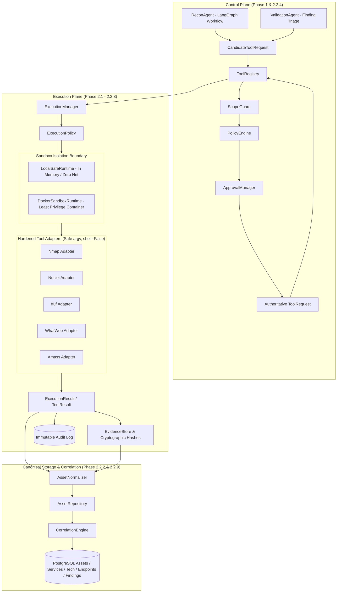
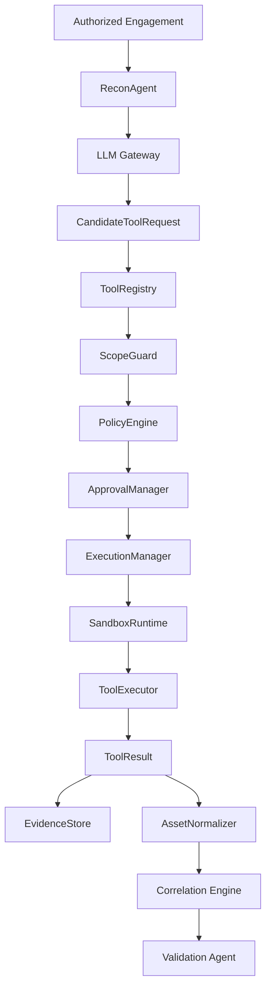
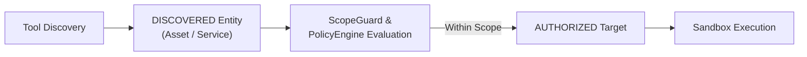
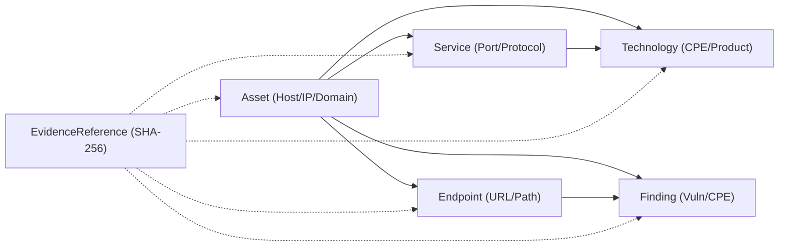

# Phase 2: Secure Tool Execution & Reconnaissance

**Current Status**:
- **Phase 2.1 (Secure Execution Engine & Sandboxing)**: **`COMPLETE`**
- **Phase 2.2.1 (Nmap Adapter & Parser Foundation)**: **`COMPLETE`**
- **Phase 2.2.2 (Canonical Asset / Service / Technology Model)**: **`COMPLETE`**
- **Phase 2.2.3 (Evidence Pipeline & Provenance Foundation)**: **`COMPLETE`**
- **Phase 2.2.4 (ReconAgent & LangGraph Recon Workflow)**: **`COMPLETE`**
- **Phase 2.2.5 (Nuclei Adapter & Finding Normalization)**: **`COMPLETE`**
- **Phase 2.2.6 (ffuf Adapter & Endpoint Normalization)**: **`COMPLETE`**
- **Phase 2.2.7 (WhatWeb Adapter & Technology Normalization)**: **`COMPLETE`**
- **Phase 2.2.8 (Amass Adapter & Passive Discovery Normalization)**: **`COMPLETE`**
- **Phase 2.2.9 (Recon Correlation & Conflict Resolution Engine)**: **`COMPLETE`**
- **Phase 2.2.10 (Validation Agent & False Positive Elimination)**: **`COMPLETE`**
- **Phase 2.2.11 (Autonomous Workflow Integration & CLI/API)**: **`COMPLETE`**
- **Phase 2.2.12 (Phase 2 Verification, Adversarial Hardening & Graphify)**: **`COMPLETE`**

---

## 1. Phase 2 Architecture Pipeline

---

## 2. Completed Phase 2 Subphases

### Phase 2.1: Secure Execution Engine & Sandboxing
- **Schemas**: `ExecutionRequest`, `ExecutionResult`, `ExecutionStatus`, `NetworkProfile`, `ExecutionLimits`.
- **Manager**: `ExecutionManager` enforcing timeouts, concurrency limits, and output collection.
- **Runtimes**: `LocalSafeRuntime` and `DockerSandboxRuntime` (non-root `1000:1000`, dropped capabilities, no shell passthrough).
- **Evidence**: Initial `EvidenceStore` with SHA-256 computation.

### Phase 2.2.1: Nmap Adapter Foundation
- Safe argument construction: strictly typed `NmapScanConfig` with explicit flag allowlist.
- XML Parsing: `defusedxml` parser immune to XML entity injection and billion-laughs attacks.
- Risk Escalation: Aggressive flags (`-sC`, `-T4`) escalate to `RiskLevel.HIGH` requiring human approval.

### Phase 2.2.2: Canonical Asset, Service, Technology & Endpoint Model
- Canonical entities: `Asset`, `Service`, `Technology`, `Endpoint`, `ObservationConflict`.
- Identity: Deterministic UUIDv5 hashing based on canonical addresses, ports, and engagement ID.
- Database: Alembic migration `003_asset_canonical_models` with PostgreSQL persistence and in-memory test doubles.
- Security Invariant: `DISCOVERED != AUTHORIZED`. Discovery stores observations without expanding scope.

### Phase 2.2.3: Evidence Pipeline & Provenance Foundation
- Content-addressed store: Append-only, deep defensive copying, SHA-256 deduplication.
- Multi-artifact capture: `RAW_STDOUT`, `RAW_STDERR`, `STRUCTURED_RESULT`.
- Secret Sanitization: Automated pattern redaction in metadata without corrupting raw binary evidence.

### Phase 2.2.4: ReconAgent
- LangGraph state graph with interruptible human-in-the-loop approval checkpoints.
- Untrusted LLM Boundary: Zero direct execution; actions strictly validated via Pydantic schemas.
- Non-authoritative discovery: Found assets marked `discovered` and re-evaluated by `ScopeGuard`.

### Phase 2.2.5: Nuclei Adapter & Finding Normalization
- Target & template validation, safe argv compilation without raw flag passthrough.
- New canonical model: `Finding` and `FindingStatus` enum (`observed`, `suspected`, `validated`, `false_positive`, `remediated`).
- Risk escalation to `HIGH` on high/critical template severity or rate > 100.

### Phase 2.2.6: ffuf Adapter & Endpoint Discovery Normalization
- Safe directory fuzzing: strictly allowlisted wordlist paths, rate limits, and recursion depth caps.
- Normalization: ffuf matches normalized into canonical `Endpoint` entities with response metadata.
- Risk escalation on rate > 50 or depth > 2.

### Phase 2.2.7: WhatWeb Adapter & Technology Normalization
- Aggression level control (`1` to `3`), safe target URL validation.
- Normalization: WhatWeb plugin fingerprints normalized into canonical `Technology` entities.
- Risk escalation on aggression level >= 3.

### Phase 2.2.8: Amass Adapter & Passive Discovery Normalization
- Passive and active DNS/certificate enumeration modes.
- Normalization: Discovered subdomains and IP addresses ingested with status `"discovered"`.
- Mandatory Invariant: Passive discoveries NEVER expand `ScopeGuard` authorization scope.

### Phase 2.2.9: Correlation Engine
- Multi-source observation fusion (`arka/app/core/correlation.py`).
- Deduplicates and merges assets, services, technologies, and endpoints across tools.
- Preserves historical provenance and flags conflicting service states as `ObservationConflict`.

### Phase 2.2.10: Validation Agent
- Autonomous false-positive elimination agent (`arka/app/agents/validation/`).
- Safely plans and executes targeted verification probes for reported findings.
- Updates finding status to `VALIDATED` or `FALSE_POSITIVE` with confidence scores.

### Phase 2.2.11: Autonomous Workflow Integration
- CLI integration: `arka recon run --engagement-id ... --target ...`.
- REST API: `POST /engagements/{id}/recon` and finding status endpoints.
- End-to-end orchestration uniting Amass, Nmap, WhatWeb, ffuf, Nuclei, Correlation, and Validation.

### Phase 2.2.12: Hardening & Adversarial Verification
- 391 automated tests passing with 0 failures across unit, integration, and security suites.
- OWASP Agent Matrix adversarial tests (traversal, shell injection, out-of-scope bypass, invariant preservation).
- Ruff check, format, and Mypy passed with zero warnings or errors.
- Alembic migration head intact at `003_asset_canonical_models`.

---

## 3. Core Architecture Diagrams

### 3.1 Recon Execution Flow

### 3.2 Discovery Versus Authorization

### 3.3 Canonical Entity Relationships

