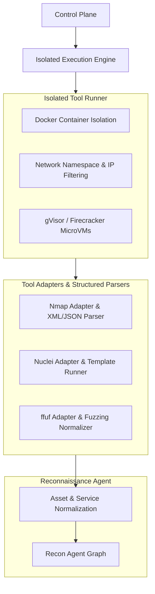

# Phase 2: Secure Tool Execution & Reconnaissance

**Status**: **`PLANNED`**

---

## 1. Phase 2 Scope & Objectives

Phase 2 transitions ARKA from mock validation to **secure, containerized tool execution and automated reconnaissance**.

---

## 2. Planned Components

1. **Isolated Tool Runner**:
   - Ephemeral, single-use Docker containers.
   - Network namespace filtering restricting egress strictly to scoped IP addresses.
   - MicroVM sandboxing (gVisor `runsc` or Firecracker) for untrusted tools.
2. **Security Tool Adapters & Structured Parsers**:
   - **Nmap**: Port discovery, service banner grabbing, and OS detection.
   - **Nuclei**: Vulnerability scanning using curated, community-approved templates.
   - **ffuf**: Web path discovery and directory fuzzing.
   - **Output Normalizers**: Parsing raw stdout/XML/JSON into typed `Finding` and `Asset` models.
3. **Reconnaissance Agent (`ReconAgent`)**:
   - Specialized LangGraph subagent for discovering assets, open ports, web servers, and DNS records.
   - Asset normalization pipeline linking findings to targets.
4. **Evidence Capture System**:
   - Raw tool logs, HTTP request/response dumps, and network captures stored with SHA-256 integrity hashes.

---

## 3. What Phase 2 Does NOT Include

To maintain strict development boundaries, Phase 2 will **NOT** implement:
- Autonomous vulnerability exploitation
- Credential dumping or brute-forcing
- Privilege escalation
- Lateral movement or pivoting
- Persistence mechanisms
- Multi-step automated attack chains
