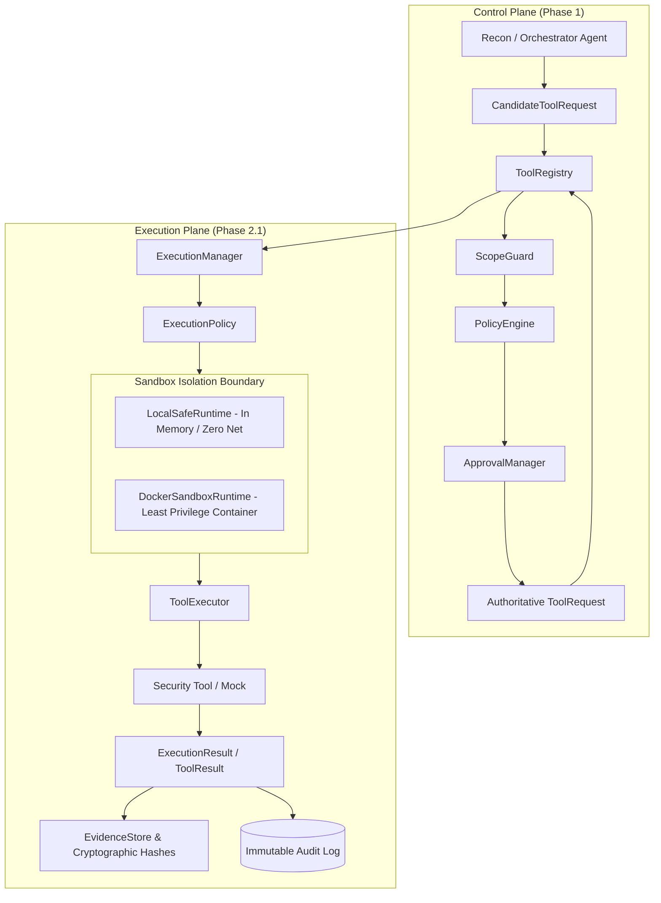

# Phase 2: Secure Tool Execution & Reconnaissance

**Current Status**:
- **Phase 2.1 (Secure Execution Engine & Sandboxing)**: **`COMPLETE`**
- **Phase 2.2 (Tool Adapters & Reconnaissance Integration)**: **`PLANNED`**

---

## 1. Phase 2 Architecture Pipeline

---

## 2. Phase 2.1 Implementation Summary (Completed)

1. **Execution Domain Models** (`arka/app/execution/schemas.py`):
   - `ExecutionStatus` (`CREATED`, `VALIDATING`, `STARTING`, `RUNNING`, `COMPLETED`, `FAILED`, `TIMED_OUT`, `CANCELLED`, `REJECTED`).
   - `NetworkProfile` (`NO_NETWORK`, `CONTROLLED_NETWORK`, `AUTHORIZED_TARGET_NETWORK`).
   - `ExecutionLimits` (configurable time, byte output, memory, and concurrency limits).
   - `ExecutionRequest` & `ExecutionResult`.
   - `EvidenceReference` with cryptographic SHA-256 integrity digest.

2. **Authoritative Execution Manager** (`arka/app/execution/manager.py`):
   - Only accepts authoritative `ToolRequest` objects stamped with `scope_validated=True` and `policy_approved=True`.
   - Manages sandbox lifecycle, limits, timeouts, cancellation, and automated cleanup.
   - Computes SHA-256 digests over execution output and generates `EvidenceReference`.

3. **Deterministic Execution Policy** (`arka/app/execution/policy.py`):
   - Enforces argument array validation (rejects `shell=True` and raw command strings).
   - Forbids shell executables (`sh`, `bash`, `cmd.exe`, `powershell.exe`, `python`, etc.).
   - Sanitizes runtime environment by stripping sensitive credentials (`LD_PRELOAD`, `DATABASE_URL`, API keys).

4. **Sandbox Runtimes** (`arka/app/execution/sandbox/`):
   - `LocalSafeRuntime`: Safe in-memory execution runtime for local testing with zero shell and zero network.
   - `DockerSandboxRuntime`: Least-privilege container isolation (non-root `1000:1000`, read-only rootfs, `ALL` capabilities dropped, `no-new-privileges:true`, no Docker socket mount, `network_mode="none"`).

5. **Cryptographic Evidence Foundation** (`arka/app/execution/evidence.py`):
   - Calculates SHA-256 hashes for all output streams and structured artifacts.
   - Validates non-repudiation and output integrity.

---

## 3. Phase 2.2 Planned Milestone

- Tool adapters and structured output parsers for Nmap, Nuclei, ffuf, WhatWeb, and Amass.
- `ReconAgent` LangGraph subagent for autonomous asset discovery and service enumeration.
- Target network routing policies linking `ScopeGuard` to container networking.
