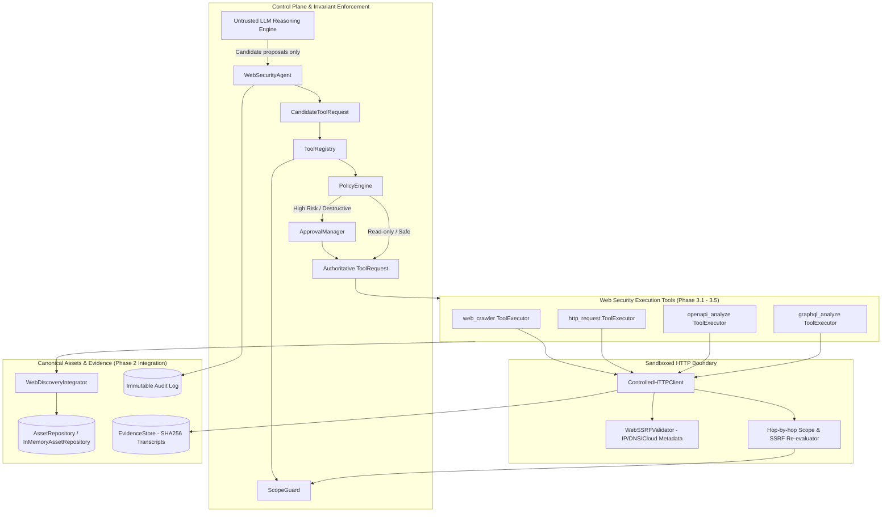

# Phase 3: Web / API Security Analysis Subsystem

**Current Status**:
- **Phase 3.1 (Web Security Domain Models & Sandboxed HTTP Client)**: **`COMPLETE`**
- **Phase 3.2 (Hardened Web Crawler & Structural Parser)**: **`COMPLETE`**
- **Phase 3.3 (Endpoint & Parameter Discovery Integration)**: **`COMPLETE`**
- **Phase 3.4 (OpenAPI / Swagger Discovery & Schema Analysis)**: **`COMPLETE`**
- **Phase 3.5 (GraphQL Schema & Introspection Analysis)**: **`COMPLETE`**
- **Autonomous Web Security Agent & Tool Integration**: **`COMPLETE`**
- **Adversarial & Regression Test Suite**: **`COMPLETE`**

---

## 1. Subsystem Architecture

---

## 2. Core Security Invariants

1. **The LLM is an Untrusted Reasoning Engine**: The model has ZERO execution or authorization authority. All proposed web actions are generated as `CandidateToolRequest`s and pass through `ToolRegistry -> ScopeGuard -> PolicyEngine -> ApprovalManager -> ExecutionManager`.
2. **`DISCOVERED != AUTHORIZED`**: Discovered links, forms, OpenAPI endpoints, servers, and GraphQL types are strictly treated as passive observations. They are stored in `AssetRepository` with `discovered_not_authorized=True` and NEVER auto-expand the authorized scope in `ScopeGuard`.
3. **Comprehensive SSRF Defense**: All outbound HTTP transactions pass through `WebSSRFValidator` prior to connection. Loopback (`127.0.0.0/8`, `::1`), RFC 1918 private subnets (`10.0.0.0/8`, `172.16.0.0/12`, `192.168.0.0/16`), link-local (`169.254.0.0/16`, `fe80::/10`), and cloud metadata IP/domains (`169.254.169.254`, `metadata.google.internal`) are blocked unconditionally.
4. **Hop-by-Hop Redirect Validation**: Redirects are not followed blindly. Every redirect hop is captured, normalized, and re-evaluated through both `WebSSRFValidator` and `ScopeGuard` before any connection is made.
5. **Bounded Execution & DoS Resilience**: Crawlers and schema analyzers enforce hard caps:
   - Crawler: maximum pages, maximum recursion depth, maximum request count, same-origin enforcement.
   - OpenAPI Parser: maximum 5 MB document size, maximum recursion depth 20 for internal `$ref`, total blocking of external `$ref` URIs.
   - GraphQL Analyzer: bounded introspection query depth, query length caps, destructive mutation flagging.

---

## 3. Subphase Implementation Summary

### Phase 3.1: Web Security Domain Models & Controlled Client
- **Models** (`arka/app/web/models/`): `HTTPRequest`, `HTTPResponse`, `HTTPTransaction`, `Parameter`, `AuthenticationContext`.
- **SSRF Defense** (`arka/app/web/client/ssrf.py`): DNS resolution checks, private IP filtering, cloud metadata blocking.
- **Controlled Client** (`arka/app/web/client/client.py`): Built atop `httpx.AsyncClient`, intercepting redirects, enforcing size/timeout limits, and capturing cryptographic evidence hashes in `EvidenceStore`.

### Phase 3.2: Hardened Web Crawler & Structural Parser
- **Parser** (`arka/app/web/crawler/parser.py`): Built with Python stdlib `html.parser` (zero external C extensions), `defusedxml` for XML sitemaps, safe robots.txt parsing, canonical URL normalization (traversal collapse, port stripping, query sorting).
- **Crawler Engine** (`arka/app/web/crawler/crawler.py`): BFS traversal with cycle detection, depth limits, page count limits, and per-link scope verification.

### Phase 3.3: Endpoint & Parameter Discovery Integration
- **Integrator** (`arka/app/web/discovery/integrator.py`): Converts discovered crawler links, forms, and API schemas into canonical Phase 2 `Endpoint`, `Asset`, and `Service` domain entities using deterministic identity generation (`generate_endpoint_id`, `generate_asset_id`).
- **Provenance**: Links all discovered endpoints to raw HTTP cryptographic evidence records in `EvidenceStore`.

### Phase 3.4: Safe OpenAPI / Swagger Discovery & Schema Analysis
- **Parser** (`arka/app/web/openapi/parser.py`): Hardened parser handling JSON and YAML (via `yaml.safe_load`). Prohibits external `$ref` resolutions (`http://`, `file://`), prevents recursive reference expansion loops, and caps file size at 5MB.
- **Analyzer** (`arka/app/web/openapi/analyzer.py`): Probes standard specification paths (`/openapi.json`, `/swagger.json`, `/api-docs`), validates declared `servers` against `ScopeGuard`, and extracts REST operations into canonical models.

### Phase 3.5: GraphQL Schema & Introspection Analysis
- **Introspection Engine** (`arka/app/web/graphql/analyzer.py`): Probes `/graphql` with a safe introspection query. Detects enabled vs disabled introspection.
- **Mutation Risk Classification**: Identifies queries, mutations, and subscriptions. Destructive mutations (e.g. `delete*`, `remove*`, `drop*`, `truncate*`, `purge*`) are flagged with `RiskLevel.HIGH`.

---

## 4. Verification & Quality Gates

- **Unit & Security Tests**: 73 dedicated web unit and security tests in `tests/unit/web/` and `tests/security/web/`.
- **Adversarial Hardening**: Verified against parameter smuggling, forged approvals, prompt injections, SSRF redirections, external `$ref` attacks, and cyclic introspection bombs.
- **Full Suite Status**: 610 passed, 10 skipped across all 620 tests in the repository.
- **Type Checking**: Clean `mypy` pass across all web and agent modules.
- **Linter & Formatter**: Clean `ruff check` and `ruff format` pass.
