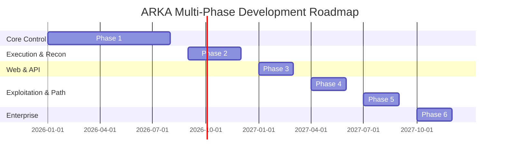

# Project Roadmap

This document outlines the multi-phase engineering roadmap for ARKA.

---

## 1. Master Phase Roadmap

---

## 2. Phase Status Matrix

| Phase | Title | Status | Core Deliverables |
|---|---|:---:|---|
| **Phase 1** | **Secure Agent Control Plane** | **`COMPLETED`** | Zero-trust LangGraph orchestrator, deterministic ScopeGuard, PolicyEngine, persistent PostgreSQL approvals, LiteLLM gateway, append-only audit, safe mock tools. |
| **Phase 2** | **Secure Tool Execution & Reconnaissance** | **`PLANNED`** | Ephemeral Docker runner, network namespace filtering, Nmap/Nuclei/ffuf adapters, structured output parsers, Reconnaissance Agent, asset normalization. |
| **Phase 3** | **Web/API Security Analysis** | **`PLANNED`** | Web crawling, OpenAPI/GraphQL schema fuzzing, authenticated session handling, business logic flaw detection, Web Security Agent. |
| **Phase 4** | **Controlled Exploitation & Validation** | **`PLANNED`** | PoC validation engine, strict human-in-the-loop exploit gating, non-destructive validation payloads, Exploitation Agent. |
| **Phase 5** | **Attack Graph & Autonomous Attack Paths** | **`PLANNED`** | Graph-based attack path modeling (Neo4j / NetworkX), multi-hop scenario planning, risk calculation, automated executive reporting. |
| **Phase 6** | **Advanced Multimodal & Enterprise** | **`PLANNED`** | UI/UX screenshot analysis, SSO/RBAC integration, SIEM event streaming, multi-tenant fleet orchestration. |
