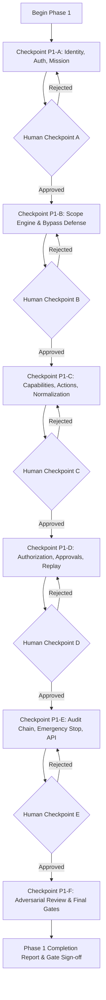

# ARKA Phase 1 — Security Kernel Foundation Architecture & Execution Plan

**Project:** ARKA — Autonomous Risk Knowledge & Assessment  
**Phase:** 1 (Deterministic Security Kernel Foundation)  
**Security Classification:** Security-Critical  
**Execution Mode:** Controlled implementation with mandatory human checkpoints  
**Status:** Approved Architecture Baseline (Post `/grill-me` Alignment)

---

## 1. Architectural Decisions Summary

Based on the thorough `/grill-me` design interview, the following technical and architectural decisions are pinned for the implementation of Phase 1:

| Area | Decision | Rationale |
| :--- | :--- | :--- |
| **Workspace Layout** | Fine-grained multi-crate workspace under `crates/`: `arka-core-types`, `arka-crypto`, `arka-kernel`, `arka-storage-sqlite` | Enforces Invariant 4.2 at the crate boundary: `arka-kernel` has zero SQL/database dependencies; `#![forbid(unsafe_code)]` enforced in domain logic. |
| **Execution Model** | Fully Asynchronous with Tokio runtime (`async fn in trait`) | Non-blocking execution across concurrent requests; native support for async SQLite connection pooling and timeouts. |
| **Transaction Boundary** | Unit of Work via explicit `StorageTransaction` trait | `Storage::begin_transaction()` yields a transaction handle that coordinates emergency stop checks, replay consumption, approval verification, and audit appending atomically (`BEGIN IMMEDIATE`). |
| **Identity & Tokens** | Deterministic JCS Signed Token (`ARKA-TOKEN-V1:`) | Cryptographic Ed25519 signature over RFC 8785 canonical bytes; verified via Phase 0 KeyProvider contracts. No JWT/ASN.1 parser risks. |
| **Mission State Machine** | 5-State Explicit Lifecycle (`Created` → `Active` ↔ `Paused` → `Completed` / `Terminated`) | Strict state validation; authenticated operator transition; Emergency Stop acts as an orthogonal persistent kill-switch. |
| **Scope Engine** | Strict Typed Target Model (Offline & Deterministic) | Strongly typed targets (`Ip`, `Cidr`, `Domain`, `UrlOrigin`); strict rejection of octal/hex IPs, userinfo, and homoglyphs. Invariant: `Exclusions > Inclusions > Port/Protocol Constraints > Default-Deny`. |
| **Normalization Boundary** | Strict AST Pre-Parser with RFC 8785 JCS Canonicalization | Rejects payloads > 64KB or depth > 8; streaming rejection of duplicate JSON keys; authoritative risk derivation from Capability Registry. |
| **Authorization & Approvals** | Two-Phase Proposal & Approval with Hash Binding | Proposal returns `REQUIRE_APPROVAL` with `action_hash`. Approval token binds exact `action_hash`, expiration, and enforces `approver != requester`. |
| **Audit Subsystem** | Dual Hash Chain (Per-Mission + System Audit) | Per-mission sequential SHA-256 hash chains eliminate lock contention across missions; signed with `AUDIT-SIGNING` Ed25519 keys; global events logged to System chain. |
| **Error Oracle Defense** | Dual Error Representation | Internal `KernelSecurityError` for audit telemetry/tracing; sanitized, bounded `ExternalSecurityError` (`AUTHORIZATION_DENIED`) for external callers. |
| **Checkpoint Protocol** | Strict Stop-and-Verify Checkpoints (P1-A through P1-F) | Implement checkpoint components & tests → verify with `cargo test`, `clippy`, and Phase 0 validator → present report → **STOP for human approval**. |

---

## 2. Target Workspace Architecture

```text
arka/
├── Cargo.toml                          # Workspace root Cargo.toml
├── crates/
│   ├── arka-core-types/                # Domain primitives, strongly typed IDs, errors
│   │   ├── Cargo.toml
│   │   └── src/
│   │       ├── lib.rs
│   │       ├── id.rs                   # MissionId, OperatorId, AgentId, TaskId, etc.
│   │       ├── subject.rs              # Authenticated subject & actor kinds
│   │       ├── errors.rs               # Internal vs External security error types
│   │       └── clock.rs                # Injectable Clock abstraction
│   │
│   ├── arka-crypto/                    # Cryptographic primitives & canonicalization
│   │   ├── Cargo.toml
│   │   └── src/
│   │       ├── lib.rs
│   │       ├── canonical.rs            # RFC 8785 JSON Canonicalization (JCS)
│   │       ├── hashing.rs              # SHA-256 with domain separation
│   │       ├── provider.rs             # Phase 0 KeyProvider trait integration
│   │       └── token.rs                # Deterministic token verification & parsing
│   │
│   ├── arka-kernel/                    # Pure deterministic Security Kernel (#![forbid(unsafe_code)])
│   │   ├── Cargo.toml
│   │   └── src/
│   │       ├── lib.rs
│   │       ├── storage.rs              # Storage & StorageTransaction trait abstractions
│   │       ├── auth/                   # AuthenticatedContext & token verification
│   │       ├── missions/               # Mission state machine & isolation rules
│   │       ├── scope/                  # Target parser & Scope Engine
│   │       ├── capabilities/           # Capability Registry & metadata
│   │       ├── actions/                # Proposal parsing, normalization, CanonicalAction
│   │       ├── policy/                 # Authorization Engine (ALLOW, DENY, REQUIRE_APPROVAL)
│   │       ├── approvals/              # Approval binding & TOCTOU parameter check
│   │       ├── replay/                 # Replay key verification & consumption
│   │       ├── audit/                  # Audit record builder & dual hash-chain logic
│   │       └── emergency_stop/         # Persistent emergency-stop gate & atomic cache
│   │
│   └── arka-storage-sqlite/            # SQLite WAL persistence implementation
│       ├── Cargo.toml
│       └── src/
│           ├── lib.rs
│           ├── db.rs                   # SQLite connection pool & WAL mode initialization
│           ├── tx.rs                   # StorageTransaction implementation (BEGIN IMMEDIATE)
│           ├── schema.rs               # DDL & migrations (replay_log, missions, audit, estop)
│           └── repos/                  # Repositories for state persistence
│
├── security/                           # Phase 0 security model, baseline manifest, validator
└── tests/                              # Integration, concurrency, property, and negative tests
```

---

## 3. Checkpoint Execution Roadmap



### Detailed Checkpoint Deliverables:

1. **Checkpoint P1-A: Identity, Authentication & Mission Lifecycle**
   - Workspace setup with `Cargo.toml` and crate scaffolding.
   - Strongly typed validated IDs: `MissionId`, `OperatorId`, `AgentId`, `TaskId`, `WorkerId`, `CapabilityId`, `ActionId`, `ProposalId`, `ApprovalId`, `TokenId`.
   - `AuthenticatedContext` construction from verified Ed25519 JCS signed tokens.
   - Injectable `Clock` trait for deterministic temporal verification.
   - Mission 5-state lifecycle state machine and cross-mission access barriers.
   - Stable test suite: `TEST-AUTH-*`, `TEST-MISSION-*`.

2. **Checkpoint P1-B: Scope Engine**
   - Canonical target representations: `Ip`, `Cidr`, `Domain`, `UrlOrigin`.
   - Scope parser with bypass defense (octal/hex IP rejection, URL userinfo rejection, IDNA/homoglyph handling).
   - Strict evaluation rules: `Exclusions > Inclusions > Port/Protocol > Default-Deny`.
   - Stable test suite: `TEST-SCOPE-*` (including negative IP, DNS, and URL bypass tests).

3. **Checkpoint P1-C: Capabilities, Actions & Normalization Boundary**
   - Capability Registry with authoritative risk ratings and required parameters.
   - Proposal parser with duplicate key rejection, 64KB max payload, and nesting depth limits.
   - RFC 8785 JCS canonicalization and `parameter_hash` generation.
   - Construction of immutable `CanonicalAction`.
   - Stable test suite: `TEST-CAP-*`, `TEST-ACTION-*`.

4. **Checkpoint P1-D: Authorization, Authority, Approvals & Replay**
   - Decision Engine: `ALLOW`, `DENY`, `REQUIRE_APPROVAL`.
   - Authority delegation validation: child authority must strictly be a subset of parent.
   - Replay protection with SQLite WAL `BEGIN IMMEDIATE` and unique constraints.
   - Mandatory multi-threaded concurrent replay stress test.
   - Approval binding verification (`action_hash`, non-expired, `approver != requester`).
   - Stable test suite: `TEST-AUTHZ-*`, `TEST-APPROVAL-*`, `TEST-REPLAY-*`.

5. **Checkpoint P1-E: Audit Chain Foundation, Emergency Stop & Contracts**
   - Dual SHA-256 hash chains (Per-Mission + System Audit) signed via `AUDIT-SIGNING`.
   - Atomic transaction enforcement: decision + replay + approval + audit commit together.
   - Persistent Emergency Stop state machine surviving restart.
   - Public security API contracts and sanitized external error responses.
   - Stable test suite: `TEST-AUDIT-*`, `TEST-ESTOP-*`.

6. **Checkpoint P1-F: Independent Adversarial Review & Gate Promotion**
   - Specification audit against PRD v2.2 and TRD v2.2.
   - Adversarial review covering the 22 mandatory security questions.
   - Execution of full verification suite (`cargo test --all`, `clippy`, P0 validator).
   - Phase 1 Completion Report generation with actual command outputs and exit codes.
