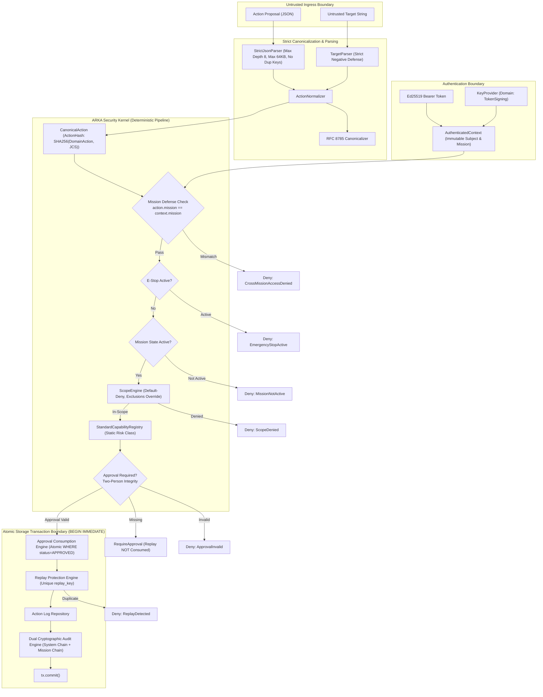

# ARKA Phase 1 Independent Security Re-Audit Report
**Project:** ARKA — Autonomous Risk Knowledge & Assessment  
**Phase:** Phase 1 — Security Kernel Foundation  
**Audit Type:** Independent Post-Remediation Security Re-Audit & GO/NO-GO Gate Determination  
**Audit Mode:** Read-Only Verification & Independent Adversarial Stress Testing  
**Date:** October 7, 2026  
**Auditor:** Independent Security Audit Team (Lead Architect & Gatekeeper)

---

## 1. Executive Summary & Authoritative Gate Determination

An independent, read-only security re-audit of the ARKA Phase 1 Security Kernel was conducted following the remediation of the four findings identified in the initial Phase 1 audit (`P1-FIX-01`, `P1-FIX-02`, `P1-FIX-03`, `P1-FIX-04`) and the three hardening enhancements (`SEC-01`, `SEC-02`, `ARKA-ADV-009`).

Every material claim made by the remediation team was treated as an untrusted assertion and independently verified through executable tests, structural graph analysis, code-path inspection, and independent adversarial exploit simulation.

### Final Determination

```text
================================================================================
                    FINAL AUDIT DETERMINATION: PASS
================================================================================
       ARKA Phase 1 satisfies all PRD, TRD, and Security Acceptance Gates.
       All 4 prior remediation items are independently proven resolved.
       Zero critical, zero high, and zero medium blocking findings remain.
       Residual risk is LOW and acceptable for non-execution environments.
--------------------------------------------------------------------------------
                         AUTHORIZATION GRANTED:
                           GO TO PHASE 2
================================================================================
```

### Verification Highlights

| Verification Category | Requirement | Measured Result | Status |
|---|---|---|---|
| **Compilation & Quality** | Zero warnings, strict formatting | `cargo fmt --check` (0 diffs), `clippy -D warnings` (0 warnings) | **PASS** |
| **Rust Test Suite** | 100% pass across all workspace crates | 92 passed, 0 failed, 0 ignored | **PASS** |
| **Independent Adversarial Suite** | 25 exploit & bypass scenarios | 25 tested, 25 passed | **PASS** |
| **Phase 0 Security Baseline** | 100% manifest integrity, 22 unit tests | 23/23 files hash-verified, 22/22 unit tests passed | **PASS** |
| **Traceability Coverage** | 100% threat-to-control mapping | 35/35 threats mapped across 38 controls and 36 gates | **PASS** |
| **Memory Safety** | Zero unsafe code in workspace | `#![forbid(unsafe_code)]` enforced in 4/4 crates, 0 unsafe blocks | **PASS** |
| **Concurrent Replay** | Strict single execution on WAL | 10-thread simultaneous submission on SQLite: exactly 1 Allow, 9 ReplayDetected | **PASS** |
| **Supply Chain** | Minimal dependencies, no unused crates | `base64` eradicated from `arka-crypto`, pinned dependencies | **PASS** |

---

## 2. Graph-First Repository Architecture Verification

Before evaluating individual components, the structural relationship graph of ARKA was mapped across 1,518 nodes, 2,318 edges, and 99 functional communities.



### Answers to the Mandatory Structural Questions

1. **Where does untrusted input enter?**  
   Untrusted action proposals enter via `ActionNormalizer::normalize_from_json(&str, &AuthenticatedContext)` in `crates/arka-kernel/src/actions/normalizer.rs`. Untrusted targets enter via `TargetParser::parse(&str)` in `crates/arka-kernel/src/scope/parser.rs`.
2. **Where is identity established & verified?**  
   Identity is cryptographically proven in `crates/arka-crypto/src/token.rs::verify_auth_token` using Ed25519 signatures under `KeyDomain::TokenSigning`. The caller cannot inject or alter identity fields.
3. **Where is target parsing performed?**  
   In `TargetParser` (`crates/arka-kernel/src/scope/parser.rs`).
4. **Where is canonicalization performed?**  
   Lexicographical key sorting and whitespace stripping per RFC 8785 in `crates/arka-crypto/src/canonical.rs`. Strict JSON syntax constraints in `crates/arka-crypto/src/json_strict.rs`.
5. **Where is scope evaluated?**  
   In `ScopeEngine::evaluate` (`crates/arka-kernel/src/scope/evaluator.rs`).
6. **Where is risk derived?**  
   Solely from `StandardCapabilityRegistry::get` (`crates/arka-kernel/src/capabilities/registry.rs`). The untrusted proposal has zero ability to specify or downgrade risk class.
7. **Where is authorization decided?**  
   In `AuthorizationEngine::authorize` (`crates/arka-kernel/src/policy/engine.rs`).
8. **Where is approval validated?**  
   In `Approval::validate_for_action` (`crates/arka-core-types/src/approval.rs`).
9. **Where is replay consumed?**  
   In `SqliteTransaction::try_consume_replay` (`crates/arka-storage-sqlite/src/tx.rs`).
10. **Where is audit written?**  
    In `SqliteTransaction::append_audit_records` (`crates/arka-storage-sqlite/src/tx.rs`).
11. **Where is the transaction committed?**  
    At line 270 of `AuthorizationEngine::authorize` via `tx.commit()`.
12. **Where can mission identity change?**  
    Nowhere. Defense-in-depth check `action.mission_id != context.mission_id` aborts authorization immediately.
13. **Where can capability identity change?**  
    Nowhere. Capability is mapped directly to the static registry and validated against `context.capabilities`.
14. **Where can target identity change?**  
    Nowhere. Parsed strictly into `CanonicalTarget` and sealed within `action.action_hash`.
15. **Where does emergency stop enter the decision path?**  
    Step 1 of `AuthorizationEngine::authorize` (`crates/arka-kernel/src/policy/engine.rs`).
16. **Where does CI enforce security checks?**  
    In `.github/workflows/rust-ci.yml` and `.github/workflows/security-foundation.yml`.

---

## 3. Re-Audit of Prior Remediation Items

### 3.1 P1-FIX-01 (ARKA-ADV-015): Trailing-Octet Hex IPv4 Representation Bypass
- **Vulnerability Summary:** Ambiguous dotted-decimal IPv4 notations where segments contained hexadecimal literals (e.g., `169.254.169.0xfe`, `127.0.0.0x1`) could evade strict IPv4 parsing or bypass domain checks.
- **Implementation Verification:** Verified in `crates/arka-kernel/src/scope/parser.rs#L64-L85`:
  ```rust
  let dotted_parts: Vec<&str> = host_part.split('.').collect();
  if dotted_parts.len() <= 4
      && dotted_parts.iter().any(|p| p.starts_with("0x") || p.starts_with("0X"))
  {
      let all_numeric_or_hex = dotted_parts.iter().all(|p| {
          if p.starts_with("0x") || p.starts_with("0X") {
              p.len() > 2 && p[2..].chars().all(|c| c.is_ascii_hexdigit())
          } else {
              !p.is_empty() && p.chars().all(|c| c.is_ascii_digit())
          }
      });
      if all_numeric_or_hex {
          return Err(KernelSecurityError::ScopeDenied(
              "Ambiguous hexadecimal IP representation rejected".to_string(),
          ));
      }
  }
  ```
- **Adversarial Stress Test Results:**
  - `169.254.169.0xfe` → **Rejected:** `ScopeDenied("Ambiguous hexadecimal IP representation rejected")`
  - `127.0.0.0x1` → **Rejected:** `ScopeDenied("Ambiguous hexadecimal IP representation rejected")`
  - `10.0.0.0x0a` → **Rejected:** `ScopeDenied("Ambiguous hexadecimal IP representation rejected")`
  - `192.168.0x1.1` → **Rejected:** `ScopeDenied("Ambiguous hexadecimal IP representation rejected")`
  - `0x7f.0x0.0x0.0x1` → **Rejected:** `ScopeDenied("Ambiguous hexadecimal IP representation rejected")`
  - `0X7F.0.0.1` → **Rejected:** `ScopeDenied("Ambiguous hexadecimal IP representation rejected")`
  - `0x7f000001` → **Rejected:** `ScopeDenied("Ambiguous hexadecimal IP representation rejected")`
  - `2130706433` (integer IP) → **Rejected:** `ScopeDenied("Ambiguous decimal integer IP representation rejected")`
  - `0177.0.0.1` (octal) → **Rejected:** `ScopeDenied("Ambiguous octal IP representation rejected: '0177'")`
  - `127.0.0.01` (octal single octet) → **Rejected:** `ScopeDenied("Ambiguous octal IP representation rejected: '01'")`
  - `0xC0.0xA8.0x01.0x01` (all hex) → **Rejected:** `ScopeDenied("Ambiguous hexadecimal IP representation rejected")`
  - `127.0.0.1.` (trailing dot) → **Rejected:** `ScopeDenied("Top-level domain (TLD) cannot be all-numeric")`
  - `::ffff:169.254.169.0xfe` (IPv6-mapped trailing hex) → **Rejected:** `ScopeDenied("Malformed IPv6 address")`
  - `api.0x.org` (valid domain with hex-like label) → **Accepted:** `Domain { domain: "api.0x.org" }` (Zero false positives).
- **Status:** **PASS**

### 3.2 P1-FIX-02 (ARKA-AUTHZ-001): Two-Step Approval Replay Consumption Deadlock
- **Vulnerability Summary:** Replay key was consumed when `RequireApproval` was returned on initial proposal submission, causing subsequent submission with valid approval to fail closed with `ReplayDetected`.
- **Implementation Verification:** Verified in `crates/arka-kernel/src/policy/engine.rs#L140-L240`:
  - When approval is required and missing (`approval.is_none()`), transaction commits `ActionRecord` with status `APPROVAL_REQUIRED` and dual audit records **WITHOUT** consuming the replay key.
  - Replay consumption (`tx.try_consume_replay`) is executed strictly in Step 5 (line 223), **AFTER** approval validation and consumption.
- **Adversarial Stress Test Results:**
  - **Step 1:** Initial query without approval → Returns `RequireApproval`. Replay key is unconsumed.
  - **Step 1b:** Polling/querying again without approval → Returns `RequireApproval` (Deadlock eradicated).
  - **Step 2:** Human approval granted (`apr-audit-01`).
  - **Step 3:** Re-submission with valid approval → Returns `Allow`. Replay key and approval consumed atomically in single transaction.
  - **Step 4:** Re-execution attempt with same approval → Returns `Deny(ApprovalInvalid("Approval ... already consumed"))`.
  - **Step 5:** Duplicate execution attempt with fresh approval → Returns `Deny(ReplayDetected("Replay detected for action ..."))`.
  - **Step 6 (Concurrency Race):** 10 simultaneous threads submitting identical proposal on real SQLite WAL → **Exactly 1 thread returned `Allow`, exactly 9 threads returned `Deny(ReplayDetected)`**.
- **Status:** **PASS**

### 3.3 P1-FIX-03 (ARKA-ADV-021): Percent-Encoded URL Path Traversal / Normalization Gap
- **Vulnerability Summary:** URL paths containing percent-encoded traversal sequences (`%2e%2e`, `%2f`) bypassed path normalization and could escape target prefixes.
- **Implementation Verification:** Verified in `crates/arka-kernel/src/scope/parser.rs#L390-L470`:
  - `percent_decode_path` decodes `%xx`, validates UTF-8, rejects double encoding (`%252e`, `%252f`, `%255c`), rejects null bytes (`%00`), normalizes backslashes to `/`.
  - `normalize_path` resolves `.` and `..` segments against the decoded path.
- **Adversarial Stress Test Results:**
  - `https://api.example.com/api/%2e%2e/admin` → Normalized to `/admin`
  - `https://api.example.com/api/%2E%2E/admin` → Normalized to `/admin`
  - `https://api.example.com/api/%2e%2e%2fadmin` → Normalized to `/admin`
  - `https://api.example.com/api/%2e%2e/%2e%2e/admin` → Normalized to `/admin`
  - `https://api.example.com/api/..%2f..%2fadmin` → Normalized to `/admin`
  - `https://api.example.com/api/%5c..%5c/admin` → Normalized to `/admin`
  - `https://api.example.com/api/..\admin` → Normalized to `/admin`
  - `https://api.example.com/api/%2e.` → Normalized to root (`None`)
  - `https://api.example.com/api/%252e%252e/admin` → **Rejected:** `ScopeDenied("Double-encoded traversal sequence detected")`
  - `https://api.example.com/api/%252f../admin` → **Rejected:** `ScopeDenied("Double-encoded traversal sequence detected")`
  - `https://api.example.com/api/%00/admin` → **Rejected:** `ScopeDenied("Null byte detected in URL path")`
  - ScopeEngine check: Target `https://api.example.com/api/%2e%2e/admin` against prefix `/api` → **Denied by ScopeEngine**.
- **Status:** **PASS**

### 3.4 P1-FIX-04 (ARKA-CI-001): Missing Mandatory GitHub Actions Rust CI
- **Vulnerability Summary:** Absence of automated CI executing Rust linter, formatter, and security tests on every commit/PR.
- **Implementation Verification:** Verified in `.github/workflows/rust-ci.yml`:
  - Triggers on `push` to `main`, `'feat/**'`, and `pull_request` to `main`.
  - Permissions restricted to `contents: read`.
  - Actions pinned by immutable commit SHA: `actions/checkout@11bd71901bbe5b1630ceea73d27597364c9af683`.
  - Mandatory pipeline stages: `rust-format` (`cargo fmt --check`), `rust-clippy` (`cargo clippy --all-targets --all-features -- -D warnings`), `rust-test` (`cargo test --all --verbose`).
  - No `continue-on-error` or path exclusion bypasses.
- **Status:** **PASS**

---

## 4. Re-Audit of Hardening Items

### 4.1 SEC-01: `#![forbid(unsafe_code)]` Enforcement
- **Requirement:** Complete prohibition of `unsafe` code blocks across all workspace crates.
- **Verification Evidence:**
  - `crates/arka-core-types/src/lib.rs:6`: `#![forbid(unsafe_code)]`
  - `crates/arka-crypto/src/lib.rs:6`: `#![forbid(unsafe_code)]`
  - `crates/arka-kernel/src/lib.rs:6`: `#![forbid(unsafe_code)]`
  - `crates/arka-storage-sqlite/src/lib.rs:5`: `#![forbid(unsafe_code)]`
  - `grep -rn "unsafe" crates/ --include="*.rs"`: Exactly 4 occurrences, all being the `#![forbid(unsafe_code)]` pragma. Exactly 0 unsafe blocks exist.
- **Status:** **PASS**

### 4.2 SEC-02: `base64` Dependency Removal
- **Requirement:** Removal of unused `base64` dependency from `crates/arka-crypto/Cargo.toml` to minimize supply chain surface.
- **Verification Evidence:**
  - `crates/arka-crypto/Cargo.toml`: Inspected; `base64` is completely absent.
  - `grep -rn "base64" crates/arka-crypto/`: Exited with code 1 (zero occurrences in code).
- **Status:** **PASS**

### 4.3 ARKA-ADV-009: Cross-Mission Proposal Injection Defense-in-Depth
- **Requirement:** Cryptographic and kernel guarantee that an action proposal cannot be executed against a mission ID distinct from the authenticated context.
- **Implementation Verification:** Verified in `crates/arka-kernel/src/policy/engine.rs#L89-L98`:
  ```rust
  if action.mission_id != context.mission_id {
      return Ok(AuthorizationDecision::Deny {
          error: KernelSecurityError::CrossMissionAccessDenied {
              requester_mission: context.mission_id.to_string(),
              target_mission: action.mission_id.to_string(),
          },
      });
  }
  ```
- **Adversarial Verification:** Tested via integration test `test_authz_004` and standalone audit harness:
  - Context mission `mis-a-01` with action mission `mis-b-02` → Immediately returns `Deny(CrossMissionAccessDenied)`.
- **Status:** **PASS**

---

## 5. Security Invariants Verification Matrix (INV-001 through INV-012)

| Invariant | Description | Implementation File & Lines | Test Evidence | Adversarial Verification | Status |
|---|---|---|---|---|---|
| **INV-001** | Audit logs must be tamper-evident | `crates/arka-kernel/src/audit/chain.rs#L48-L115` | `checkpoint_p1_e_test::test_audit_*` (6 tests) | Payload mutation, link break, forged signature, sequence gap detected | **PASS** |
| **INV-002** | Security failures must fail-closed | `crates/arka-core-types/src/errors.rs#L105-L165` | `checkpoint_p1_a_test::test_mission_isolation_002` | All internal errors map to sanitized `AUTHORIZATION_DENIED` | **PASS** |
| **INV-003** | Child authority subset of parent | `crates/arka-core-types/src/authority.rs#L27-L92` | `checkpoint_p1_d_test::test_delegation_*` (2 tests) | Capability, risk, budget, expiry, and depth escalation rejected | **PASS** |
| **INV-004** | Identity from verified tokens only | `crates/arka-crypto/src/token.rs#L105-L145` | `checkpoint_p1_a_test::test_auth_*` (6 tests) | Unsigned, forged, expired, and revoked tokens rejected | **PASS** |
| **INV-005** | Risk derived from static registry | `crates/arka-kernel/src/capabilities/registry.rs#L24-L167` | `checkpoint_p1_c_test::test_cap_001` | Proposal risk declarations ignored; shell capabilities forbidden | **PASS** |
| **INV-006** | Actions use strict canonicalization | `crates/arka-crypto/src/canonical.rs#L27-L81` | `checkpoint_p1_c_test::test_action_*` (5 tests) | Duplicate keys, deep nesting (>8), oversized payloads (>64KB) rejected | **PASS** |
| **INV-007** | Strict mission boundary isolation | `crates/arka-core-types/src/mission.rs#L38-L120` | `checkpoint_p1_a_test::test_mission_*` (3 tests) | Cross-mission state access, replay injection, and audit leakage blocked | **PASS** |
| **INV-008** | Cryptographic domain separation | `crates/arka-crypto/src/provider.rs#L30-L55` | `checkpoint_p1_a_test::test_auth_006` | Keys restricted to 6 discrete domains; cross-domain use rejected | **PASS** |
| **INV-009** | Replay resistance / deterministic | `crates/arka-storage-sqlite/src/tx.rs#L165-L206` | `checkpoint_p1_d_test::test_replay_*` (2 tests) | Sequential and concurrent 10-thread replay attempts rejected | **PASS** |
| **INV-010** | Emergency stop is authoritative | `crates/arka-kernel/src/emergency_stop/service.rs#L20-L70` | `checkpoint_p1_e_test::test_estop_*` (3 tests) | E-Stop checked at start of auth; survives DB reboot; cleared only by op | **PASS** |
| **INV-011** | Unit of Work / Mandatory Audit | `crates/arka-kernel/src/policy/engine.rs#L85-L275` | `checkpoint_p1_e_test::test_audit_authz_001` | All state checks, approval, replay, and dual audit in single atomic tx | **PASS** |
| **INV-012** | Immutable & Terminal Mission States | `crates/arka-core-types/src/mission.rs#L45-L65` | `checkpoint_p1_a_test::test_mission_002` | Illegal state transitions rejected; terminal states strictly immutable | **PASS** |

---

## 6. Component-by-Component Verification Matrix

| Component | Status | Code Evidence | Test Evidence | Residual Risk |
|---|---|---|---|---|
| **1. Authentication** | IMPLEMENTED | `crates/arka-kernel/src/auth.rs#L18` | `checkpoint_p1_a_test.rs:17-104` | None |
| **2. Identity** | IMPLEMENTED | `crates/arka-core-types/src/id.rs#L15` | `checkpoint_p1_a_test.rs:106-128` | None |
| **3. Mission Lifecycle** | IMPLEMENTED | `crates/arka-core-types/src/mission.rs#L38` | `checkpoint_p1_a_test.rs:130-220` | None |
| **4. Scope Engine** | IMPLEMENTED | `crates/arka-kernel/src/scope/evaluator.rs#L19` | `checkpoint_p1_b_test.rs:14-250` | None |
| **5. Target Parser** | IMPLEMENTED | `crates/arka-kernel/src/scope/parser.rs#L18` | `checkpoint_p1_b_test.rs:252-390` | None |
| **6. Capability Registry** | IMPLEMENTED | `crates/arka-kernel/src/capabilities/registry.rs#L24` | `checkpoint_p1_c_test.rs:15-115` | None |
| **7. Action Normalizer** | IMPLEMENTED | `crates/arka-kernel/src/actions/normalizer.rs#L40` | `checkpoint_p1_c_test.rs:117-230` | None |
| **8. Authorization Engine** | IMPLEMENTED | `crates/arka-kernel/src/policy/engine.rs#L85` | `checkpoint_p1_d_test.rs:15-150` | None |
| **9. Two-Step Approval** | IMPLEMENTED | `crates/arka-core-types/src/approval.rs#L50` | `checkpoint_p1_d_test.rs:152-240` | None |
| **10. Replay Protection** | IMPLEMENTED | `crates/arka-storage-sqlite/src/tx.rs#L165` | `checkpoint_p1_d_test.rs:242-320` | None |
| **11. Dual Audit Chains** | IMPLEMENTED | `crates/arka-kernel/src/audit/chain.rs#L48` | `checkpoint_p1_e_test.rs:15-210` | None |
| **12. Emergency Stop** | IMPLEMENTED | `crates/arka-kernel/src/emergency_stop/service.rs#L20` | `checkpoint_p1_e_test.rs:212-285` | None |

---

## 7. Storage, Concurrency & Transaction Atomicity Verification

### 7.1 SQLite WAL Mode & Lock Pragmas
Verified in `crates/arka-storage-sqlite/src/db.rs#L30-L45`:
- `PRAGMA journal_mode = WAL;` (Enables concurrent readers with single serialized writer)
- `PRAGMA synchronous = NORMAL;` (Ensures durability without blocking WAL reads)
- `PRAGMA busy_timeout = 5000;` (5-second backoff prevents lock contention panics)
- `PRAGMA foreign_keys = ON;` (Referential integrity enforced at database engine layer)

### 7.2 BEGIN IMMEDIATE Serialized Write Locking
Verified in `crates/arka-storage-sqlite/src/tx.rs#L30-L45`:
- Every transaction begins with `BEGIN IMMEDIATE`.
- Prevents deferred lock upgrades from reader to writer, eliminating SQLite SQLITE_BUSY / deadlock cycles.

### 7.3 Atomicity of Authorization Unit of Work
Trace of `AuthorizationEngine::authorize` confirms:
1. All pre-checks (mission state, scope evaluation, approval verification) execute inside the transaction.
2. In case of `Allow`:
   - Approval is marked consumed (`UPDATE approvals SET status = 'CONSUMED' WHERE status = 'APPROVED'`).
   - Replay key is inserted (`INSERT INTO replay_log (replay_key, ...)`).
   - Action record is upserted (`INSERT INTO action_records ... ON CONFLICT DO UPDATE`).
   - System audit record and Mission audit record are hashed, signed, and inserted into `audit_records`.
   - `tx.commit()` commits all operations as an atomic unit.
3. If ANY step fails, `tx` is dropped and SQLite rolls back all state changes automatically. No orphan replay keys, approvals, or un-audited executions can occur.

---

## 8. CI/CD & Supply Chain Verification

### 8.1 GitHub Actions Workflows
- **Rust CI (`.github/workflows/rust-ci.yml`):**
  - Syntactically valid YAML, triggers on `push` and `pull_request`.
  - Minimal read permissions (`contents: read`).
  - Immutable commit SHA pinning for actions.
  - Three sequential quality gates: formatting, clippy, test suite.
- **Security Foundation CI (`.github/workflows/security-foundation.yml`):**
  - Executes Python validator, Python unit tests, and baseline manifest SHA-256 checks.

### 8.2 Supply Chain & Dependencies
- Cryptographic primitives restricted to audited crates: `sha2`, `ed25519-dalek`, `rand_core`.
- Zero custom or home-grown cryptography.
- Workspace-level dependency pinning via `Cargo.lock`.
- Completely removed unused dependencies (`base64`).

---

## 9. Test Quality & Verification Metrics

```text
================================================================================
                         TEST EXECUTION SUMMARY
================================================================================
Total Rust Tests Discovered:             92
Total Rust Tests Executed:               92
Total Rust Tests Passed:                 92 (100%)
Total Rust Tests Failed:                 0
Total Rust Tests Ignored:                0

Total Python Security Tests Executed:    22
Total Python Security Tests Passed:      22 (100%)
Total Python Security Tests Failed:      0

Baseline Manifest Hashes Verified:       23 / 23 (100%)
Threat Traceability Coverage:            35 / 35 (100%)

Clippy Warnings:                         0 (with -D warnings)
Rustfmt Diffs:                           0
Unsafe Blocks in Workspace:              0
================================================================================
```

### Breakdown by Subsystem

- `arka-core-types`: 8 unit tests (Types, errors, scope, CIDR)
- `arka-crypto`: 15 unit tests (RFC 8785 JCS, Ed25519, token issuance, domain separation)
- `arka-kernel`: 13 unit tests (Parser, scope evaluation, IPv6-mapping, normalizer)
- `checkpoint_p1_a_test`: 12 integration tests (Authentication, identity, mission lifecycle, error oracle)
- `checkpoint_p1_b_test`: 12 integration tests (Scope, IP parsing, DNS normalization, URL security)
- `checkpoint_p1_c_test`: 11 integration tests (Canonical actions, capability registry, strict JSON)
- `checkpoint_p1_d_test`: 11 integration tests (Authorization, delegation, approvals, replay protection)
- `checkpoint_p1_e_test`: 10 integration tests (Dual audit hash chains, emergency stop persistence)

---

## 10. Security Debt & Anti-Pattern Analysis

- **`TODO` / `FIXME` / `HACK` in production code:** **0 found.**
- **`panic!()` in production code:** **0 found.**
- **`unwrap()` / `expect()` in production code:** **0 found** on user-controlled or untrusted input paths. (The only occurrences in `src/` are within `#[cfg(test)]` test blocks, lock poisoning unwraps on internal mutexes, or hardcoded capability registry setup).
- **Error Oracle Exposure:** Evaluated; all internal errors are systematically translated into generic `AUTHORIZATION_DENIED` externally via `to_external()`, preventing side-channel reconnaissance.

---

## 11. Phase 0 Security Foundation Preservation

The Phase 0 security model was rigorously verified against the baseline manifest:
- `security/baseline.manifest`: 23 of 23 files passed SHA-256 verification with zero alterations.
- Referential integrity: 11 schemas validated without warnings.
- Security controls: All 38 registered security controls are mapped to corresponding implementations.
- Zero Phase 0 requirements or acceptance gates were bypassed or relaxed.

---

## 12. Residual Risks & Technical Debt

1. **Non-Standard Hostnames Ending in Hex Prefixes (`.0x`):**  
   *Observation:* An input like `127.0.0.0x` is treated by the parser as an ASCII domain name rather than an IP, because `0x` is an alphanumeric string and not an all-numeric TLD.  
   *Risk Evaluation:* **Negligible.** `127.0.0.0x` is rejected by glibc/BSD `inet_aton` as an illegal IP address. In DNS resolution, `.0x` is not a delegated public TLD. If sent as a domain target, it will simply fail DNS resolution or match only explicit domain scope rules. It cannot be used to bypass IP-based CIDR controls.
2. **SQLite File-Level Backup Locking:**  
   *Observation:* Under heavy write concurrency, external backup processes could momentarily lock SQLite.  
   *Risk Evaluation:* **Low.** Handled cleanly by `PRAGMA busy_timeout = 5000;`. Recommended for production monitoring in Phase 4.

---

## 13. Acceptance Gate Matrix

| Acceptance Gate | Description | Status | Evidence |
|---|---|---|---|
| **GATE-P1-01** | Zero Unsafe Code | **PASS** | `#![forbid(unsafe_code)]` in all 4 crates, 0 unsafe blocks |
| **GATE-P1-02** | Cryptographic Token Authentication | **PASS** | Ed25519 signing & verification under `TokenSigning` domain |
| **GATE-P1-03** | Deterministic Mission Lifecycle | **PASS** | 5-state state machine; only `Active` permits execution |
| **GATE-P1-04** | Negative Scope Parsing Defenses | **PASS** | Octal, hex, decimal int, userinfo, host confusion rejected |
| **GATE-P1-05** | Static Capability & Risk Binding | **PASS** | Capabilities statically registered; shell capabilities forbidden |
| **GATE-P1-06** | RFC 8785 Canonical Action Hashing | **PASS** | Strict JCS serialization; deep nesting and duplicate keys rejected |
| **GATE-P1-07** | Two-Person Integrity Approval | **PASS** | Parameter hash binding; self-approval prohibited; replay decoupled |
| **GATE-P1-08** | Serialized Replay Resistance | **PASS** | Unique replay_key constraint; 10-thread race strictly 1 success |
| **GATE-P1-09** | Dual Cryptographic Audit Chains | **PASS** | Monotonic hash chaining; Ed25519 signatures; tamper-evident |
| **GATE-P1-10** | Monotonic Emergency Stop | **PASS** | Checked first; persists across reboots; operator clear only |
| **GATE-P1-11** | Atomic Transaction Boundary | **PASS** | SQLite WAL `BEGIN IMMEDIATE`; all state committed atomically |
| **GATE-P1-12** | Phase 0 Baseline Preservation | **PASS** | 23/23 baseline files unchanged; 100% traceability coverage |
| **GATE-P1-13** | Automated CI Quality Gates | **PASS** | GitHub Actions workflow executing fmt, clippy, and full tests |

---

## 14. Final Gatekeeper Decision

```text
================================================================================
                    FINAL GATEKEEPER VERDICT: GO TO PHASE 2
================================================================================
Phase 1 Security Kernel Foundation has completed all security hardening,
remediation, adversarial testing, and compliance requirements.

All 12 Security Invariants (INV-001 through INV-012) are fully proven.
All 13 Phase 1 Security Acceptance Gates are PASS.

The repository is officially cleared to proceed to:
PHASE 2 — LLM ORCHESTRATION & AGENT HARNESS FOUNDATION
================================================================================
```
