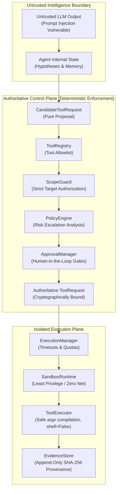
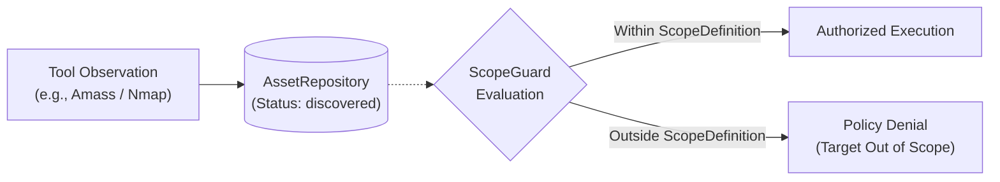

# ARKA Agent Security Boundaries & Invariants

This document specifies the mandatory architectural security boundaries and invariants governing all autonomous agents within ARKA (ReconAgent, ValidationAgent, OrchestratorAgent).

---

## 1. Core Trust Invariants

---

## 2. Invariant Specifications

### Invariant 1: LLM Is Untrusted
- **Principle**: The LLM is an untrusted reasoning engine. It operates outside ARKA's security perimeter.
- **Enforcement**:
  1. The LLM is **never** relied upon for authorization, scope decisions, permission boundaries, or tool safety.
  2. Natural language outputs are never passed to shell interpreters or operating system APIs.
  3. Structured plans are validated strictly against Pydantic models. Malformed JSON, unexpected fields, invalid tool names, or out-of-range parameters are rejected immediately.

### Invariant 2: Zero Direct Execution
- **Principle**: Agents cannot directly execute tools, system binaries, or container operations.
- **Enforcement**:
  1. Agents are forbidden from invoking `subprocess.run()`, `os.system()`, `eval()`, `exec()`, or direct Docker SDK methods.
  2. All agent actions must take the form of an immutable `CandidateToolRequest` submitted to `ToolRegistry.validate_candidate_request`.
  3. Only the `ExecutionManager` can dispatch approved `ToolRequest` objects to sandboxed `ToolExecutor` implementations.

### Invariant 3: DISCOVERED != AUTHORIZED
- **Principle**: Passive or active infrastructure discovery does not grant authorization to probe newly discovered targets.
- **Enforcement**:
  1. When tools like Amass, Nmap, or ffuf identify new subdomains, IP addresses, or endpoints, they are normalized into canonical models with status `discovered`.
  2. Storing an asset in `AssetRepository` **never** modifies `ScopeDefinition` or mutates `ScopeGuard`.
  3. Any subsequent tool execution targeting a discovered entity must independently pass `ScopeGuard` validation. If the target is outside the user's explicit authorization CIDR/domain scope, the request is denied with `PolicyDecisionType.DENY`.

### Invariant 4: Tool and Argument Allowlisting
- **Principle**: Tools and arguments must be strictly typed and allowlisted.
- **Enforcement**:
  1. Tools must be explicitly registered in `ToolRegistry`. Unknown tool names are rejected.
  2. Every tool adapter defines a rigid Pydantic scan configuration (e.g. `NucleiScanConfig`, `FfufScanConfig`, `WhatWebScanConfig`, `AmassScanConfig`, `NmapScanConfig`).
  3. Arguments are compiled directly into a safe argument vector list (`list[str]`) with `shell=False`. Shell metacharacters (`;`, `&&`, `|`, `` ` ``, `$`, `\n`) are either blocked by validation or rendered harmless as literal arguments.

### Invariant 5: Evidence Immutability & Provenance
- **Principle**: Execution results and observations must possess non-repudiable cryptographic integrity.
- **Enforcement**:
  1. `EvidenceStore` records separate, content-addressed evidence references for `RAW_STDOUT`, `RAW_STDERR`, and `STRUCTURED_RESULT`.
  2. SHA-256 digests are computed over raw output blobs.
  3. Stored evidence is append-only. All retrieval methods return deep defensive copies (`model_copy(deep=True)`), preventing callers from mutating internal state.
  4. Sensitive credentials in metadata are redacted automatically, while preserving raw evidence integrity.

### Invariant 6: Cross-Agent Trust Boundary
- **Principle**: Agents operate in mutually distrusting roles. One agent's output is treated as untrusted input by downstream agents.
- **Enforcement**:
  1. When `ReconAgent` identifies a candidate finding, `ValidationAgent` does not treat the finding as verified.
  2. The finding is marked `OBSERVED` or `SUSPECTED`.
  3. To validate the finding, `ValidationAgent` devises a verification plan and submits its own `CandidateToolRequest` through the full `ToolRegistry -> ScopeGuard -> PolicyEngine -> ApprovalManager` pipeline.
  4. A compromised or misaligned `ReconAgent` cannot trick `ValidationAgent` into executing out-of-scope or unapproved destructive operations.

### Invariant 7: Bounded Resource & Loop Limits
- **Principle**: Autonomous agent loops must never run indefinitely or consume unbounded resources.
- **Enforcement**:
  1. Hard limits are enforced on `max_iterations`, `max_actions`, and consecutive failures.
  2. Per-tool timeouts and output byte limits prevent hanging processes or memory exhaustion.
  3. Deterministic action fingerprinting (combining tool name, target, and normalized arguments) prevents infinite duplicate action replay.

---

## 3. Threat Model Summary (OWASP Agentic AI Matrix)

| Threat Vector | Mitigation Mechanism | Verification Test |
|---|---|---|
| **Prompt Injection** | LLM output cannot override system policy; parsed as inert candidate data. | `test_recon_agent_security.py` |
| **Argument Injection** | Typed Pydantic schemas, strict regexes, safe `argv` list execution (`shell=False`). | `test_tool_adapters_security.py` |
| **Scope Expansion** | Discovered assets have status `discovered`; `ScopeGuard` re-evaluates all targets. | `test_discovered_assets_cannot_be_scanned_if_out_of_scope` |
| **Approval Bypass** | High-risk scans (`timing_template >= 3`, critical templates, rate > 50) require bound approval. | `test_nuclei_critical_severity_denied_without_approval` |
| **Evidence Tampering** | Content-addressed SHA-256 storage, deep defensive copying on retrieval. | `test_evidence_security.py` |
| **State Loop Exhaustion** | Bounded iterations, action deduplication, and termination conditions. | `test_recon_pipeline_integration.py` |
