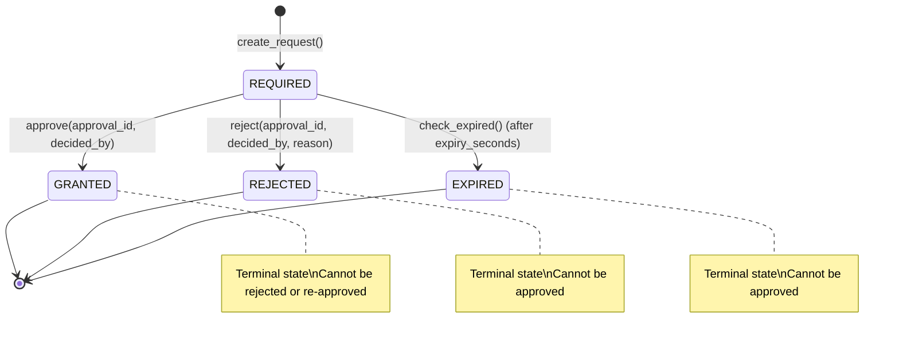

# Persistent Human Approval System (ApprovalManager)

The **ApprovalManager** (`arka/app/core/approvals/manager.py`) manages human-in-the-loop authorization gates for elevated risk operations.

---

## 1. Approval State Machine

Approvals follow a strictly validated state machine stored in PostgreSQL (`approvals` table):

### Transition Invariants:
- Attempting to transition from `GRANTED -> REJECTED`, `REJECTED -> GRANTED`, `EXPIRED -> GRANTED`, or `GRANTED -> GRANTED` raises a `ValueError`.
- Default expiration is 3600 seconds (1 hour). Expired requests cannot be approved.

---

## 2. Strict Operation Binding

To prevent replay attacks and cross-scope drift, an approval is bound to the exact operational tuple:

$$\text{Approval} \iff (\text{engagement\_id}, \text{task\_id}, \text{tool\_name}, \text{target})$$

### Binding Verification (`validate_approval_for_request`):
When a tool execution attempts to consume an `approval_id`:
1. The approval record must exist and have status `GRANTED`.
2. `approval.engagement_id` must match `request.engagement_id`.
3. `approval.task_id` must match `request.task_id`.
4. `approval.tool_name` must match `request.tool_name`.
5. `approval.target.strip()` must match `request.target.strip()`.
6. `approval.is_expired` must be `False`.

If any check fails, authorization is denied.
