# Asset Discovery Security: The Discovered != Authorized Boundary

## 1. The Core Principle

> [!CRITICAL]
> **TOOLS PRODUCE OBSERVATIONS.**
> **THE CANONICAL MODEL STORES NORMALIZED OBSERVATIONS.**
> **OBSERVATIONS NEVER AUTOMATICALLY EXPAND AUTHORIZATION SCOPE.**

In autonomous and AI-assisted penetration testing systems, one of the most critical failure modes is **accidental scope expansion** — where an observation tool discovers a new asset, and the system automatically assumes that the discovered asset is authorized for active probing or exploitation.

ARKA strictly prevents this by enforcing complete architectural separation between **Asset Storage** and **Scope Authorization**.

```mermaid
graph TD
    subgraph DiscoveryFlow["Observation & Normalization Plane"]
        Scan["Nmap Scan on Authorized 192.168.1.10"]
        DiscoveredAsset["Discovered Asset: 10.0.0.50 (Internal Router)"]
        Normalizer["AssetNormalizer"]
        AssetDB[("Asset Repository (Storage Only)")]
        
        Scan --> DiscoveredAsset
        DiscoveredAsset --> Normalizer
        Normalizer --> AssetDB
    end

    subgraph SecurityBoundary["Scope & Policy Boundary"]
        Agent["ReconAgent / Orchestrator"]
        ProposedReq["CandidateToolRequest (target: 10.0.0.50)"]
        Registry["ToolRegistry"]
        ScopeGuard["ScopeGuard (Enforces ScopeDefinition)"]
        PolicyEngine["PolicyEngine"]
        Decision["DENIED: Target 10.0.0.50 is Out of Scope"]
        
        Agent -.-> ProposedReq
        ProposedReq --> Registry
        Registry --> ScopeGuard
        ScopeGuard --> PolicyEngine
        PolicyEngine --> Decision
    end
```

---

## 2. Security Invariants

1. **Storage Does Not Equal Permission**:
   Writing an asset record into `assets`, `services`, `technologies`, or `endpoints` tables does not alter the engagement's `ScopeDefinition`.

2. **ScopeGuard Independence**:
   `ScopeGuard` checks only the authoritative `ScopeDefinition` established at engagement creation. It has zero dependencies on `AssetRepository`.

3. **Multi-Stage Validation**:
   Even if an AI agent proposes targeting a discovered asset, the candidate request must pass through:
   - `ToolRegistry._validate_arguments` (Schema checking)
   - `ScopeGuard.validate_target` (CIDR/Domain allowlist/exclusion matching)
   - `PolicyEngine.evaluate` (Risk level and permission check)
   - `ApprovalManager.requires_approval` (Human-in-the-loop authorization if escalated)

4. **Adversarial Content Immunity**:
   Data parsed from external targets (service banners, HTML titles, SSL certificates, hostnames) is treated as **untrusted, target-controlled data**. It is stored as inert text and never executed, shell-interpolated, or directly trusted.

5. **Cryptographic Provenance**:
   Every entity records `evidence_refs` pointing to immutable records in `EvidenceStore` with SHA-256 digests. This guarantees complete forensic traceability for every observation.
