# ARKA Evidence Pipeline & Cryptographic Provenance Architecture

## 1. Core Principles

The ARKA evidence pipeline guarantees:

1. **Non-Repudiation & Cryptographic Integrity**: Every security observation, raw output stream, and structured result is digested with SHA-256 upon recording.
2. **Defensive Immutability**: All evidence queries return deep defensive copies. Callers cannot mutate internal store state or forge hashes.
3. **Content-Addressed Deduplication**: Identical output blobs across multiple executions are stored once (deduplicated by SHA-256), while preserving separate, immutable provenance references for each execution.
4. **Data Isolation (Discovered ≠ Authorized)**: Evidence is pure observation data. Recording evidence or observing an asset never expands authorization scope or bypasses `ScopeGuard`.
5. **Secret Redaction**: Sensitive credentials (API keys, JWT bearer tokens, private keys) are automatically sanitized from evidence metadata without altering raw binary artifacts.

---

## 2. Evidence Data Model

### Evidence Types (`EvidenceType`)
- `RAW_STDOUT`: Unparsed tool output stream (e.g. raw Nmap XML).
- `RAW_STDERR`: Execution error stream.
- `STRUCTURED_RESULT`: Deterministically normalized/parsed dictionary output.
- `TOOL_ARTIFACT`: Ancillary files or binary outputs produced by tools.
- `PARSED_RESULT`: Downstream parsed output.

### Evidence Reference (`EvidenceReference`)
| Field | Type | Description |
|---|---|---|
| `evidence_id` | UUIDv4 (str) | Unique identifier for this evidence record |
| `execution_id` | UUIDv4 (str) | Execution instance provenance |
| `request_id` | UUIDv4 (str) | Authoritative `ToolRequest` linkage |
| `engagement_id` | UUIDv4 (str) | Tenant / assessment scope boundary |
| `task_id` | UUIDv4 (str) | LangGraph task provenance |
| `tool_name` | str | Tool that generated the observation |
| `evidence_type` | str (`EvidenceType`) | Typed category |
| `location` | str | Storage location (`in_memory`, filesystem, artifact bucket) |
| `sha256` | str (hex) | Cryptographic digest over raw bytes |
| `size_bytes` | int | Size of stored raw content |
| `created_at` | datetime (UTC) | Timestamp of evidence recording |
| `metadata` | dict | Sanitized execution parameters and contextual tags |

---

## 3. Provenance Traceability Flow

```mermaid
sequenceDiagram
    participant Agent as ReconAgent
    participant Registry as ToolRegistry / ScopeGuard / PolicyEngine
    participant ExecMgr as ExecutionManager
    participant Tool as NmapToolExecutor
    participant EvStore as EvidenceStore
    participant Normalizer as AssetNormalizer
    participant AssetRepo as AssetRepository

    Agent->>Registry: CandidateToolRequest
    Registry->>ExecMgr: Authoritative ToolRequest (validated)
    ExecMgr->>Tool: Execute inside Sandbox
    Tool-->>ExecMgr: ToolResult (raw XML + parsed dict)
    
    rect rgb(30, 45, 60)
        Note over ExecMgr,EvStore: Cryptographic Evidence Capture
        ExecMgr->>EvStore: record_evidence(raw_stdout: XML)
        ExecMgr->>EvStore: record_evidence(structured_result: dict)
        EvStore-->>ExecMgr: [ev_ref_raw, ev_ref_structured]
    end

    ExecMgr->>Normalizer: normalize_nmap_result(..., evidence_refs=[...])
    Normalizer->>AssetRepo: save_bundle(NormalizedAssetBundle)
    Note over AssetRepo: Assets & Services contain evidence_refs
```

---

## 4. Security Controls & Guarantees

### Immutability Verification (`verify_integrity`)
`EvidenceStore.verify_integrity(evidence_id)` recomputes the SHA-256 digest over the stored raw blob and compares it against the recorded `sha256` field. Any alteration fails immediately.

### Untrusted Data Handling
All evidence content is treated as untrusted data. Prompt injection strings, shell metacharacters, or malicious XML embedded in tool output are stored verbatim as inert data. They are never evaluated as code, passed to shell interpreters, or used to expand authorization boundaries.

---

## 5. Storage & Persistence Boundary

- **Phase 2.2.3 Status**: `EvidenceStore` operates as a fast, deterministic in-memory store.
- **PostgreSQL Persistence Boundary**: The database contains an `evidence` table schema (`arka/app/database/models.py`), but direct bridge connections from `EvidenceStore` to PostgreSQL and object storage (S3/local disk) are planned for a subsequent worker persistence milestone.
- **No Durable Storage Claims**: Current phase guarantees in-memory cryptographic integrity, provenance tracking, and defensive copying; durable cross-restart artifact persistence is future work.
