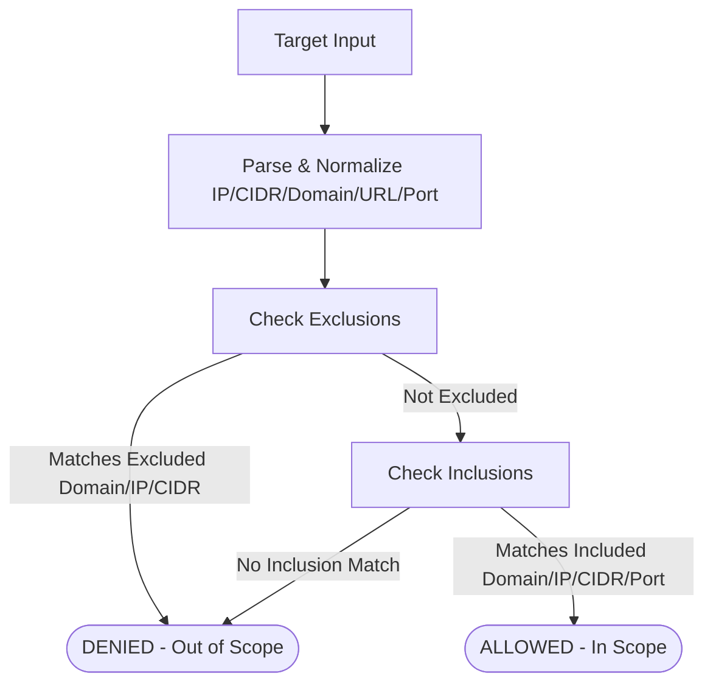

# Scope Enforcement Architecture (ScopeGuard)

The **ScopeGuard** (`arka/app/core/scope/scopeguard.py`) is the deterministic engine responsible for verifying that targets remain strictly within authorized engagement boundaries.

---

## 1. Scope Target Capabilities

A `ScopeDefinition` contains two `ScopeTarget` definitions: `includes` (authorized) and `excludes` (prohibited).

```python
class ScopeTarget(BaseModel):
    domains: list[str] = Field(default_factory=list)
    subdomains_allowed: bool = False
    ip_addresses: list[str] = Field(default_factory=list)
    cidrs: list[str] = Field(default_factory=list)
    ports: list[int] = Field(default_factory=list)
    port_ranges: list[str] = Field(default_factory=list)  # e.g., ["8000-9000"]
```

---

## 2. Invariant: Exclusions Override Inclusions

> [!CAUTION]
> If a target falls within an authorized CIDR, domain, or IP list, but matches ANY excluded domain, IP, or CIDR, the target is **IMMEDIATELY REJECTED**.
>
> Exclusions have absolute priority over inclusions.



---

## 3. Scoping Rules & Attack Prevention

### 1. Domain Suffix Collision Attacks
- **Vulnerability**: If `example.com` is in scope, a naive suffix check (`target.endswith("example.com")`) would allow `notexample.com` or `evil-example.com`.
- **ScopeGuard Mitigation**: `_is_subdomain_of` requires either an exact match (`domain == parent`) or a dot-prefixed boundary (`domain.endswith("." + parent)`).

### 2. Subdomain Disabling Mode
- If `subdomains_allowed=False`, only exact domain matches (`target.com`) are allowed; subdomains (`api.target.com`) are rejected.

### 3. CIDR Subnet Containment & Overlap
- An IP is verified against included CIDRs via `ip_address in ip_network`.
- A candidate CIDR is checked via `net_obj.subnet_of(inc_net)`. If a candidate CIDR overlaps with any excluded network (`net_obj.overlaps(ex_net)`), it is rejected.

### 4. Port Validation & Ranges
- Specific ports (e.g. `80`, `443`) and port ranges (e.g. `8000-9000`) are checked. Unlisted ports raise a `ScopeViolation`.

### 5. URL Normalization & Host Extraction
- URLs (e.g. `https://api.target.com:8080/v1/health`) are parsed via `urlparse`. The host and port are extracted and independently checked.
