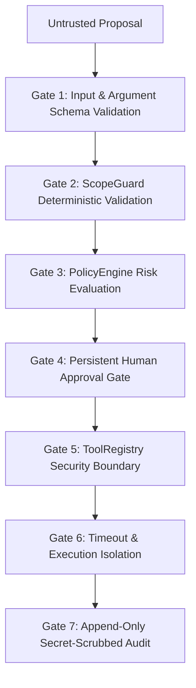

# ARKA Security Model

This document outlines the core security model, invariant policies, and defense-in-depth design implemented in ARKA.

---

## 1. Fundamental Principles

1. **Authorized Operations Only**: ARKA is engineered strictly for authorized security assessments. All actions must be contained within legally approved scope boundaries.
2. **Deterministic Control Plane**: LLMs are probabilistic engines and cannot be trusted with security boundaries. All authorization checks are programmatic and deterministic.
3. **Least Privilege**: Components operate with the minimum permissions necessary to perform their designated function.
4. **Defense in Depth**: Security controls are applied sequentially across input validation, scope validation, policy enforcement, human approval gates, execution sandboxing, and immutable audit logging.

---

## 2. Security Capabilities Comparison

| Security Control | Phase 1 Status | Phase 2+ Roadmap | Implementation File |
|---|---|---|---|
| **Deterministic Scoping** | **`IMPLEMENTED`** | Enhanced DNS resolving | `arka/app/core/scope/scopeguard.py` |
| **Authoritative Risk Scoring** | **`IMPLEMENTED`** | Contextual risk escalation | `arka/app/core/policies/engine.py` |
| **Persistent Approvals** | **`IMPLEMENTED`** | Multi-party & role-based approval | `arka/app/core/approvals/manager.py` |
| **Input Schema Enforcement** | **`IMPLEMENTED`** | Semantic parameter validation | `arka/app/tools/registry/registry.py` |
| **Mock Execution Sandbox** | **`IMPLEMENTED`** | Container / gVisor MicroVM isolation | `arka/app/tools/mock/tools.py` |
| **Append-Only Audit Trail** | **`IMPLEMENTED`** | Cryptographic hash chaining / SIEM forwarding | `arka/app/audit/service.py` |
| **Credential Scrubbing** | **`IMPLEMENTED`** | Automated DLP / regex secret scanner | `arka/app/audit/service.py` |

---

## 3. Defense-in-Depth Pipeline

