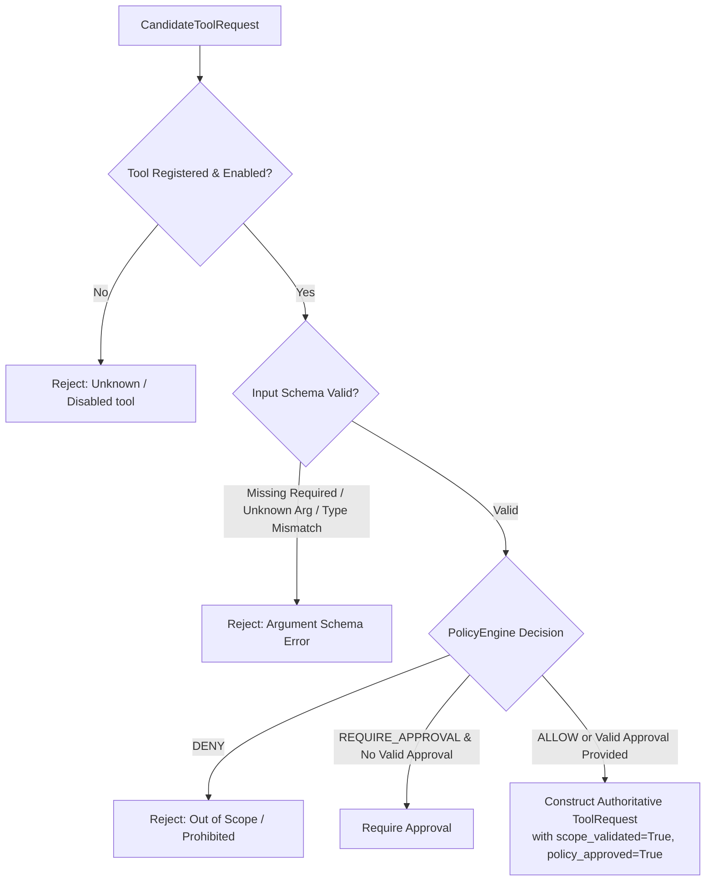

# Tool Execution Security

This document outlines the security controls governing tool registration, parameter validation, timeout enforcement, and execution boundaries in ARKA.

---

## 1. Tool Request Validation Boundary

All tool execution requests originate from untrusted proposals and must pass through `ToolRegistry.validate_candidate_request()` (`arka/app/tools/registry/registry.py`).



---

## 2. Input Schema & Parameter Validation

Every `ToolDefinition` declares a strict JSON schema:

```json
{
  "type": "object",
  "properties": {
    "target": {"type": "string"},
    "ports": {"type": "string"},
    "depth": {"type": "integer"}
  },
  "required": ["target"]
}
```

The registry validates:
1. **Required Arguments**: Ensures all required fields are present.
2. **Disallowed Unknown Arguments**: Rejects candidate requests containing unrecognized arguments (preventing argument injection).
3. **Type Checking**: Validates that values match declared JSON schema primitive types (`string`, `integer`, `boolean`, `array`, `object`).

---

## 3. Timeout & Crash Protection

- **Asynchronous Timeouts**: Tool execution is wrapped in `asyncio.wait_for(executor.execute(...), timeout=timeout_seconds)`. Frozen executions are terminated immediately.
- **Structured Exception Wrapping**: If an underlying executor fails or crashes, `ToolRegistry` catches the exception and returns a structured `ToolResult(success=False, error=str(e))` while emitting a `TOOL_FAILED` audit event.
