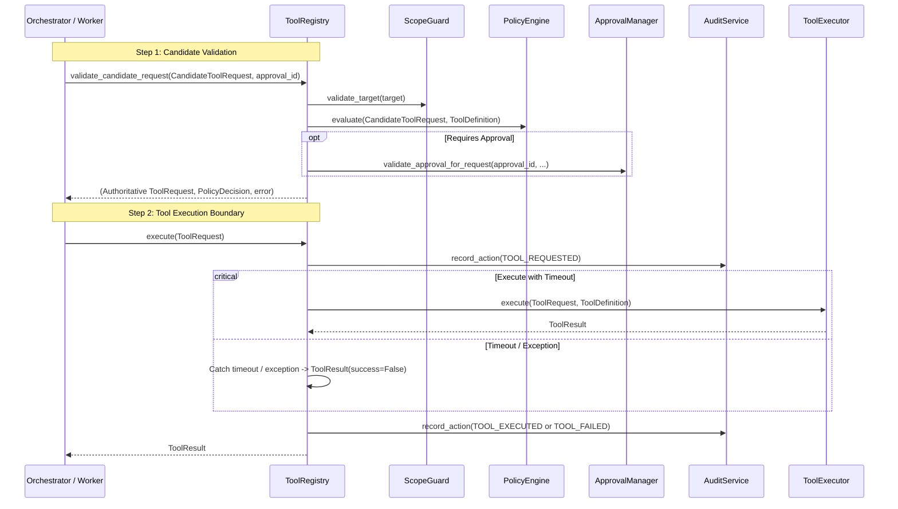

# Tool Execution Pipeline

This document details the step-by-step lifecycle of tool execution from candidate validation to output result capture.

---

## 1. Execution Boundary Flow



---

## 2. Tool Result Contract (`ToolResult`)

Every execution returns a standardized `ToolResult`:

```python
class ToolResult(BaseModel):
    request_id: str
    engagement_id: str
    task_id: str
    tool_name: str
    success: bool
    output: dict[str, Any] = Field(default_factory=dict)
    error: str | None = None
    execution_time_ms: int = 0
    artifacts: list[dict[str, Any]] = Field(default_factory=list)
    evidence_refs: list[str] = Field(default_factory=list)
```
