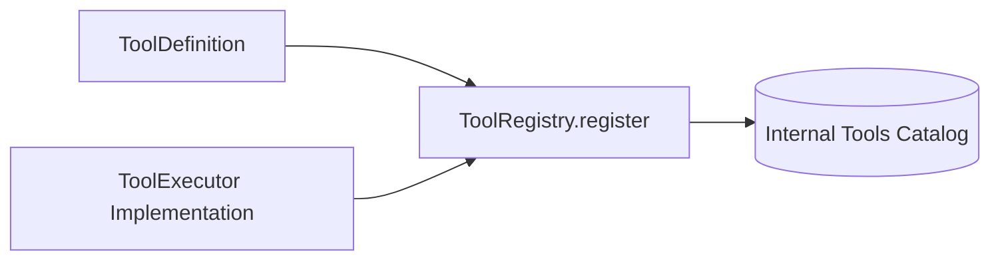

# Tool Registry Architecture

The **ToolRegistry** (`arka/app/tools/registry/registry.py`) maintains the authoritative catalog of security tools, defines tool metadata, and enforces input schema contracts.

---

## 1. Tool Definition Schema (`ToolDefinition`)

Every tool registered in ARKA is represented by a `ToolDefinition`:

```python
class ToolDefinition(BaseModel):
    name: str  # Unique tool identifier
    description: str  # Capability summary for LLM prompt
    version: str = "1.0.0"
    input_schema: dict[str, Any]  # JSON schema validating arguments
    output_schema: dict[str, Any]  # JSON schema validating outputs
    risk_level: RiskLevel = RiskLevel.LOW  # Authoritative risk classification
    enabled: bool = True  # Operational toggle
    timeout_seconds: int = 300  # Maximum allowed execution time
    tags: list[str] = Field(default_factory=list)
```

---

## 2. Tool Registration Lifecycle



### Registration Rules:
1. **Uniqueness**: Tool names must be unique. Registering a duplicate name overwrites the existing entry.
2. **Deterministic Risk Level**: The risk level is defined in code by security engineers and cannot be altered at runtime by agents or LLM prompts.
3. **Enabled State**: Disabled tools are retained in the catalog but immediately rejected during candidate validation.
